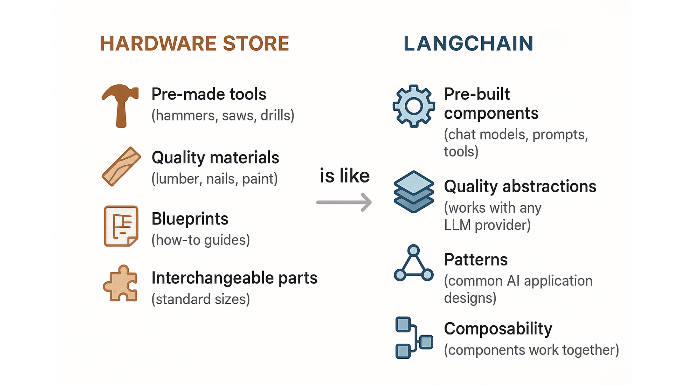
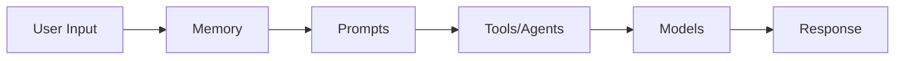
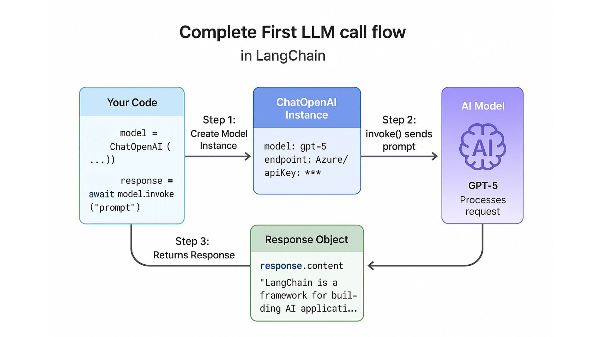
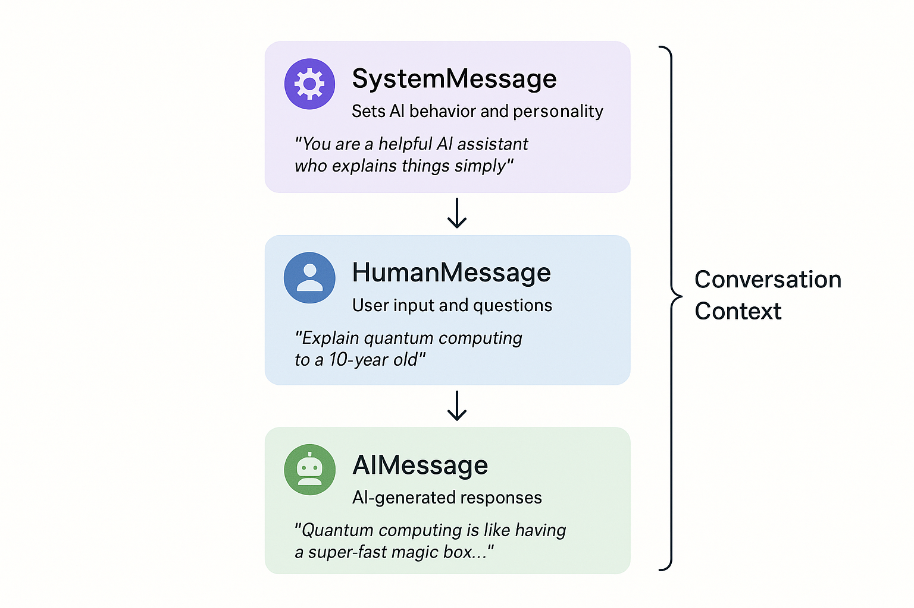
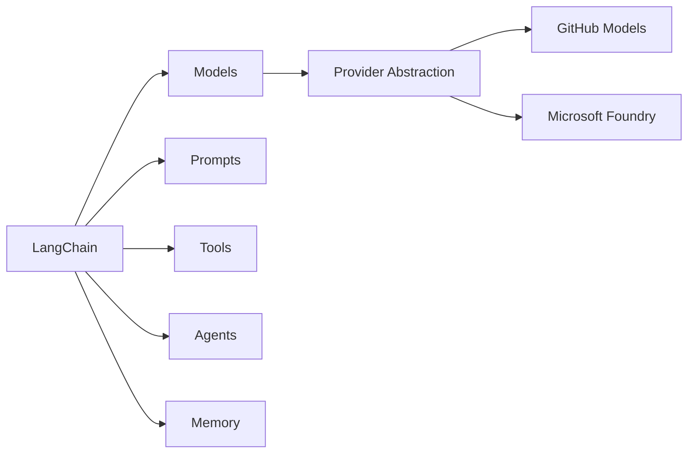

# Introduction to LangChain (Giới thiệu về LangChain)

Chào mừng bạn đến với bước đầu tiên trong việc xây dựng ứng dụng dùng AI với LangChain! Trong chương này, bạn sẽ học LangChain là gì, vì sao nó tồn tại, khám phá các khái niệm cốt lõi như model, prompt, và tool, và thực hiện lệnh gọi LLM đầu tiên bằng GitHub Models. Kết thúc chương, bạn sẽ hiểu cách LangChain cung cấp một interface nhất quán trên nhiều AI provider khác nhau, giúp bạn dễ dàng chuyển đổi giữa chúng chỉ bằng biến môi trường.

## Yêu cầu trước

- Đã hoàn thành [Course Setup](../00-course-setup/README.md)

## Mục tiêu học tập

Kết thúc chương này, bạn sẽ có thể:

- ✅ Hiểu LangChain là gì và vì sao nó tồn tại
- ✅ Nhận diện các pattern ứng dụng AI phổ biến
- ✅ Thiết lập môi trường phát triển
- ✅ Thực hiện lệnh gọi LLM đầu tiên bằng GitHub Models

---

## 📖 Giới thiệu: Ví von cửa hàng dụng cụ (Hardware Store Analogy)

**Hãy tưởng tượng bạn đang xây một căn nhà.** Bạn có thể tự sản xuất gạch, tự làm xi măng, tự rèn dụng cụ. Hoặc, bạn có thể dùng cửa hàng dụng cụ (hardware store) cung cấp sẵn vật liệu chất lượng và dụng cụ đã được kiểm chứng.

**LangChain chính là cửa hàng dụng cụ cho việc phát triển AI.**

Giống như một cửa hàng dụng cụ cung cấp:
- 🔨 **Dụng cụ dùng ngay** (búa, cưa, máy khoan) → để bạn không phải tự chế dụng cụ từ đầu
- 🔌 **Adapter đa năng** (giúp mọi phích cắm hoạt động với mọi ổ cắm) → để bạn có thể đổi thương hiệu dễ dàng
- 📋 **Bản vẽ thiết kế** (hướng dẫn cho các dự án phổ biến) → để bạn làm theo thiết kế đã được kiểm chứng
- 🧱 **Linh kiện có thể thay thế lẫn nhau** (kích cỡ chuẩn hoạt động ăn khớp) → để bạn dễ dàng phối hợp

LangChain cung cấp:
- 🔨 **Component dùng ngay** (prompt, memory, tool) → để bạn không phải xây mọi thứ từ đầu
- 🔌 **Chat và LLM Abstraction** (một interface cho OpenAI, Azure, Anthropic) → để bạn dễ dàng đổi LLM
- 📋 **Pattern** (agent, RAG, chatbot) → để bạn làm theo thiết kế ứng dụng AI đã được kiểm chứng
- 🧱 **Khả năng kết hợp (Composability)** (các component hoạt động ăn khớp với nhau) → phối hợp database, vector store và nhiều thứ khác trong project của bạn

**Kết quả?** Bạn có thể tập trung xây dựng ứng dụng, thay vì phát minh lại bánh xe.



*LangChain giống như một cửa hàng dụng cụ cho việc phát triển AI - cung cấp các component dựng sẵn và abstraction chất lượng*

---

## 🧠 LangChain là gì?

LangChain là một **framework để xây dựng ứng dụng dùng AI**, sử dụng Large Language Model (LLM).

### Vấn đề mà nó giải quyết

Nếu không có LangChain, bạn sẽ cần:
- Viết code riêng cho từng LLM provider (OpenAI, Anthropic, Azure, v.v.)
- Tự xây hệ thống quản lý prompt
- Tạo tool tuỳ chỉnh và logic function calling
- Tự cài đặt memory và xử lý hội thoại từ đầu
- Xây dựng hệ thống agent mà không có cấu trúc nào

### Giải pháp của LangChain

Với LangChain, bạn có được:

- **Provider abstraction** - Chuyển đổi giữa OpenAI, Azure, Anthropic với thay đổi code tối thiểu
- **Prompt template** - Prompt có thể tái sử dụng, kiểm thử được
- **Tool** - Mở rộng khả năng AI với hàm và API tuỳ chỉnh
- **Memory** - Lịch sử hội thoại dựng sẵn
- **Agent** - AI ra quyết định, có thể dùng tool

---

## 🏗️ Tổng quan các khái niệm cốt lõi

LangChain được xây dựng quanh 5 khái niệm cốt lõi mà bạn sẽ học xuyên suốt khoá học:

- **Models (Model)**: "Bộ não" AI xử lý input và tạo ra output. Học trong chương này.
- **Prompts (Prompt)**: Cách bạn giao tiếp với AI model bằng template có thể tái sử dụng. Xem [Prompts, Messages, and Structured Outputs](../03-prompts-messages-outputs/README.md).
- **Tools (Tool)**: Mở rộng khả năng AI với hàm và API bên ngoài. Xây dựng trong [Function Calling & Tools](../04-function-calling-tools/README.md).
- **Agents (Agent)**: Hệ thống AI biết suy luận và tự quyết định dùng tool nào. Tạo trong [Getting Started with Agents](../05-agents/README.md).
- **Memory**: Ghi nhớ ngữ cảnh xuyên suốt các lượt tương tác. Cài đặt trong [Chat Models & Basic Interactions](../02-chat-models/README.md).

---

### Các khái niệm này hoạt động cùng nhau như thế nào

Khi tiến bước qua khoá học, bạn sẽ thấy các khái niệm này kết hợp ra sao:



**Đừng lo nếu chưa hiểu hết ngay bây giờ!** Bạn sẽ học từng khái niệm qua thực hành, xây dựng dần các ứng dụng ngày càng phức tạp hơn. Hãy bắt đầu với lệnh gọi AI đầu tiên của bạn.

---

## 💻 Thực hành: Lệnh gọi LLM đầu tiên của bạn

Hãy thực hiện lệnh gọi AI đầu tiên bằng LangChain và GitHub Models!

### Ví dụ 1: Hello World

Trong ví dụ này, bạn sẽ tạo chương trình LangChain đầu tiên gửi một message đơn giản đến AI model và hiển thị phản hồi.

Hãy đi qua từng bước rồi chạy code:

#### **Bước 1: Import những gì cần thiết**

```python
from langchain_openai import ChatOpenAI
from dotenv import load_dotenv
import os

load_dotenv()
```

#### **Bước 2: Tạo AI model**

```python
model = ChatOpenAI(
    model=os.getenv("AI_MODEL"),
    base_url=os.getenv("AI_ENDPOINT"),
    api_key=os.getenv("AI_API_KEY")
)
```

#### **Bước 3: Hỏi LLM một câu hỏi**

```python
response = model.invoke("What is LangChain in one sentence?")
print("🤖 AI Response:", response.content)
```

**Code**: [`code/01_hello_world.py`](./code/01_hello_world.py)
**Chạy**: `python 01-introduction/code/01_hello_world.py`

**Đây là code ví dụ đầy đủ**:

```python
from langchain_openai import ChatOpenAI
from dotenv import load_dotenv
import os

load_dotenv()

def main():
    print("🦜🔗 Hello LangChain!\n")

    # Create a chat model instance
    model = ChatOpenAI(
        model=os.getenv("AI_MODEL"),
        base_url=os.getenv("AI_ENDPOINT"),
        api_key=os.getenv("AI_API_KEY")
    )

    # Make your first AI call!
    response = model.invoke("What is LangChain in one sentence?")

    print("🤖 AI Response:", response.content)
    print("\n✅ Success! You just made your first LangChain call!")

if __name__ == "__main__":
    main()
```

### Kết quả mong đợi

Khi chạy ví dụ này bằng `python 01-introduction/code/01_hello_world.py`, bạn sẽ thấy:

```bash
🦜🔗 Hello LangChain!

🤖 AI Response: LangChain is a framework for building applications powered by large language models (LLMs).

✅ Success! You just made your first LangChain call!
```

### Cách hoạt động

#### **Chuyện gì đang xảy ra?**
1. Chúng ta import `ChatOpenAI` từ package `langchain_openai`
2. Chúng ta tạo một model instance bằng cách khởi tạo `ChatOpenAI` với các tham số cần thiết
3. Chúng ta gọi `invoke()` với một prompt dạng chuỗi đơn giản — đây là cách chuẩn để nhận response từ LLM trong LangChain.
4. Chúng ta nhận lại một response chứa câu trả lời của LLM



*Luồng của lệnh gọi LLM đầu tiên - từ việc tạo model instance đến khi nhận response*

#### **Hiểu về cấu hình ChatOpenAI**:

Constructor `ChatOpenAI` nhận ba tham số chính: `model` (AI model nào), `base_url` (API endpoint), và `api_key` (xác thực).

Chúng ta đọc các giá trị này từ biến môi trường (`AI_MODEL`, `AI_ENDPOINT`, `AI_API_KEY`) khai báo trong file `.env`. Điều này giúp credential không nằm trong code, và cho phép bạn đổi provider bằng cách cập nhật `.env`.

**Vì sao dùng biến môi trường?**
- `AI_MODEL` chỉ định AI model nào được dùng (như `gpt-5` hoặc `gpt-5-mini`)
- `AI_ENDPOINT` cho ứng dụng biết nơi tìm AI service
- `AI_API_KEY` cung cấp credential xác thực.

Lưu các giá trị này trong `.env` nghĩa là bạn có thể chuyển đổi giữa các provider (GitHub Models, Azure, OpenAI v.v.) chỉ bằng cách đổi file cấu hình, không cần đổi code.

---

## 💬 Hiểu về Messages

LLM hoạt động tốt nhất với hội thoại có cấu trúc. LangChain cung cấp các loại message tách biệt system instruction (`SystemMessage`) khỏi input của user (`HumanMessage`), cho bạn quyền kiểm soát chính xác tính cách và hành vi của AI.

### Ví dụ 2: Các loại Message

Hãy xem cách dùng SystemMessage và HumanMessage để kiểm soát hành vi AI và định giọng điệu cho response.

**Code**: [`code/02_message_types.py`](./code/02_message_types.py)
**Chạy**: `python 01-introduction/code/02_message_types.py`

**Đây là code ví dụ đầy đủ**:

```python
from langchain_openai import ChatOpenAI
from langchain_core.messages import HumanMessage, SystemMessage
from dotenv import load_dotenv
import os

load_dotenv()

def main():
    print("🎭 Understanding Message Types\n")

    model = ChatOpenAI(
        model=os.getenv("AI_MODEL"),
        base_url=os.getenv("AI_ENDPOINT"),
        api_key=os.getenv("AI_API_KEY")
    )

    # Using structured messages for better control
    messages = [
        SystemMessage(content="You are a helpful AI assistant who explains things simply."),
        HumanMessage(content="Explain quantum computing to a 10-year-old."),
    ]

    response = model.invoke(messages)

    print("🤖 AI Response:\n")
    print(response.content)
    print("\n✅ Notice how the SystemMessage influenced the response style!")

if __name__ == "__main__":
    main()
```

### Kết quả mong đợi

Khi chạy ví dụ này bằng `python 01-introduction/code/02_message_types.py`, bạn sẽ thấy gì đó tương tự:

```bash
🎭 Understanding Message Types

🤖 AI Response:

Quantum computing is like having a super-fast magic box that can try many different solutions to a puzzle at the same time! While regular computers look at one answer at a time, quantum computers can explore lots of possibilities all at once, which helps them solve really hard problems much faster.

✅ Notice how the SystemMessage influenced the response style!
```

### Cách hoạt động

#### **Các loại Message**:
- **SystemMessage**: Định hành vi và tính cách của AI
- **HumanMessage**: Input của user
- **AIMessage**: Response của AI (thường được tự động thêm vào)

#### **Chuyện gì đang xảy ra**:
1. SystemMessage bảo AI giải thích đơn giản (như cho người mới bắt đầu)
2. HumanMessage chứa câu hỏi của user về quantum computing
3. AI tạo ra response khớp với system instruction (giải thích đơn giản)
4. Vì chúng ta đặt tính cách trong SystemMessage, response phù hợp độ tuổi và rõ ràng.



*Cách SystemMessage, HumanMessage, và AIMessage phối hợp trong một hội thoại*

#### **Vì sao dùng message thay vì chuỗi (string)?**
- Kiểm soát hành vi AI tốt hơn
- Duy trì ngữ cảnh hội thoại
- Mạnh mẽ và linh hoạt hơn

---

## 🔄 So sánh Model

GitHub Models cho bạn quyền truy cập nhiều AI model. Hãy so sánh chúng!

**Bạn đang xây một app và cần chọn model nào để dùng.** Nên dùng `gpt-5` (mạnh hơn nhưng tốn kém hơn) hay `gpt-5-mini` (nhanh và rẻ hơn)?

Hãy nghĩ giống như chọn giữa các loại máy tính cầm tay: máy tính khoa học xử lý được phương trình phức tạp nhưng tốn nhiều thời gian và tài nguyên hơn, trong khi máy tính cơ bản nhanh và hiệu quả cho phép toán đơn giản. Cách tốt nhất để quyết định là test cả hai với prompt thực tế của bạn và so sánh response.

### Ví dụ 3: So sánh Model

Hãy xem cách so sánh các model khác nhau song song bằng code.

**Code**: [`code/03_model_comparison.py`](./code/03_model_comparison.py)
**Chạy**: `python 01-introduction/code/03_model_comparison.py`

**Đây là code ví dụ đầy đủ**:

```python
from langchain_openai import ChatOpenAI
from dotenv import load_dotenv
import os
import time

load_dotenv()

def compare_models():
    print("🔬 Comparing AI Models\n")

    prompt = "Explain recursion in programming in one sentence."
    models = ["gpt-5", "gpt-5-mini"]

    for model_name in models:
        print(f"\n📊 Testing: {model_name}")
        print("─" * 50)

        model = ChatOpenAI(
            model=model_name,
            base_url=os.getenv("AI_ENDPOINT"),
            api_key=os.getenv("AI_API_KEY"),
        )

        start_time = time.time()
        response = model.invoke(prompt)
        duration = (time.time() - start_time) * 1000

        print(f"Response: {response.content}")
        print(f"⏱️  Time: {duration:.0f}ms")

    print("\n✅ Comparison complete!")
    print("\n💡 Key Observations:")
    print("   - gpt-5 is more capable and detailed")
    print("   - gpt-5-mini is faster and uses fewer resources")
    print("   - Choose based on your needs: speed vs. capability")

if __name__ == "__main__":
    compare_models()
```

### Kết quả mong đợi

Khi chạy ví dụ này bằng `python 01-introduction/code/03_model_comparison.py`, bạn sẽ thấy:

```
🔬 Comparing AI Models


📊 Testing: gpt-5
──────────────────────────────────────────────────
Response: Recursion in programming is a technique where a function calls itself to solve smaller instances of the same problem until it reaches a base case.
⏱️  Time: 2134ms

📊 Testing: gpt-5-mini
──────────────────────────────────────────────────
Response: Recursion is when a function calls itself to solve a problem by breaking it down into smaller, similar sub-problems.
⏱️  Time: 1845ms

✅ Comparison complete!

💡 Key Observations:
   - gpt-5 is more capable and detailed
   - gpt-5-mini is faster and uses fewer resources
   - Choose based on your needs: speed vs. capability
```

> **Lưu ý**: Response từ LLM của bạn có thể hơi khác so với ví dụ này, và thời gian phụ thuộc vào kết nối mạng và tải API.

### Cách hoạt động

#### **Chuyện gì đang xảy ra**:
1. Chúng ta định nghĩa một prompt duy nhất hỏi về recursion
2. Chúng ta lặp qua hai model khác nhau: `gpt-5` và `gpt-5-mini`
3. Với mỗi model, chúng ta tạo một `ChatOpenAI` instance mới với tên model đó
4. Chúng ta gọi cùng một prompt trên mỗi model
5. Chúng ta hiển thị response từ mỗi model để so sánh

#### **Điều bạn sẽ nhận thấy**:
- Các model khác nhau có phong cách response khác nhau
- `gpt-5` thường chi tiết và tinh vi hơn
- `gpt-5-mini` súc tích hơn nhưng vẫn chính xác
- Cả hai câu trả lời đều đúng, chỉ diễn đạt khác nhau

---

## 🔄 Chuyển sang Microsoft Foundry

**Muốn dùng Microsoft Foundry thay vì GitHub Models?** Toàn bộ code bạn vừa viết sẽ hoạt động mà không cần thay đổi gì!

Chỉ cần cập nhật file `.env` với Azure endpoint và API key của bạn. Để có hướng dẫn thiết lập chi tiết, xem [Microsoft Foundry Setup](../00-course-setup/APPENDIX.md#microsoft-foundry-setup).

---

## 🗺️ Sơ đồ khái niệm

Chương này đã giới thiệu cho bạn các khái niệm cốt lõi của LangChain:



*Các khái niệm này phối hợp với nhau để tạo ra ứng dụng AI mạnh mẽ. Bạn sẽ khám phá từng cái sâu hơn xuyên suốt khoá học.*

---

## 🎮 Thử thêm

**Thử thách nhanh**: Trước khi chuyển sang phần tiếp theo, hãy thử chỉnh sửa Ví dụ 1:

1. Mở `code/01_hello_world.py`
2. Đổi câu hỏi từ "What is LangChain in one sentence?" thành "Explain AI in simple terms"
3. Chạy lại: `python 01-introduction/code/01_hello_world.py`
4. Quan sát cách AI thích nghi với câu hỏi khác nhau

**Bonus**: Thử hỏi về khái niệm lập trình hoặc sở thích yêu thích của bạn!

---

## 🌟 Ứng dụng thực tế

#### **Nơi bạn sẽ thấy các khái niệm này trong thực tế:**

- **Chatbot & Trợ lý ảo**: Dùng model, memory, và system message để duy trì hội thoại hữu ích
- **Công cụ tạo nội dung**: Dùng prompt và template để tạo nội dung nhất quán, chất lượng cao
- **Trợ lý code**: Dùng tool và agent để tìm tài liệu, chạy test, và gợi ý cải tiến
- **Hệ thống hỗ trợ khách hàng**: Dùng loại message để định giọng điệu và memory để duy trì ngữ cảnh xuyên suốt hội thoại

Giờ bạn đã hiểu các khái niệm này áp dụng vào ứng dụng thực tế ra sao, hãy cùng ôn lại những gì đã học.

---

## 🎓 Điểm chính cần nhớ

Hãy ôn lại những gì bạn đã học:

- **LangChain là một abstraction layer** - Cung cấp interface nhất quán trên nhiều LLM provider khác nhau
- **Xây dựng từ các component có thể kết hợp** - Model, prompt, tool, agent, và memory phối hợp với nhau
- **GitHub Models cung cấp quyền truy cập miễn phí** - Hoàn hảo để học và làm prototype
- **Microsoft Foundry sẵn sàng cho production** - Chuyển đổi bất cứ lúc nào bằng cách đổi biến môi trường trong file `.env`
- **Message có nhiều loại** - SystemMessage, HumanMessage, và AIMessage phục vụ mục đích khác nhau

---

## 🏆 Bài tập

Càng luyện tập nhiều bạn sẽ càng giỏi! Chúng tôi đã chuẩn bị thêm vài thử thách để bạn luyện tập. Hoàn thành các thử thách trong [assignment.md](./assignment.md)!

Bài tập gồm:
1. **System Prompts Experiment** - Học cách SystemMessage ảnh hưởng đến hành vi AI
2. **Model Performance Comparison** (Bonus) - So sánh nhiều model trên cùng một task

---

## 📚 Tài nguyên bổ sung

- [LangChain Python Documentation](https://python.langchain.com/)
- [GitHub Models Marketplace](https://github.com/marketplace/models)
- [Chat Models Documentation](https://python.langchain.com/docs/integrations/chat/)

---

## 🚀 Bước tiếp theo?

Làm tốt lắm! Bạn đã học các **khái niệm nền tảng** của LangChain — từ nó là gì và vì sao nó tồn tại, đến thiết lập môi trường và hiểu các abstraction chính giúp vận hành ứng dụng AI.

Bạn đã đặt nền móng trong chương này. Tiếp theo, bạn sẽ bắt đầu với hội thoại AI cơ bản, học cách kiểm soát output bằng prompt và dữ liệu có cấu trúc, thêm khả năng dùng tool, làm agent tự trị, kết nối dịch vụ bên ngoài, thêm semantic search, và cuối cùng kết hợp tất cả thành hệ thống RAG thông minh.

---

## 🗺️ Điều hướng

[← Trước: Course Setup](../00-course-setup/README.md) | [Về trang chính](../README.md) | [Tiếp: Chat Models & Basic Interactions →](../02-chat-models/README.md)

---

## 💬 Có thắc mắc hoặc gặp khó khăn?

Nếu gặp khó khăn hoặc có câu hỏi khi xây dựng ứng dụng AI, hãy tham gia:

[](https://aka.ms/foundry/discord)

Nếu bạn có góp ý sản phẩm hoặc gặp lỗi khi xây dựng, hãy truy cập:

[](https://aka.ms/foundry/forum)

Nếu bạn gặp vấn đề với tài liệu khoá học, hãy mở issue trong repo GitHub:

[](https://github.com/microsoft/langchain-for-beginners/issues)
