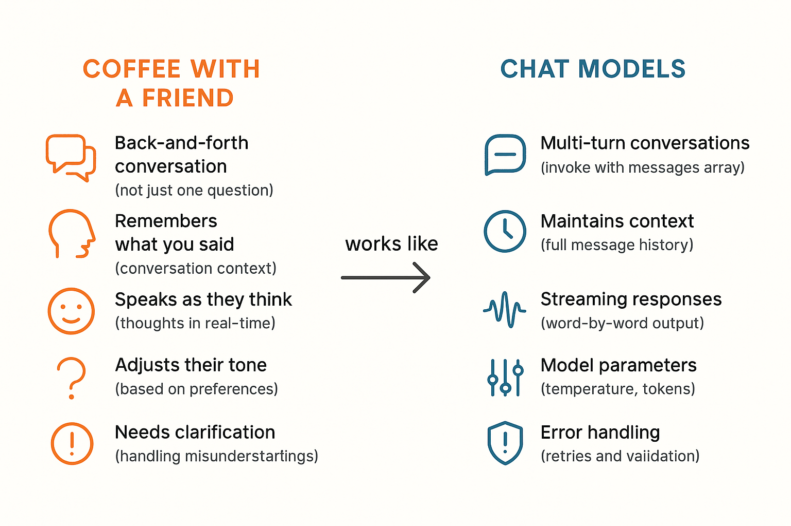
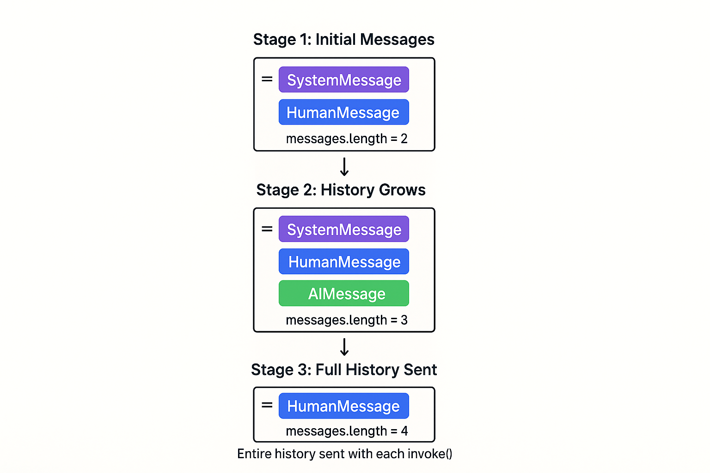
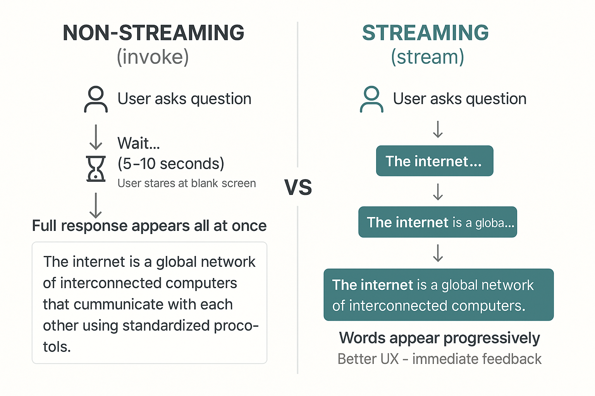
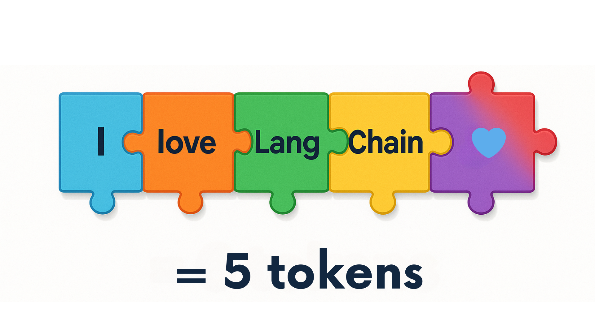
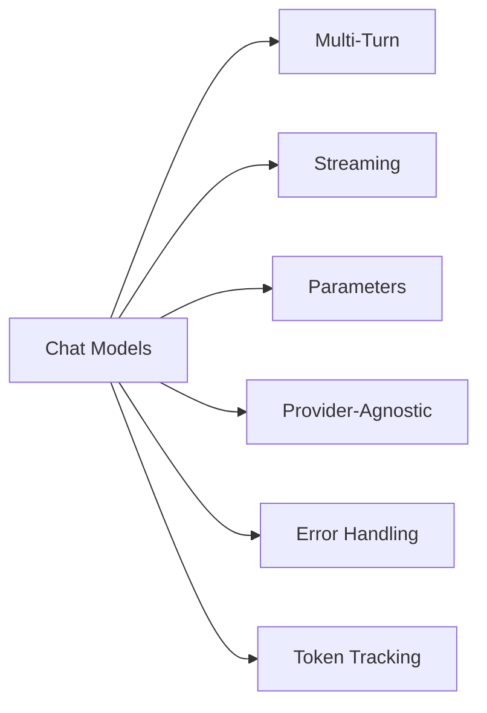

# Chat Models & Basic Interactions (Chat Model & Tương tác cơ bản)

Trong chương này, bạn sẽ học nghệ thuật trò chuyện tự nhiên với AI model. Bạn sẽ học cách duy trì ngữ cảnh hội thoại qua nhiều lượt trao đổi, stream response theo thời gian thực để có trải nghiệm người dùng tốt hơn, và xử lý lỗi một cách khéo léo bằng retry logic. Bạn cũng sẽ khám phá các tham số quan trọng như temperature để kiểm soát độ sáng tạo của AI và hiểu về token usage để tối ưu chi phí.

## Yêu cầu trước

- Đã hoàn thành [Introduction to LangChain](../01-introduction/README.md)

## Mục tiêu học tập

Kết thúc chương này, bạn sẽ có thể:

- ✅ Có hội thoại nhiều lượt (multi-turn) với AI
- ✅ Stream response để có trải nghiệm người dùng tốt hơn
- ✅ Xử lý lỗi một cách khéo léo
- ✅ Kiểm soát hành vi model bằng tham số
- ✅ Hiểu về token usage

---

## 📖 Ví von người bạn hiểu biết (Knowledgeable Friend Analogy)

**Hãy tưởng tượng bạn đang uống cà phê với một người bạn hiểu biết.**

Khi bạn nói chuyện với họ:

- 💬 **Bạn có cuộc trò chuyện qua lại** (không chỉ một câu hỏi)
- 🧠 **Họ nhớ những gì bạn đã nói trước đó** (ngữ cảnh hội thoại)
- 🗣️ **Họ nói khi họ nghĩ** (streaming response)
- 😊 **Họ điều chỉnh giọng điệu** theo sở thích của bạn (tham số model)
- ⚠️ **Đôi khi họ cần làm rõ thêm** (xử lý lỗi)

**Chat model hoạt động tương tự!**

Không giống các câu hỏi đơn lẻ, chat model nổi bật ở:

- Hội thoại nhiều lượt
- Duy trì ngữ cảnh
- Stream response theo thời gian thực
- Thích nghi hành vi

Chương này dạy bạn cách trò chuyện tự nhiên, tương tác với AI.



*Chat model hoạt động như một người bạn hiểu biết - trò chuyện qua lại với ngữ cảnh và khả năng thích nghi*

---

## 💬 Hội thoại nhiều lượt (Multi-Turn)

Trước đây, chúng ta gửi các message đơn lẻ. Nhưng hội thoại thực tế có nhiều lượt trao đổi.

### Cách hoạt động của lịch sử hội thoại

Chat model thực ra không "nhớ" các message trước đó. Thay vào đó, bạn gửi toàn bộ lịch sử hội thoại cùng với mỗi message mới.

**Hãy nghĩ như thế này**: Mỗi lần gửi message, bạn đang cho AI xem toàn bộ luồng hội thoại từ đầu đến giờ.



*Cách danh sách message tích luỹ qua nhiều lượt trao đổi - toàn bộ lịch sử được gửi với mỗi lần invoke()*

---

### Các loại Message trong LangChain

LangChain cung cấp ba loại message cốt lõi để xây dựng hội thoại:

| Loại | Mục đích | Ví dụ |
|------|---------|---------|
| **SystemMessage** | Định hành vi và tính cách AI | `SystemMessage(content="You are a helpful coding tutor")` |
| **HumanMessage** | Input và câu hỏi của user | `HumanMessage(content="What is Python?")` |
| **AIMessage** | Response của AI kèm metadata | Được trả về bởi `model.invoke()` với `content`, `usage_metadata`, `id` |

> **💡 Sắp tới:** Trong [Prompts, Messages, and Structured Outputs](../03-prompts-messages-outputs/README.md), bạn sẽ học khi nào dùng message so với template, và các pattern xây dựng bổ sung để tạo agent.

---

### Tạo Message

Trong khoá học này, chúng ta dùng **message class** để tạo message. Cách tiếp cận này rõ ràng và dễ cho người mới bắt đầu:

```python
from langchain_core.messages import SystemMessage, HumanMessage, AIMessage

messages = [
    SystemMessage(content="You are a helpful assistant"),
    HumanMessage(content="Hello!")
]
```

**Vì sao dùng message class?**

- ✅ **Rõ ràng, tường minh** - Dễ hiểu mỗi message đại diện cho cái gì
- ✅ **Type hint** - Type checker của Python giúp bắt lỗi
- ✅ **Autocomplete tốt hơn** - Editor giúp bạn viết code nhanh hơn
- ✅ **Pattern nhất quán** - Cùng một cách tiếp cận dùng xuyên suốt khoá học

> **💡 Còn cách khác:** LangChain cũng hỗ trợ định dạng dictionary (`{"role": "system", "content": "..."}`) và cú pháp rút gọn dạng chuỗi cho trường hợp đơn giản. Bạn sẽ học về các cú pháp thay thế này và khi nào dùng mỗi cách trong [Prompts, Messages, and Structured Outputs](../03-prompts-messages-outputs/README.md).

---

**Vì sao cần lịch sử message?**

**Hãy tưởng tượng bạn đang xây một chatbot dạy code.** Khi học viên hỏi "What is Python?", rồi hỏi tiếp "Can you show me an example?", LLM cần nhớ họ đang nói về Python. Nếu không có lịch sử hội thoại, nó sẽ không biết "it" hay "an example" đang nói đến cái gì.

**Đó là lúc việc duy trì lịch sử message phát huy tác dụng.** Bằng cách lưu tất cả message trước đó (system, human, và AI) trong một list và gửi toàn bộ lịch sử với mỗi request, AI có thể tham chiếu các phần trước đó của hội thoại và đưa ra response phù hợp ngữ cảnh.

### Ví dụ 1: Hội thoại nhiều lượt

Hãy xem cách duy trì ngữ cảnh hội thoại bằng một list `messages` với `SystemMessage`, `HumanMessage`, và `AIMessage`.

**Code chính bạn sẽ làm việc cùng:**

```python
# Build the conversation list
messages = [
    SystemMessage(content="You are a helpful coding tutor..."),
    HumanMessage(content="What is Python?"),
]

# Get AI response and add it to history
response1 = model.invoke(messages)
messages.append(AIMessage(content=response1.content))

# Continue the conversation - AI remembers context
messages.append(HumanMessage(content="Can you show me a simple example?"))
response2 = model.invoke(messages)
```

**Code**: [`code/01_multi_turn.py`](./code/01_multi_turn.py)
**Chạy**: `python 02-chat-models/code/01_multi_turn.py`

**Code ví dụ:**

```python
from langchain_openai import ChatOpenAI
from langchain_core.messages import HumanMessage, AIMessage, SystemMessage
from dotenv import load_dotenv
import os

load_dotenv()

def main():
    print("💬 Multi-Turn Conversation Example\n")

    model = ChatOpenAI(
        model=os.getenv("AI_MODEL"),
        base_url=os.getenv("AI_ENDPOINT"),
        api_key=os.getenv("AI_API_KEY"),
    )

    # Start with system message and first question
    messages = [
        SystemMessage(content="You are a helpful coding tutor who gives clear, concise explanations."),
        HumanMessage(content="What is Python?"),
    ]

    print("👤 User: What is Python?")

    # First exchange
    response1 = model.invoke(messages)
    print("\n🤖 AI:", response1.content)
    messages.append(AIMessage(content=response1.content))

    # Second exchange - AI remembers the context
    print("\n👤 User: Can you show me a simple example?")
    messages.append(HumanMessage(content="Can you show me a simple example?"))

    response2 = model.invoke(messages)
    messages.append(AIMessage(content=response2.content))
    print("\n🤖 AI:", response2.content)

    # Third exchange - AI still remembers everything
    print("\n👤 User: What are the benefits compared to other languages?")
    messages.append(HumanMessage(content="What are the benefits compared to other languages?"))

    # the 3rd AI response is not added to conversation history since it is the last in the conversation
    response3 = model.invoke(messages)
    print("\n🤖 AI:", response3.content)

    print("\n\n✅ Notice how the AI maintains context throughout the conversation!")
    print(f"📊 Total messages in history: {len(messages)} messages, that include 1 system message, 3 Human messages and 2 AI responses")

if __name__ == "__main__":
    main()
```

> **🤖 Thử với [GitHub Copilot](https://github.com/features/copilot) Chat:** Muốn tìm hiểu thêm về đoạn code này? Mở file này trong editor và hỏi Copilot:
>
> - "Why do we need to append AIMessage to the messages list after each response?"
> - "How would I implement a loop to keep the conversation going with user input?"

### Kết quả mong đợi

Khi chạy ví dụ này bằng `python 02-chat-models/code/01_multi_turn.py`, bạn sẽ thấy hội thoại ba lượt:

```bash
💬 Multi-Turn Conversation Example

👤 User: What is Python?

🤖 AI: [Detailed explanation of Python]

👤 User: Can you show me a simple example?

🤖 AI: [Python code example with explanation]

👤 User: What are the benefits compared to other languages?

🤖 AI: [Explanation of Python benefits]

✅ Notice how the AI maintains context throughout the conversation!
📊 Total messages in history: 6 messages, that include 1 system message, 3 Human messages and 2 AI responses
```

Để ý cách mỗi response tham chiếu ngữ cảnh trước đó - AI "nhớ" vì chúng ta gửi toàn bộ lịch sử message với mỗi lần gọi!

### Cách hoạt động

**Điểm chính**:

1. **List messages chứa toàn bộ hội thoại** - Chúng ta tạo một Python list lưu tất cả message (system, human, và AI)
2. **Mỗi response được thêm vào lịch sử** - Sau khi nhận response, ta append nó vào list messages
3. **AI có thể tham chiếu message trước đó** - Khi hỏi "Can you show me a simple example?", AI biết ta đang nói về Python từ lượt trao đổi đầu tiên
4. **Toàn bộ lịch sử được gửi mỗi lần** - Với mỗi lần gọi `invoke()`, ta gửi toàn bộ lịch sử hội thoại

**Vì sao điều này quan trọng**: AI thực ra không "nhớ" gì cả. Nó chỉ biết những gì có trong list messages bạn gửi. Đây là lý do vì sao duy trì lịch sử hội thoại rất quan trọng cho hội thoại nhiều lượt.

---

## ⚡ Streaming Response

Khi bạn hỏi một câu hỏi phức tạp, việc đợi toàn bộ response có thể cảm thấy chậm. Streaming gửi response từng từ một khi nó được sinh ra.

**Giống như xem một người bạn suy nghĩ thành tiếng** thay vì đợi họ hoàn thành toàn bộ ý nghĩ.

**Bạn đang xây một chatbot nơi user hỏi những câu hỏi phức tạp.** Với response thông thường, user nhìn màn hình trống 5-10 giây tự hỏi có gì đang xảy ra không. Với streaming, họ thấy từ ngữ xuất hiện ngay lập tức - giống như ChatGPT - cảm giác phản hồi nhanh hơn nhiều dù tổng thời gian như nhau.



*Non-streaming hiển thị toàn bộ response cùng lúc sau khi đợi, trong khi streaming hiển thị từ ngữ dần dần để có UX tốt hơn*

### Ví dụ 2: Streaming

Hãy xem cách dùng `.stream()` thay vì `.invoke()` để hiển thị response khi nó đang được sinh ra.

**Code chính bạn sẽ làm việc cùng:**

Khi stream một response, ta dùng định dạng này trong python

```python
# Stream the response instead of waiting for it all at once
for chunk in model.stream("Explain how the internet works in 3 paragraphs."):
    print(chunk.content, end="", flush=True)  # Display immediately without newline
```

**Code**: [`code/02_streaming.py`](./code/02_streaming.py)
**Chạy**: `python 02-chat-models/code/02_streaming.py`

**Đoạn code ví dụ:**

> [!NOTE]
> File thực tế [`02_streaming.py`](./code/02_streaming.py) bao gồm thêm phép đo thời gian và so sánh giữa cách tiếp cận streaming và non-streaming để minh hoạ lợi ích về hiệu năng. Code bên dưới thể hiện khái niệm streaming cốt lõi cho rõ ràng.

```python
from langchain_openai import ChatOpenAI
from dotenv import load_dotenv
import os

load_dotenv()

#function is called streaming_example in 02_streaming.py 
def main():

    print("🤖 AI (streaming):")

    model = ChatOpenAI(
        model=os.getenv("AI_MODEL"),
        base_url=os.getenv("AI_ENDPOINT"),
        api_key=os.getenv("AI_API_KEY")
    )

    # Stream the response chunk by chunk
    for chunk in model.stream("Explain how the internet works in 2 paragraphs."):
        # Write each chunk as it arrives (no newline)
        print(chunk.content, end="", flush=True) 

    print("\n\n✅ Stream complete!")

if __name__ == "__main__":
    main()
  
```

### Kết quả mong đợi

Nếu chỉ chạy hàm `streaming_example` trong `python 02-chat-models/code/02_streaming.py`, bạn sẽ thấy response xuất hiện từng từ một, giống như sau:

```bash
🤖 AI (streaming):
The internet is a global network of networks: countless computers, phones, servers, and other devices are connected by physical links (fiber-optic and copper cables, cell towers and satellites) and by local networks run by Internet Service Providers (ISPs). Data sent between devices is broken into small labeled units called packets, each carrying source and destination addresses (IP addresses). Routers and switches along the path read those addresses and forward packets toward their destination across the fastest available routes, hopping between smaller networks and large backbone lines until the packets arrive and are reassembled.

On top of this physical and routing layer are standard communication rules, or protocols, that make sense of the packets: TCP/IP governs reliable delivery and addressing, DNS translates human domain names into IP addresses, and application protocols like HTTP/HTTPS define how web pages are requested and delivered. When you type a web address, your device asks a DNS server for the site's IP, opens a TCP connection to that server, and uses HTTP/HTTPS to request content, which the server sends back in packets; systems like caching, content delivery networks, and encryption (TLS) help make that process faster and more secure.

✅ Stream complete!
```

Bạn sẽ thấy văn bản xuất hiện dần dần, từng từ một, thay vì cùng lúc!

### Cách hoạt động

**Chuyện gì đang xảy ra**:

1. Chúng ta gọi `model.stream()` thay vì `model.invoke()`
2. Hàm này trả về một generator sinh ra chunk khi chúng được tạo
3. Chúng ta lặp qua từng chunk bằng vòng lặp for
4. Mỗi chunk chứa một phần của response (thường vài từ)
5. Chúng ta dùng `flush=True` để hiển thị text ngay lập tức, tạo hiệu ứng streaming

**Lợi ích của Streaming**:

- Trải nghiệm người dùng tốt hơn (phản hồi tức thì)
- Cảm giác phản hồi nhanh hơn - user thấy tiến trình ngay lập tức
- User có thể bắt đầu đọc trong khi AI vẫn đang sinh phần còn lại
- Cải thiện hiệu năng cảm nhận dù tổng thời gian như nhau

**Khi nào nên dùng**:

- ✅ Response dài (bài viết, giải thích, code)
- ✅ Chatbot hướng người dùng và ứng dụng tương tác
- ✅ Khi bạn muốn hiển thị tiến trình cho user
- ❌ Khi bạn cần toàn bộ response trước (parsing, validation, post-processing)

> **🤖 Thử với [GitHub Copilot](https://github.com/features/copilot) Chat:** Muốn tìm hiểu thêm về đoạn code này? Mở [`02_streaming.py`](./code/02_streaming.py) trong editor và hỏi Copilot:
>
> - "How does the for loop work with the stream generator?"
> - "Can I collect all chunks into a single string while streaming?"

> **💡 Bonus**: Để theo dõi token usage khi streaming, một số provider hỗ trợ bao gồm usage metadata trong chunk cuối cùng. Điều này tuỳ thuộc vào provider - kiểm tra tài liệu của provider để biết có hỗ trợ hay không.

---

## 🎛️ Tham số Model (Model Parameters)

Bạn có thể kiểm soát cách LLM phản hồi bằng cách điều chỉnh tham số. Các tham số này có thể khác nhau tuỳ provider/model nên luôn kiểm tra tài liệu.

### 2 tham số chính

#### i. Temperature (0.0 - 2.0)

Temperature kiểm soát độ ngẫu nhiên và sáng tạo:

- **0.0 = Deterministic (xác định)**: Cùng câu hỏi → Cùng câu trả lời
  - Dùng cho: Sinh code, câu trả lời dựa trên sự thật
- **1.0 = Cân bằng** (mặc định): Kết hợp giữa nhất quán và đa dạng
  - Dùng cho: Hội thoại thông thường
- **2.0 = Sáng tạo**: Một số model hỗ trợ đến 2.0 cho response ngẫu nhiên và sáng tạo hơn nhưng thường khó đoán hơn
  - Dùng cho: Viết sáng tạo, brainstorm

> **⚠️ Khác biệt giữa Provider và Model**:
>
> - **GitHub Models (OpenAI)**: Hỗ trợ 0.0 đến 2.0 cho hầu hết model
> - **Microsoft Foundry**: Thường giới hạn temperature ở 0.0-1.0 tuỳ model
> - **Một số model**: Có thể chỉ hỗ trợ giá trị temperature mặc định (1) và từ chối giá trị khác
>
> Code demo temperature bao gồm xử lý lỗi để bỏ qua khéo léo các giá trị không được hỗ trợ, vậy nên bạn có thể chạy nó với model bất kỳ mà không bị crash.

#### ii. Max Tokens

**Token là gì?** Token là đơn vị cơ bản của văn bản mà AI model xử lý. Hãy nghĩ về chúng như các mảnh của từ - khoảng 1 token ≈ 4 ký tự hoặc ¾ từ. Ví dụ, "Hello world!" khoảng 3 token.

Giới hạn độ dài response:

- Kiểm soát response có thể dài đến đâu
- Đặt `max_tokens=100` giới hạn response còn khoảng 75 từ
- Ngăn chi phí phát sinh ngoài kiểm soát bằng cách giới hạn độ dài output



*Minh hoạ cách văn bản được tách thành token - mỗi mảnh ghép đại diện một token*

**Bạn cần sinh ra các câu mở đầu truyện sáng tạo, nhưng không chắc nên dùng giá trị `temperature` nào.** Nên dùng 0 (deterministic), 1 (cân bằng), hay 2 (sáng tạo)? Cách tốt nhất để hiểu là test cùng một prompt ở các temperature khác nhau và xem response thay đổi ra sao. Lưu ý rằng một số model có thể không hỗ trợ tất cả giá trị temperature.

### Ví dụ 3: Tham số Model

Hãy xem cách kiểm soát độ sáng tạo bằng cách điều chỉnh tham số `temperature` và độ dài response bằng cách điều chỉnh tham số `max_tokens` trong `ChatOpenAI`.

**Code chính bạn sẽ làm việc cùng:**

Với temperature:

```python
temperatures = [0, 1, 2]

for temp in temperatures:
    # Create model with specific temperature
    model = ChatOpenAI(
        model=os.getenv("AI_MODEL"),
        temperature=temp,  # Controls randomness/creativity
        # ... other config
    )

    # Try same prompt twice to see variation
    response = model.invoke(prompt)
```

Với max tokens:

```python
for max_tokens in token_limits:

    model = ChatOpenAI(
        model=os.getenv("AI_MODEL"),
        max_tokens=max_tokens,
        # ... other config
    )

    # get character count
    response = model.invoke(prompt)
```

**Code**: [`code/03_parameters.py`](./code/03_parameters.py)
**Chạy**: `python 02-chat-models/code/03_parameters.py`

**Code ví dụ:**

```python
from langchain_openai import ChatOpenAI
from dotenv import load_dotenv
import os

load_dotenv()

def temperature_comparison():
    prompt = "Write a creative opening line for a sci-fi story about time travel."
    temperatures = [0, 1, 2]

    for temp in temperatures:
        print(f"\n🌡️ Temperature: {temp}")
        print("-" * 80)

        model = ChatOpenAI(
            model=os.getenv("AI_MODEL"),
            base_url=os.getenv("AI_ENDPOINT"),
            api_key=os.getenv("AI_API_KEY"),
            temperature=temp,
        )

        try:
            for i in range(1, 3):
                response = model.invoke(prompt)
                print(f"  Try {i}: {response.content}")
        except Exception as e:
            # Some models may not support certain temperature values
            print(f"  ⚠️  This model doesn't support temperature={temp}. Skipping...")
            print(f"  💡 Error: {e}")

    print("\n💡 General Temperature Guidelines:")
    print("   - Lower values (0-0.3): More deterministic, consistent responses")
    print("   - Medium values (0.7-1.0): Balanced creativity and consistency")
    print("   - Higher values (1.5-2.0): More creative and varied responses")

if __name__ == "__main__":
    temperature_comparison()
```

> **🤖 Thử với [GitHub Copilot](https://github.com/features/copilot) Chat:** Muốn tìm hiểu thêm về đoạn code này? Mở file này trong editor và hỏi Copilot:
>
> - "What temperature value should I use for a customer service chatbot?"
> - "How do I add the max_tokens parameter to limit response length?"

### Kết quả mong đợi

Khi chạy ví dụ này bằng `python 02-chat-models/code/03_parameters.py`, kết quả phụ thuộc vào model của bạn:

**Với model hỗ trợ mọi giá trị temperature:**

```bash
🌡️ Temperature: 0
────────────────────────────────────────────────────────────
  Try 1: "In the year 2157, humanity had finally broken free from the confines of Earth."
  Try 2: "In the year 2157, humanity had finally broken free from the confines of Earth."

🌡️ Temperature: 1
────────────────────────────────────────────────────────────
  Try 1: "The stars whispered secrets through the observation deck's reinforced glass, but Captain Reeves had stopped listening years ago."
  Try 2: "Time folded like origami in Dr. Chen's laboratory..."

🌡️ Temperature: 2
────────────────────────────────────────────────────────────
  Try 1: "Zyx-9 flickered into existence at precisely the wrong moment—right between the temporal rift and Dr. Kwan's morning coffee."
  Try 2: "The chronometer screamed in colors that hadn't been invented yet..."

💡 General Temperature Guidelines:
   - Lower values (0-0.3): More deterministic, consistent responses
   - Medium values (0.7-1.0): Balanced creativity and consistency
   - Higher values (1.5-2.0): More creative and varied responses
```

**Với model chỉ hỗ trợ temperature mặc định (như gpt-4-mini):**

```bash
🌡️ Temperature: 0
────────────────────────────────────────────────────────────
  ⚠️  This model doesn't support temperature=0. Skipping...
  💡 Error: 400 Unsupported value: 'temperature' does not support 0 with this model.

🌡️ Temperature: 1
────────────────────────────────────────────────────────────
  Try 1: On the morning the calendar unstitched itself, I reached into yesterday and came out with a photograph of tomorrow.
  Try 2: The first time I traveled back, I found my future self waiting with tired eyes and a list of instructions on how not to become him.

🌡️ Temperature: 2
────────────────────────────────────────────────────────────
  ⚠️  This model doesn't support temperature=2. Skipping...
  💡 Error: 400 Unsupported value: 'temperature' does not support 2 with this model.
```

> **⚠️ Hành vi riêng theo model**: Việc xử lý lỗi giúp script chạy thành công bất kể model của bạn hỗ trợ giá trị temperature nào. Điều này minh hoạ cách ứng dụng AI thực tế cần xử lý khéo léo các ràng buộc tham số.

### Cách hoạt động

**Tham số Temperature**:

1. Chúng ta dùng cùng một prompt với ba mức temperature khác nhau (0, 1, 2)
2. Code bọc mỗi lần gọi model trong try-except để xử lý giá trị temperature không được hỗ trợ
3. Nếu model không hỗ trợ một temperature cụ thể, nó hiển thị cảnh báo và chuyển sang giá trị tiếp theo
4. Temperature 0 cho ra response dễ đoán nhất (khi được hỗ trợ)
5. Temperature 1 (mặc định) cân bằng giữa nhất quán và sáng tạo
6. Temperature 2 cho ra các biến thể khác thường và sáng tạo hơn

**Tham số Max Tokens**:

1. Script cũng minh hoạ tham số `max_tokens`, giới hạn độ dài response
2. Giới hạn thấp (50) thường cho ra response chưa hoàn chỉnh, bị cắt ngang
3. Giới hạn cao (500) cho phép response đầy đủ, chi tiết

---

## 🔌 Khởi tạo không phụ thuộc Provider (Provider-Agnostic Initialization)

LangChain cung cấp `init_chat_model()` để khởi tạo không phụ thuộc provider. Hãy nghĩ nó giống như adapter nguồn điện đa năng - thay vì có sạc riêng cho mỗi thiết bị (Microsoft Foundry, OpenAI, Anthropic, Google), bạn có một adapter dùng được cho tất cả.

### Vì sao dùng init_chat_model()?

- 🔄 **Dễ dàng chuyển provider**: Đổi provider bằng cách cập nhật một chuỗi duy nhất
- 🏗️ **Xây dựng framework**: Tạo thư viện hỗ trợ nhiều provider
- 🎯 **Interface thống nhất**: Cùng một pattern code hoạt động trên mọi provider
- ✅ **Hỗ trợ Microsoft Foundry**: Hoạt động với Microsoft Foundry và GitHub Models qua `langchain-azure-ai`

### Thiết lập LangChain Azure AI

Với Azure AI Foundry và GitHub Models, dùng package `langchain-azure-ai`. Package này đã được cài sẵn trong môi trường dev của bạn qua file requirements.txt, nhưng đây là lệnh bạn có thể chạy để cài riêng:

```bash
pip install langchain-azure-ai
```

**Định dạng Endpoint**:

Endpoint `\models` là bắt buộc khi dùng LangChain Azure AI.

| Provider | Định dạng Endpoint | Ví dụ |
|----------|-----------------|---------|
| GitHub Models | Hoạt động nguyên trạng | `https://models.inference.ai.azure.com` |
| Microsoft Foundry | Dùng endpoint `/models` | `https://your-resource.openai.azure.com/models` |

> **⚠️ Lưu ý**: LangChain Azure AI yêu cầu định dạng endpoint `/models`, không phải `/openai/v1`. Code ví dụ tự động chuyển đổi endpoint `/openai/v1` sang định dạng `/models` nếu cần.

### Ví dụ 4: Khởi tạo không phụ thuộc Provider

Ví dụ này cho thấy cách dùng `init_chat_model()` với Azure AI theo cách tiếp cận sạch, không phụ thuộc provider.

**Code chính bạn sẽ làm việc cùng:**

```python
from langchain.chat_models import init_chat_model

# Set environment variables for Azure AI
os.environ["AZURE_AI_ENDPOINT"] = os.getenv("AI_ENDPOINT")
os.environ["AZURE_AI_CREDENTIAL"] = os.getenv("AI_API_KEY")

# Initialize using azure_ai provider prefix
model = init_chat_model("azure_ai:gpt-5-mini")

response = model.invoke("What is LangChain?")
```

**Code**: [`code/04_init_chat_model.py`](./code/04_init_chat_model.py)
**Chạy**: `python 02-chat-models/code/04_init_chat_model.py`

**Code ví dụ:**

```python
from langchain.chat_models import init_chat_model
from langchain_core.messages import HumanMessage
from dotenv import load_dotenv
import os

load_dotenv()

def main():
    print("🔌 Provider-Agnostic Initialization with Azure AI\n")

    # Set environment variables required by LangChain Azure AI
    os.environ["AZURE_AI_ENDPOINT"] = os.getenv("AI_ENDPOINT", "")
    os.environ["AZURE_AI_CREDENTIAL"] = os.getenv("AI_API_KEY", "")

    model_name = os.getenv("AI_MODEL", "gpt-5-mini")

    # Initialize model using the azure_ai provider prefix
    model = init_chat_model(f"azure_ai:{model_name}")

    response = model.invoke([
        HumanMessage(content="What is LangChain in one sentence?")
    ])

    print("✅ Response:", response.content)

if __name__ == "__main__":
    main()
```

> **🤖 Thử với [GitHub Copilot](https://github.com/features/copilot) Chat:** Muốn tìm hiểu thêm về đoạn code này? Mở file này trong editor và hỏi Copilot:
>
> - "How do I switch from Azure AI to Anthropic using init_chat_model?"
> - "What environment variables does langchain-azure-ai need?"

### Kết quả mong đợi

Khi chạy ví dụ này bằng `python 02-chat-models/code/04_init_chat_model.py`, bạn sẽ thấy:

```bash
🔌 Provider-Agnostic Initialization with LangChain Azure AI

============================================================

=== init_chat_model() with Azure AI ===

📝 Note: Converted endpoint from /openai/v1 to /models format
🔗 Using endpoint: https://your-resource.openai.azure.com/models
🤖 Using model: gpt-5-mini

✅ Response: LangChain is a framework for developing applications powered by 
language models, providing tools and abstractions for building chains, agents, 
and retrieval systems.

=== Provider Switching Concepts ===

init_chat_model() makes switching between providers simple:

  # Azure AI (recommended for this course)
  model = init_chat_model("azure_ai:gpt-5-mini")

  # Standard OpenAI
  model = init_chat_model("openai:gpt-5-mini")

  # Anthropic
  model = init_chat_model("anthropic:claude-3-5-sonnet-20241022")

  # Google
  model = init_chat_model("google-genai:gemini-pro")

💡 Same interface, different providers - just change the model string!
```

> **📝 Lưu ý**: Nếu bạn dùng Azure AI Foundry với endpoint `/openai/v1`, script tự động chuyển nó sang định dạng `/models` mà `langchain-azure-ai` yêu cầu.

### Cách hoạt động

**Chuyện gì đang xảy ra**:

1. **Chuyển đổi endpoint**: Nếu endpoint kết thúc bằng `/openai/v1`, nó tự động được chuyển sang `/models`
2. **Thiết lập environment**: Đặt `AZURE_AI_ENDPOINT` và `AZURE_AI_CREDENTIAL` từ file `.env`
3. **Tiền tố provider**: Dùng định dạng `azure_ai:<model_name>` để chỉ định provider Azure AI
4. **Interface thống nhất**: Cùng phương thức `invoke()` hoạt động bất kể provider
5. **Dễ chuyển đổi**: Đổi provider bằng cách cập nhật chuỗi model

**Định dạng chuỗi Provider**:

| Provider | Định dạng | Ví dụ |
|----------|--------|--------|
| Azure AI | `azure_ai:<model>` | `azure_ai:gpt-5-mini` |
| OpenAI | `openai:<model>` | `openai:gpt-4` |
| Anthropic | `anthropic:<model>` | `anthropic:claude-3-5-sonnet` |
| Google | `google-genai:<model>` | `google-genai:gemini-pro` |

Microsoft Foundry và GitHub models đều cung cấp quyền truy cập dựng sẵn đến model OpenAI, Anthropic, DeepSeek, Qwen, Mistral và nhiều hơn nữa! Chỉ cần đổi tên model bạn dùng `azure_ai:claude-4-5-sonnet`

---

## 🛡️ Xử lý lỗi với Retry tích hợp sẵn

Lệnh gọi API có thể thất bại do rate limit, lỗi mạng, hoặc sự cố dịch vụ tạm thời. LangChain cung cấp logic retry tích hợp sẵn với exponential backoff.

### Các lỗi phổ biến bạn sẽ gặp

- **429 Too Many Requests**: Vượt rate limit (phổ biến nhất với gói miễn phí)
- **401 Unauthorized**: API key không hợp lệ
- **500 Server Error**: Sự cố tạm thời từ provider
- **Network timeout**: Vấn đề kết nối

### Ví dụ 5: Dùng Retry Logic tích hợp sẵn

Thay vì tự cài đặt retry logic thủ công, dùng phương thức `with_retry()` của LangChain — tự động xử lý exponential backoff:

**Code chính bạn sẽ làm việc cùng:**

```python
model = ChatOpenAI(
    model=os.getenv("AI_MODEL"),
    # ... other config
)

# Add automatic retry logic with exponential backoff
model_with_retry = model.with_retry(stop_after_attempt=3)  # Will retry up to 3 times

# Use it just like the regular model - retries happen automatically
response = model_with_retry.invoke("What is LangChain?")
```

**Code**: [`code/05_error_handling.py`](./code/05_error_handling.py)
**Chạy**: `python 02-chat-models/code/05_error_handling.py`

**Code ví dụ:**

```python
from langchain_openai import ChatOpenAI
from dotenv import load_dotenv
import os

load_dotenv()

def main():
    model = ChatOpenAI(
        model=os.getenv("AI_MODEL"),
        base_url=os.getenv("AI_ENDPOINT"),
        api_key=os.getenv("AI_API_KEY"),
    )

    # Use built-in retry logic - automatically handles 429 errors
    model_with_retry = model.with_retry(stop_after_attempt=3)  # Max retry attempts

    try:
        print("Making API call with automatic retry...\n")
        response = model_with_retry.invoke("What is LangChain?")
        print("✅ Success!")
        print(response.content)
    except Exception as error:
        print(f"❌ Error: {error}")

        # Handle specific error types
        error_msg = str(error)
        if "429" in error_msg:
            print("\n💡 Rate limit hit. Try again in a few moments.")
        elif "401" in error_msg:
            print("\n💡 Check your API key in .env file")

if __name__ == "__main__":
    main()
```

> **🤖 Thử với [GitHub Copilot](https://github.com/features/copilot) Chat:** Muốn tìm hiểu thêm về đoạn code này? Mở file này trong editor và hỏi Copilot:
>
> - "How does with_retry() implement exponential backoff?"
> - "Can I customize the retry delay and max attempts with with_retry()?"

### Cách hoạt động

**Lợi ích của Retry tích hợp sẵn**:

- ✅ **Exponential backoff tự động**: Đợi lâu hơn giữa mỗi lần retry (1s, 2s, 4s...)
- ✅ **Hoạt động với mọi component LangChain**: Tương thích với agent, RAG, và chain
- ✅ **Xử lý lỗi 429 khéo léo**: Tự động retry lỗi rate limit
- ✅ **Ít code hơn**: Không cần vòng lặp retry thủ công

**Chuyện gì đang xảy ra**:

1. `with_retry()` bọc model với retry logic
2. Nếu request thất bại (429, 500, timeout), nó tự động retry
3. Exponential backoff tăng thời gian đợi giữa các lần retry
4. Sau số lần thử tối đa, nó throw lỗi để bạn xử lý

**Vì sao dùng retry tích hợp sẵn?**

- Code đơn giản hơn - không cần vòng lặp thủ công
- Đã được kiểm chứng trong production - xử lý các edge case
- Hoạt động liền mạch khi bạn tiến đến agent và RAG ở các chương sau
- Chuẩn hoá xuyên suốt hệ sinh thái LangChain

> **⚠️ Hạn chế đã biết**: `with_retry()` hiện có vấn đề với streaming (`.stream()`). Retry logic hoạt động đúng với `.invoke()` nhưng có thể không thực thi với `.stream()`. Với các thao tác quan trọng cần retry logic, dùng `.invoke()` thay vì `.stream()`.

---

## 📊 Theo dõi Token và Chi phí

Token vận hành AI model, và chúng ảnh hưởng trực tiếp đến chi phí và hiệu năng. Hãy theo dõi chúng!

### Ví dụ 6: Theo dõi Token Usage

Ví dụ này cho thấy cách theo dõi token usage để ước tính chi phí và giám sát, giúp bạn tối ưu chi phí ứng dụng AI.

**Code chính bạn sẽ làm việc cùng:**

```python
# Make a request
response = model.invoke("Explain what Python is in 2 sentences.")

# Extract token usage from the response metadata
usage = response.usage_metadata

print(f"  Prompt tokens:     {usage.get('input_tokens')}")   # Your input
print(f"  Completion tokens: {usage.get('output_tokens')}")  # AI's response
print(f"  Total tokens:      {usage.get('total_tokens')}")   # Total cost basis
```

**Code**: [`code/06_token_tracking.py`](./code/06_token_tracking.py)
**Chạy**: `python 02-chat-models/code/06_token_tracking.py`

**Code ví dụ:**

```python
from langchain_openai import ChatOpenAI
from dotenv import load_dotenv
import os

load_dotenv()

def track_token_usage():
    model = ChatOpenAI(
        model=os.getenv("AI_MODEL"),
        base_url=os.getenv("AI_ENDPOINT"),
        api_key=os.getenv("AI_API_KEY")
    )

    print("📊 Token Usage Tracking Example\n")

    # Make a request
    response = model.invoke("Explain what Python is in 2 sentences.")

    # Extract token usage from metadata
    usage = response.usage_metadata

    if usage:
        print("Token Breakdown:")
        print(f"  Prompt tokens:     {usage.get('input_tokens', 'N/A')}")
        print(f"  Completion tokens: {usage.get('output_tokens', 'N/A')}")
        print(f"  Total tokens:      {usage.get('total_tokens', 'N/A')}")
    else:
        print("⚠️  Token usage information not available in response metadata.")

    print("\n📝 Response:")
    print(response.content)

if __name__ == "__main__":
    track_token_usage()
```

> **🤖 Thử với [GitHub Copilot](https://github.com/features/copilot) Chat:** Muốn tìm hiểu thêm về đoạn code này? Mở file này trong editor và hỏi Copilot:
>
> - "How can I track token usage across multiple API calls in a conversation?"
> - "How would I calculate the cost based on token usage?"

### Kết quả mong đợi

Khi chạy ví dụ này bằng `python 02-chat-models/code/06_token_tracking.py`, bạn sẽ thấy:

```
📊 Token Usage Tracking Example

Token Breakdown:
  Prompt tokens:     16
  Completion tokens: 216
  Total tokens:      232

📝 Response:
Python is a high-level, interpreted programming language known for its clean syntax and 
readability, making it ideal for beginners and experienced developers alike. It supports 
multiple programming paradigms and has a vast ecosystem of libraries for web development, 
data science, machine learning, and automation.
```

### Cách hoạt động

**Chuyện gì đang xảy ra**:

1. **Gọi API**: Gửi prompt đến model
2. **Trích xuất metadata**: Lấy `response.usage_metadata`
3. **Tính chi phí**: Nhân số token với đơn giá của provider
4. **Theo dõi chi tiêu**: Giám sát chi phí trên mỗi request

**Điểm chính**:

- **Prompt token**: Input của bạn (câu hỏi + lịch sử hội thoại)
- **Completion token**: Output của AI (response)
- **Total token**: Tổng cả hai (cơ sở tính chi phí)

**Vì sao theo dõi token?**

- 💰 **Giám sát chi phí**: Hiểu chi tiêu API của bạn
- ⚡ **Hiệu năng**: Nhiều token hơn = response chậm hơn
- 📊 **Tối ưu**: Xác định các truy vấn tốn kém
- 🎯 **Lập ngân sách**: Dự đoán chi phí cho production

### Chiến lược tối ưu chi phí

Hai chiến lược chính để giảm chi phí:

**1. Giới hạn độ dài response bằng max_tokens:**

```python
model = ChatOpenAI(
    model=os.getenv("AI_MODEL"),
    base_url=os.getenv("AI_ENDPOINT"),
    api_key=os.getenv("AI_API_KEY"),
    max_tokens=1000  # Cap the response length
)
```

**2. Cắt bớt lịch sử hội thoại:**

```python
# Keep only recent messages to reduce input tokens
recent_messages = messages[-10:]
response = model.invoke(recent_messages)
```

**Vì sao điều này quan trọng**: Model có giới hạn context window (4K-200K+ token), nhiều token hơn = chi phí cao hơn và response chậm hơn.

---

## 🗺️ Sơ đồ khái niệm

Chương này bao quát các khối xây dựng thiết yếu để tạo hội thoại AI tương tác:



*Nắm vững các khái niệm này để xây dựng ứng dụng AI vững chắc.*

---

## 🎓 Điểm chính cần nhớ

- **Hội thoại nhiều lượt**: Gửi toàn bộ lịch sử message với mỗi lần gọi
- **Streaming**: Hiển thị response khi nó đang được sinh ra để có UX tốt hơn
- **Temperature**: Kiểm soát độ ngẫu nhiên (0 = nhất quán, 2 = sáng tạo)
- **Provider-agnostic**: Dùng `init_chat_model()` với `langchain-azure-ai` để dễ dàng đổi provider
- **Xử lý lỗi**: Luôn dùng try-except và cài đặt retry
- **Theo dõi token**: Giám sát usage và ước tính chi phí để lập ngân sách
- **Tối ưu chi phí**: Chọn model phù hợp, giới hạn response, cache kết quả
- **Token**: Ảnh hưởng chi phí và giới hạn (1 token ≈ 4 ký tự)
- **Context window**: Model chỉ có thể xử lý một lượng lịch sử hội thoại giới hạn

---

## 🏆 Bài tập

Sẵn sàng luyện tập chưa? Hoàn thành các thử thách trong [assignment.md](./assignment.md)!

Bài tập gồm:

1. **Multi-Turn Chatbot** - Xây dựng bot hội thoại có lịch sử
2. **Temperature Experiment** (Bonus) - So sánh độ sáng tạo ở các mức thiết lập khác nhau

---

## 📚 Tài nguyên bổ sung

- [LangChain Chat Models Documentation](https://python.langchain.com/docs/integrations/chat/)
- [Streaming Guide](https://python.langchain.com/docs/how_to/streaming/)
- [Model Parameters](https://platform.openai.com/docs/api-reference/chat/create)

💡 **Muốn thêm ví dụ?** Xem thư mục [samples/](./samples) để có thêm code ví dụ bao gồm streaming response, xử lý lỗi, và theo dõi token!

---

## 🚀 Bước tiếp theo?

Làm tốt lắm! Bạn đã học cách tương tác với AI chat model — từ thực hiện lệnh gọi cơ bản đến xử lý hội thoại có lịch sử message. Giờ bạn có thể trò chuyện qua lại với AI!

### Từ hội thoại cơ bản đến Output có kiểm soát

Bạn có thể trò chuyện với AI, nhưng làm sao để kiểm soát nó nói gì và nhận được response đáng tin cậy, có cấu trúc?

Tiếp theo, bạn sẽ học cách kiểm soát các hội thoại đó bằng prompt và nhận output có cấu trúc, đáng tin cậy mà code của bạn có thể phụ thuộc vào!

---

## 🗺️ Điều hướng

[← Trước: Introduction](../01-introduction/README.md) | [Về trang chính](../README.md) | [Tiếp: Prompts, Messages & Outputs →](../03-prompts-messages-outputs/README.md)

---

## 💬 Có thắc mắc hoặc gặp khó khăn?

Nếu gặp khó khăn hoặc có câu hỏi khi xây dựng ứng dụng AI, hãy tham gia:

[](https://aka.ms/foundry/discord)

Nếu bạn có góp ý sản phẩm hoặc gặp lỗi khi xây dựng, hãy truy cập:

[Microsoft Foundry Developer Forum](https://aka.ms/foundry/forum)
