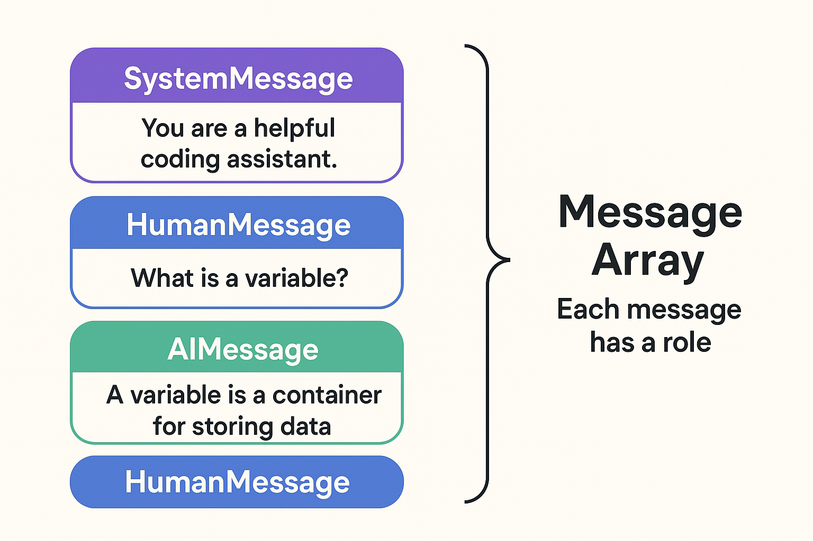
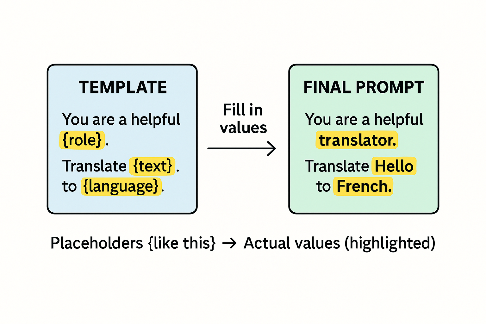
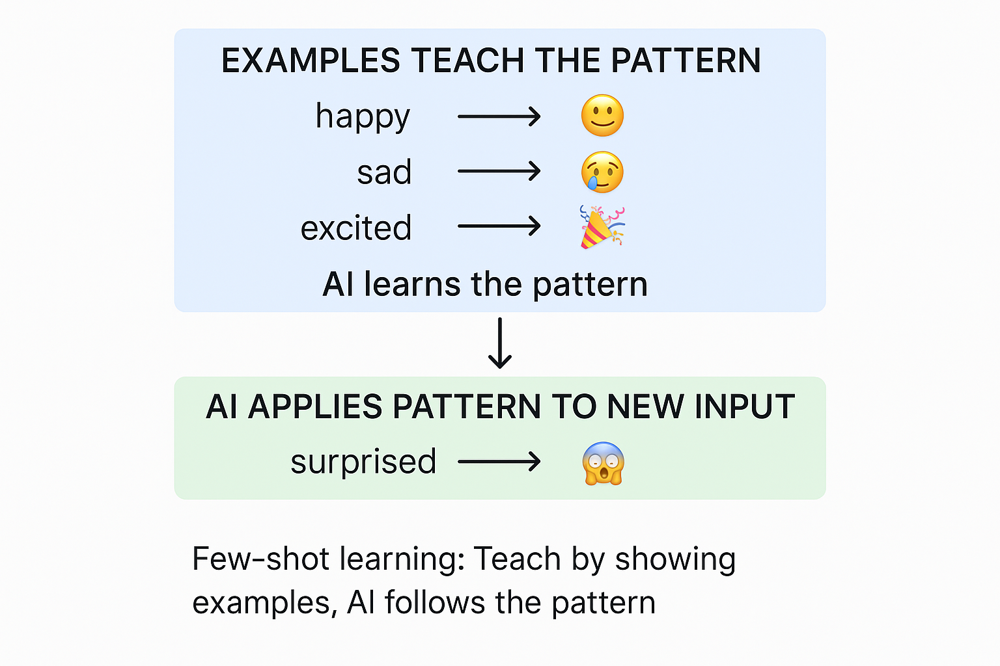
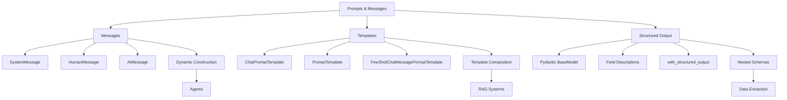

# Prompts, Messages, and Structured Outputs (Prompt, Message, và Output có cấu trúc)

Trong chương này, bạn sẽ học ba kỹ thuật thiết yếu để làm việc với LLM trong LangChain: **message**, **prompt template**, và **structured output**. Hiểu các kỹ thuật này rất quan trọng, vì ứng dụng LangChain hiện đại chọn cách tiếp cận khác nhau tuỳ use case. Message cung cấp cách xây dựng linh động cho workflow linh hoạt như agent, template cung cấp prompt tái sử dụng được với thay thế biến, và structured output đảm bảo trích xuất dữ liệu type-safe.

Chương này chuẩn bị cho bạn cả **agent** (dùng message) và **hệ thống RAG** (dùng template).

## Yêu cầu trước

- Đã hoàn thành [Chat Models & Basic Interactions](../02-chat-models/README.md)

## 🎯 Mục tiêu học tập

Kết thúc chương này, bạn sẽ có thể:

- ✅ Hiểu khi nào dùng message so với template
- ✅ Xây dựng mảng message cho workflow agent
- ✅ Tạo prompt template tái sử dụng cho hệ thống RAG
- ✅ Dùng biến và nội dung động trong prompt
- ✅ Cài đặt few-shot prompting (dạy bằng ví dụ)
- ✅ Sinh structured output với Pydantic model
- ✅ Chọn cách tiếp cận đúng cho use case của bạn

---

## 🎯 Khung quyết định: Message vs Template

**Trước khi vào code, hãy hiểu khi nào dùng mỗi cách tiếp cận**:


| Cách tiếp cận | Dùng cho | Chương |
|----------|---------|---------|
| **Messages** | Agent, workflow động, suy luận nhiều bước, tích hợp tool | [Getting Started with Agents](../05-agents/README.md) |
| **Templates** | Prompt tái sử dụng, thay thế biến, tính nhất quán, hệ thống RAG | [Documents, Embeddings & Semantic Search](../07-documents-embeddings-semantic-search/README.md) |

**Cả hai cách tiếp cận đều có giá trị**: Message cho workflow động, template cho khả năng tái sử dụng và tính nhất quán.

---

## PHẦN 1: Prompting dựa trên Message

Mảng message là nền tảng của hệ thống agent trong LangChain. Khi làm việc với agent, bạn sẽ dùng mảng message làm input và output.

### Ví von hội thoại (Conversation Analogy)



Hãy nghĩ về việc giao tiếp với AI giống như có một cuộc hội thoại. Giống hội thoại giữa người với người, có nhiều loại message khác nhau:

- **System Message**: "Luật chơi" - giống như nói với ai đó trước cuộc hội thoại rằng họ đang đóng vai một nhân vật
- **Human Message**: Những gì bạn nói
- **AI Message**: Những gì AI phản hồi

### Tham khảo nhanh: Các loại Message

| Loại Message | Mục đích | Ví dụ |
|-------------|---------|---------|
| `SystemMessage` | Định hành vi và ngữ cảnh AI | "You are a helpful Python tutor" |
| `HumanMessage` | Input của user | "How do I write a for loop?" |
| `AIMessage` | Response của AI (cho lịch sử hội thoại) | "Here's how you write a for loop..." |

### Ví dụ 1: Message vs Template

Ví dụ nền tảng này so sánh song song cả hai cách tiếp cận, cho bạn thấy khác biệt chính về cú pháp và cách dùng.

**Code**: [`code/01_messages_vs_templates.py`](./code/01_messages_vs_templates.py)
**Chạy**: `python 03-prompts-messages-outputs/code/01_messages_vs_templates.py`

**Code ví dụ:**

```python
from langchain_openai import ChatOpenAI
from langchain_core.messages import HumanMessage, SystemMessage
from langchain_core.prompts import ChatPromptTemplate
from dotenv import load_dotenv
import os

load_dotenv()

def main():
    model = ChatOpenAI(
        model=os.getenv("AI_MODEL"),
        base_url=os.getenv("AI_ENDPOINT"),
        api_key=os.getenv("AI_API_KEY"),
    )

    # APPROACH 1: Messages (Dynamic - great for agents)
    print("APPROACH 1: Message Arrays\n")

    messages = [
        SystemMessage(content="You are a helpful translator."),
        HumanMessage(content="Translate 'Hello, world!' to French"),
    ]

    message_response = model.invoke(messages)
    print("Response:", message_response.content)

    # APPROACH 2: Templates (Reusable - great for RAG)
    print("\nAPPROACH 2: Templates\n")

    template = ChatPromptTemplate.from_messages([
        ("system", "You are a helpful translator."),
        ("human", "Translate '{text}' to {language}"),
    ])

    template_chain = template | model
    template_response = template_chain.invoke({
        "text": "Hello, world!",
        "language": "French",
    })

    print("Response:", template_response.content)

if __name__ == "__main__":
    main()
```

### Kết quả mong đợi

```text
APPROACH 1: Message Arrays

Response: "Bonjour, le monde !"

APPROACH 2: Templates

Response: "Bonjour, le monde !"
```

### Cách hoạt động

**Message Arrays**:
- Xây dựng trực tiếp bằng `SystemMessage()` và `HumanMessage()`
- Truyền trực tiếp vào `model.invoke(messages)`
- Không có templating hay thay thế biến
- Được agent trong LangChain dùng cho workflow động

**Templates**:
- Tạo bằng `ChatPromptTemplate.from_messages()`
- Dùng biến như `{text}` và `{language}`
- Pipe vào model bằng toán tử `|`: `template | model`
- Có giá trị cho khả năng tái sử dụng và tính nhất quán trong hệ thống RAG

---

### Ví dụ 2: Xây dựng Message động

Học cách xây dựng mảng message bằng code và dùng few-shot prompting với message.

**Code**: [`code/02_message_construction.py`](./code/02_message_construction.py)
**Chạy**: `python 03-prompts-messages-outputs/code/02_message_construction.py`

**Code ví dụ:**

```python
from langchain_openai import ChatOpenAI
from langchain_core.messages import HumanMessage, SystemMessage, AIMessage, BaseMessage
from dotenv import load_dotenv
import os
from typing import List

load_dotenv()

def create_conversation(role: str, examples: List[dict], new_question: str) -> List[BaseMessage]:
    """Build message arrays programmatically."""
    messages: List[BaseMessage] = [SystemMessage(content=f"You are a {role}.")]
    
    # Add few-shot examples
    for example in examples:
        messages.append(HumanMessage(content=example["question"]))
        messages.append(AIMessage(content=example["answer"]))
    
    messages.append(HumanMessage(content=new_question))
    return messages

def main():
    model = ChatOpenAI(
        model=os.getenv("AI_MODEL"),
        base_url=os.getenv("AI_ENDPOINT"),
        api_key=os.getenv("AI_API_KEY"),
    )

    # Few-Shot Learning with Messages
    emoji_messages = create_conversation(
        "emoji translator",
        [
            {"question": "happy", "answer": "😊"},
            {"question": "sad", "answer": "😢"},
            {"question": "excited", "answer": "🎉"},
        ],
        "surprised",
    )

    print(f"Messages constructed: {len(emoji_messages)}")
    response = model.invoke(emoji_messages)
    print(f"AI Response: {response.content}")  # Expected: 😮

if __name__ == "__main__":
    main()
```

### Kết quả mong đợi

```text
Messages constructed: 8
AI Response: 😮
```

### Cách hoạt động

1. **Xây dựng động**: Message được xây dựng bằng code dựa trên input
2. **Few-Shot Learning**: Dạy bằng ví dụ, dùng `AIMessage` cho response trong quá khứ
3. **Nhận diện pattern**: Model học từ ví dụ để tạo output tương tự

---

## PHẦN 2: Prompting dựa trên Template

Template cho phép bạn tạo prompt tái sử dụng, dễ bảo trì với biến. Hãy nghĩ nó giống "mail merge" - cùng định dạng, giá trị khác nhau.

### Ví von Mail Merge



Template hoạt động giống mail merge trong trình soạn thảo văn bản:
- Tạo một template với placeholder (`{name}`, `{product}`)
- Tái sử dụng với giá trị khác nhau
- Hoàn hảo cho prompt nhất quán, lặp lại được

### Ví dụ 3: Template cơ bản

Tạo prompt template tái sử dụng với thay thế biến.

**Code**: [`code/03_basic_template.py`](./code/03_basic_template.py)
**Chạy**: `python 03-prompts-messages-outputs/code/03_basic_template.py`

**Code ví dụ:**

```python
from langchain_core.prompts import ChatPromptTemplate
from langchain_openai import ChatOpenAI
from dotenv import load_dotenv
import os

load_dotenv()

def main():
    # Create a reusable template
    template = ChatPromptTemplate.from_messages([
        ("system", "You are a helpful assistant that translates {input_language} to {output_language}."),
        ("human", "{text}"),
    ])

    model = ChatOpenAI(
        model=os.getenv("AI_MODEL"),
        base_url=os.getenv("AI_ENDPOINT"),
        api_key=os.getenv("AI_API_KEY"),
    )

    # Use the template multiple times with different values
    chain = template | model

    result1 = chain.invoke({
        "input_language": "English",
        "output_language": "French",
        "text": "Hello, how are you?",
    })

    print("French:", result1.content)

    result2 = chain.invoke({
        "input_language": "English",
        "output_language": "Spanish",
        "text": "Hello, how are you?",
    })

    print("Spanish:", result2.content)

if __name__ == "__main__":
    main()
```

### Kết quả mong đợi

```text
French: Bonjour, comment allez-vous ?
Spanish: ¡Hola, cómo estás?
```

### Cách hoạt động

1. **Định nghĩa một lần**: Tạo template với placeholder
2. **Tái sử dụng nhiều lần**: Gọi `.invoke()` với giá trị khác nhau
3. **Chain Pattern**: Dùng `template | model` để tạo chain tái sử dụng được

---

### Ví dụ 4: Các định dạng Template

LangChain hỗ trợ nhiều định dạng template khác nhau. So sánh `ChatPromptTemplate` (cho chat model) với `PromptTemplate` (cho prompt đơn).

**Code**: [`code/04_template_formats.py`](./code/04_template_formats.py)
**Chạy**: `python 03-prompts-messages-outputs/code/04_template_formats.py`

**Code ví dụ:**

```python
from langchain_core.prompts import ChatPromptTemplate, PromptTemplate
from langchain_openai import ChatOpenAI
from dotenv import load_dotenv
import os

load_dotenv()

def main():
    model = ChatOpenAI(
        model=os.getenv("AI_MODEL"),
        base_url=os.getenv("AI_ENDPOINT"),
        api_key=os.getenv("AI_API_KEY"),
    )

    # ChatPromptTemplate - for multi-turn conversations
    chat_template = ChatPromptTemplate.from_messages([
        ("system", "You are a helpful {role}."),
        ("human", "{question}"),
    ])

    chat_chain = chat_template | model
    result1 = chat_chain.invoke({"role": "math tutor", "question": "What is 2+2?"})
    print("ChatPromptTemplate:", result1.content)

    # PromptTemplate - for simple single prompts
    simple_template = PromptTemplate.from_template(
        "Answer this {topic} question briefly: {question}"
    )

    simple_chain = simple_template | model
    result2 = simple_chain.invoke({"topic": "science", "question": "Why is the sky blue?"})
    print("PromptTemplate:", result2.content)

if __name__ == "__main__":
    main()
```

### Kết quả mong đợi

```text
ChatPromptTemplate: 2 + 2 equals 4.
PromptTemplate: The sky appears blue because of Rayleigh scattering...
```

### Cách hoạt động

| Loại Template | Use Case | Cú pháp |
|--------------|----------|--------|
| `ChatPromptTemplate` | Hội thoại nhiều lượt có role | `from_messages([("role", "content")])` |
| `PromptTemplate` | Prompt đơn giản, đơn lẻ | `from_template("text with {variables}")` |

---

### Ví dụ 5: Few-Shot Prompting với Template

Dạy AI bằng cách cung cấp ví dụ. Đây là một trong những kỹ thuật prompting mạnh mẽ nhất.



**Code**: [`code/05_few_shot.py`](./code/05_few_shot.py)
**Chạy**: `python 03-prompts-messages-outputs/code/05_few_shot.py`

**Code ví dụ:**

```python
from langchain_core.prompts import ChatPromptTemplate, FewShotChatMessagePromptTemplate
from langchain_openai import ChatOpenAI
from dotenv import load_dotenv
import os

load_dotenv()

def main():
    model = ChatOpenAI(
        model=os.getenv("AI_MODEL"),
        base_url=os.getenv("AI_ENDPOINT"),
        api_key=os.getenv("AI_API_KEY"),
    )

    # Teaching examples
    examples = [
        {"input": "happy", "output": "😊"},
        {"input": "sad", "output": "😢"},
        {"input": "excited", "output": "🎉"},
    ]

    # Example template
    example_template = ChatPromptTemplate.from_messages([
        ("human", "{input}"),
        ("ai", "{output}"),
    ])

    # Few-shot template
    few_shot_template = FewShotChatMessagePromptTemplate(
        example_prompt=example_template,
        examples=examples,
    )

    # Final template combining system message + examples + user input
    final_template = ChatPromptTemplate.from_messages([
        ("system", "You are an emoji translator. Convert words to emojis."),
        few_shot_template,
        ("human", "{input}"),
    ])

    chain = final_template | model

    # Test with new inputs
    for word in ["angry", "love", "confused"]:
        result = chain.invoke({"input": word})
        print(f"{word} → {result.content}")

if __name__ == "__main__":
    main()
```

### Kết quả mong đợi

```text
angry → 😠
love → ❤️
confused → 😕
```

### Cách hoạt động

1. **Định nghĩa ví dụ**: Tạo cặp input/output minh hoạ pattern
2. **Example Template**: Định nghĩa cách mỗi ví dụ được định dạng
3. **Few-Shot Template**: Bọc ví dụ trong `FewShotChatMessagePromptTemplate`
4. **Kết hợp**: Thêm system message, ví dụ, và input của user với nhau

---

### Ví dụ 6: Kết hợp Template (Composition)

Xây dựng prompt phức tạp bằng cách kết hợp các template nhỏ hơn.

**Code**: [`code/06_composition.py`](./code/06_composition.py)
**Chạy**: `python 03-prompts-messages-outputs/code/06_composition.py`

**Code ví dụ:**

```python
from langchain_core.prompts import ChatPromptTemplate
from langchain_openai import ChatOpenAI
from dotenv import load_dotenv
import os

load_dotenv()

def main():
    model = ChatOpenAI(
        model=os.getenv("AI_MODEL"),
        base_url=os.getenv("AI_ENDPOINT"),
        api_key=os.getenv("AI_API_KEY"),
    )

    # Base template with common elements
    base_instructions = """You are a {role} assistant.
Your communication style is {style}.
Always be helpful and professional."""

    # Compose templates for different use cases
    educator_template = ChatPromptTemplate.from_messages([
        ("system", base_instructions),
        ("system", "Focus on teaching concepts clearly with examples."),
        ("human", "{question}"),
    ])

    support_template = ChatPromptTemplate.from_messages([
        ("system", base_instructions),
        ("system", "Focus on solving problems efficiently."),
        ("human", "{question}"),
    ])

    # Use the educator template
    educator_chain = educator_template | model
    result = educator_chain.invoke({
        "role": "Python programming",
        "style": "friendly and encouraging",
        "question": "What is a list comprehension?",
    })

    print("Educator Response:")
    print(result.content)

if __name__ == "__main__":
    main()
```

### Kết quả mong đợi

```text
Educator Response:
A list comprehension is a concise way to create lists in Python! 

Instead of writing:
squares = []
for x in range(5):
    squares.append(x**2)

You can write:
squares = [x**2 for x in range(5)]

Both produce [0, 1, 4, 9, 16]. List comprehensions are more readable and Pythonic!
```

### Cách hoạt động

1. **Base Instructions**: Định nghĩa phần chung dùng chung giữa các template
2. **Template chuyên biệt**: Thêm hướng dẫn riêng cho từng use case
3. **Kết hợp (Compose)**: Kết hợp base + chuyên biệt + input của user

---

## PHẦN 3: Structured Output với Pydantic

Dùng Pydantic model để nhận dữ liệu type-safe, có cấu trúc từ LLM. Điều này đảm bảo bạn nhận đúng cấu trúc dữ liệu cần thiết.

### Ví von Schema


Hãy nghĩ structured output giống một biểu mẫu (form):
- Bạn định nghĩa các trường (tên, email, tuổi)
- AI điền vào biểu mẫu
- Bạn nhận lại dữ liệu đã được validate, có kiểu (typed)

### Ví dụ 7: Structured Output cơ bản

Trích xuất dữ liệu có cấu trúc bằng Pydantic model với `with_structured_output()`.

**Code**: [`code/07_structured_output.py`](./code/07_structured_output.py)
**Chạy**: `python 03-prompts-messages-outputs/code/07_structured_output.py`

**Code ví dụ:**

```python
from langchain_openai import ChatOpenAI
from pydantic import BaseModel, Field
from dotenv import load_dotenv
import os

load_dotenv()

# Define your output schema with Pydantic
class Person(BaseModel):
    """Schema for person information."""
    name: str = Field(description="The person's full name")
    age: int = Field(description="The person's age in years")
    occupation: str = Field(description="The person's job or profession")

def main():
    model = ChatOpenAI(
        model=os.getenv("AI_MODEL"),
        base_url=os.getenv("AI_ENDPOINT"),
        api_key=os.getenv("AI_API_KEY"),
    )

    # Create a structured output model
    structured_model = model.with_structured_output(Person)

    text = "John Smith is a 35-year-old software engineer from Seattle."

    result = structured_model.invoke(f"Extract person information from: {text}")

    # Access typed fields directly
    print(f"Name: {result.name}")
    print(f"Age: {result.age}")
    print(f"Occupation: {result.occupation}")

if __name__ == "__main__":
    main()
```

### Kết quả mong đợi

```text
Name: John Smith
Age: 35
Occupation: software engineer
```

### Cách hoạt động

1. **Định nghĩa Schema**: Tạo Pydantic `BaseModel` với các trường có kiểu
2. **Thêm mô tả**: Dùng `Field(description="...")` để hướng dẫn AI
3. **Tạo Structured Model**: Gọi `model.with_structured_output(Schema)`
4. **Nhận dữ liệu có kiểu**: Kết quả là một instance của Pydantic model với thuộc tính có kiểu

---

### Ví dụ 8: Pydantic Schema phức tạp

Xây dựng schema tinh vi hơn với object lồng nhau, enum, và validation.

**Code**: [`code/08_pydantic_schemas.py`](./code/08_pydantic_schemas.py)
**Chạy**: `python 03-prompts-messages-outputs/code/08_pydantic_schemas.py`

**Code ví dụ:**

```python
from langchain_openai import ChatOpenAI
from pydantic import BaseModel, Field
from typing import Literal
from dotenv import load_dotenv
import os

load_dotenv()

# Complex schema with nested objects and enums
class Address(BaseModel):
    """Address information."""
    street: str = Field(description="Street address")
    city: str = Field(description="City name")
    country: str = Field(description="Country name")

class Company(BaseModel):
    """Company information with nested address."""
    name: str = Field(description="Company name")
    industry: Literal["Technology", "Finance", "Healthcare", "Retail", "Other"] = Field(
        description="Industry sector"
    )
    employee_count: int = Field(description="Number of employees")
    headquarters: Address = Field(description="Company headquarters location")
    is_public: bool = Field(description="Whether the company is publicly traded")

def main():
    model = ChatOpenAI(
        model=os.getenv("AI_MODEL"),
        base_url=os.getenv("AI_ENDPOINT"),
        api_key=os.getenv("AI_API_KEY"),
    )

    structured_model = model.with_structured_output(Company)

    text = """
    Microsoft Corporation is a technology giant headquartered in Redmond, Washington, USA.
    The company has approximately 220,000 employees worldwide and is publicly traded on NASDAQ.
    """

    result = structured_model.invoke(f"Extract company information from: {text}")

    print(f"Company: {result.name}")
    print(f"Industry: {result.industry}")
    print(f"Employees: {result.employee_count:,}")
    print(f"Location: {result.headquarters.city}, {result.headquarters.country}")
    print(f"Public: {result.is_public}")

if __name__ == "__main__":
    main()
```

### Kết quả mong đợi

```text
Company: Microsoft Corporation
Industry: Technology
Employees: 220,000
Location: Redmond, USA
Public: True
```

### Cách hoạt động

1. **Model lồng nhau**: Định nghĩa `Address` và dùng nó bên trong `Company`
2. **Kiểu Literal**: Dùng `Literal["A", "B", "C"]` cho ràng buộc kiểu enum
3. **Validation**: Pydantic tự động validate kiểu dữ liệu
4. **Truy cập dữ liệu lồng nhau**: Dùng dot notation như `result.headquarters.city`

---

## ✅ Checkpoint tiến độ

Trước khi tiếp tục, đảm bảo bạn có thể:

| Kỹ năng | Kiểm tra |
|-------|-------|
| Xây dựng mảng message với `SystemMessage`, `HumanMessage`, `AIMessage` | ⬜ |
| Tạo template tái sử dụng với `ChatPromptTemplate` | ⬜ |
| Dùng biến trong template với cú pháp `{placeholder}` | ⬜ |
| Cài đặt few-shot prompting với `FewShotChatMessagePromptTemplate` | ⬜ |
| Định nghĩa Pydantic schema cho structured output | ⬜ |
| Trích xuất dữ liệu có kiểu bằng `with_structured_output()` | ⬜ |
| Chọn giữa message và template cho các use case khác nhau | ⬜ |

---

## 🧭 Sơ đồ khái niệm



---

## 🎓 Điểm chính cần nhớ

### Message vs Template

| Khía cạnh | Messages | Templates |
|--------|----------|-----------|
| **Phù hợp nhất cho** | Agent, workflow động | RAG, prompt tái sử dụng |
| **Độ linh hoạt** | Cao - xây dựng bằng code | Trung bình - cấu trúc định sẵn |
| **Khả năng tái sử dụng** | Thấp hơn - thường dùng một lần | Cao - định nghĩa một lần, dùng nhiều lần |
| **Độ phức tạp** | Có thể phức tạp với lịch sử dài | Dễ bảo trì hơn |

### Structured Outputs

- **Pydantic** là tương đương Python của Zod trong JavaScript
- Dùng `Field(description="...")` để hướng dẫn AI
- Model lồng nhau cho phép cấu trúc dữ liệu phức tạp
- Kiểu `Literal` ràng buộc giá trị vào các lựa chọn cụ thể

### Khi nào dùng cái gì

1. **Đang xây agent?** → Dùng mảng message
2. **Đang xây RAG?** → Dùng template
3. **Cần dữ liệu nhất quán?** → Dùng structured output
4. **Dạy bằng ví dụ?** → Dùng few-shot prompting

---

## 🎯 Bài tập

Sẵn sàng luyện tập chưa? Hoàn thành các thử thách trong [`assignment.md`](./assignment.md):

1. **Few-Shot Format Teacher** - Dạy AI một định dạng JSON tuỳ chỉnh
2. **Product Data Extractor** - Trích xuất dữ liệu sản phẩm có cấu trúc với Pydantic

---

## 🗺️ Điều hướng

[← Trước: Chat Models](../02-chat-models/README.md) | [Về trang chính](../README.md) | [Tiếp: Function Calling & Tools →](../04-function-calling-tools/README.md)

---

## 💬 Có thắc mắc?

[](https://aka.ms/foundry/discord)
