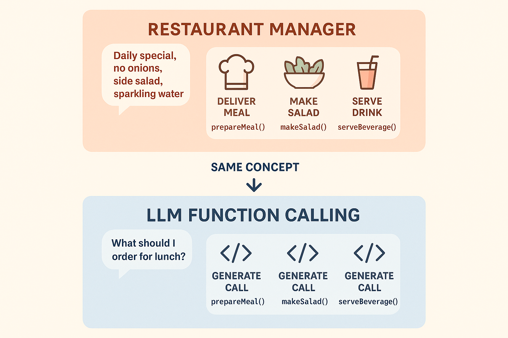
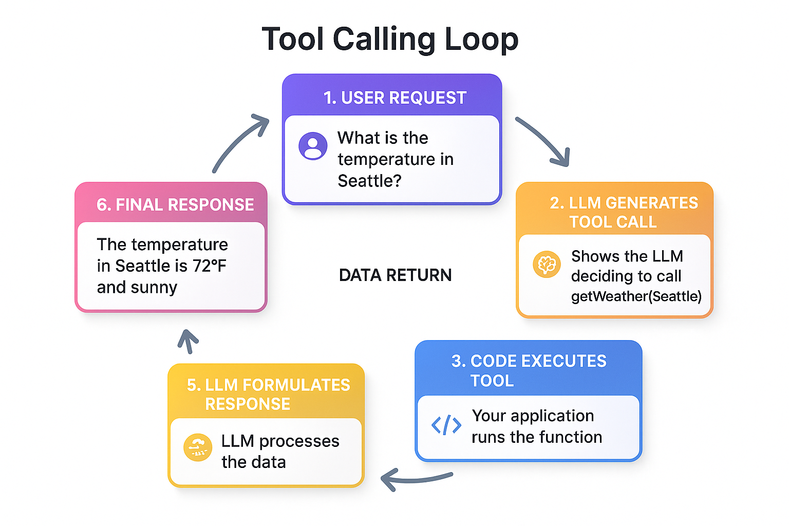
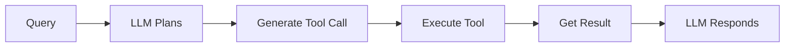

# Function Calling & Tools (Gọi hàm & Công cụ)

Trong chương này, bạn sẽ học cách mở rộng khả năng AI vượt ra ngoài việc sinh văn bản, bằng cách cho phép function calling và tool. Bạn sẽ khám phá cách LLM có thể gọi hàm với tham số có cấu trúc, tạo tool type-safe bằng Pydantic schema, và xây dựng hệ thống nơi AI có thể kích hoạt các hành động thực tế như gọi API, truy vấn database, hoặc tính toán.

**Đây là chương nền tảng để xây dựng AI agent.** Tool là những khối xây dựng cho agent khả năng của chúng — nếu không có tool, agent chỉ là công cụ sinh văn bản. Trong [Getting Started with Agents](../05-agents/README.md), bạn sẽ thấy cách agent dùng các tool bạn tạo ở đây để tự trị ra quyết định và giải quyết vấn đề nhiều bước.

## Yêu cầu trước

- Đã hoàn thành [Prompts, Messages, and Structured Outputs](../03-prompts-messages-outputs/README.md)

## 🎯 Mục tiêu học tập

Kết thúc chương này, bạn sẽ có thể:

- ✅ Hiểu function calling là gì và vì sao nó quan trọng
- ✅ Tạo tool với Pydantic schema để đảm bảo type safety
- ✅ Bind tool vào chat model
- ✅ Gọi tool và xử lý response
- ✅ Xây dựng hệ thống với nhiều tool
- ✅ Áp dụng best practice khi thiết kế tool

---

## 📌 Về các ví dụ code

Đoạn code trong README này được đơn giản hoá cho rõ ràng. File code thực tế trong thư mục `code/` và `solution/` bao gồm:

- ✨ **Xử lý lỗi nâng cao** với khối try-except đầy đủ
- 🎨 **Console output chi tiết** với giải thích từng bước và định dạng
- 🔒 **Best practice bảo mật** bao gồm sanitize và validate input
- 💡 **Comment mang tính giáo dục** giải thích pattern thực thi 3 bước
- 📊 **Ví dụ bổ sung** minh hoạ edge case và best practice

Khi chạy file, hãy chờ đợi output chi tiết hơn và nhiều biện pháp bảo vệ hơn so với đoạn code đơn giản hoá bên dưới.

---

## 📖 Ví von nhân viên nhà hàng (Restaurant Staff Analogy)

**Hãy tưởng tượng bạn là quản lý nhà hàng, điều phối đội ngũ của mình.**

Khi khách hàng gọi "Tôi muốn món đặc biệt trong ngày, không hành, kèm salad, và nước có ga", bạn không tự làm mọi thứ. Thay vào đó:

1. **Bạn hiểu yêu cầu** (họ muốn gì)
2. **Bạn giao việc cho chuyên viên**:
   - 👨‍🍳 Đầu bếp: "Làm món đặc biệt, không hành" (hàm: `prepare_meal`)
   - 🥗 Trạm salad: "Chuẩn bị salad" (hàm: `make_salad`)
   - 🍷 Quầy bar: "Phục vụ nước có ga" (hàm: `serve_beverage`)
3. **Mỗi chuyên viên xác nhận** việc họ đang làm
4. **Bạn điều phối phản hồi** lại cho khách hàng

**Function calling trong AI hoạt động y hệt như vậy!**

LLM:
- **Hiểu** yêu cầu của user
- **Sinh function call có cấu trúc** với tham số phù hợp
- **Trả về** thông tin hàm (nhưng không thực thi chúng)
- **Xử lý** kết quả hàm để tạo response

Điểm mấu chốt: LLM không *thực hiện* hành động. Thay vào đó, nó *mô tả* hàm nào cần gọi và tham số gì. Code của bạn thực thi chúng.



*Function calling hoạt động như quản lý nhà hàng giao việc cho chuyên viên - LLM sinh function call, code của bạn thực thi chúng*

---

## 🎯 Function Calling là gì?

[Function calling](../GLOSSARY.md#function-calling) biến LLM từ công cụ sinh văn bản thành người điều phối hành động. Thay vì chỉ sinh văn bản, LLM có thể kích hoạt các thao tác thực tế — kiểm tra thời tiết, truy vấn database, gọi API, và nhiều hơn nữa.

### Sự thay đổi paradigm

**Trước đây**: LLM chỉ có thể sinh văn bản. "What's the weather in Seattle?" → "I cannot access real-time weather data..."

**Bây giờ**: LLM có thể yêu cầu thao tác bên ngoài. "What's the weather in Seattle?" → LLM sinh `{ "function": "get_weather", "args": { "city": "Seattle" } }`, code của bạn thực thi nó, LLM phản hồi "It's currently 62°F and cloudy in Seattle."

### Hiểu về mô hình thực thi

**Khái niệm quan trọng: LLM không bao giờ trực tiếp thực thi hàm.** Đây là những gì thực sự xảy ra:

**1. Vai trò của LLM (Lập kế hoạch)**:
- Phân tích yêu cầu của user
- Xác định hàm nào cần gọi
- Sinh function call có cấu trúc với tham số
- Trả về dưới dạng JSON (không thực thi gì cả)

**2. Vai trò của code bạn (Thực hiện)**:
- Nhận mô tả function call
- Thực sự thực thi hàm
- Nhận kết quả thực tế (gọi API, tính toán, v.v.)
- Gửi kết quả trở lại LLM

**3. Vai trò của LLM (một lần nữa - Giao tiếp)**:
- Đưa kết quả hàm vào response tự nhiên
- Trả về câu trả lời hữu ích cho user

### Vì sao sự tách biệt này quan trọng

**Bảo mật & Kiểm soát**: Code của bạn quyết định hàm nào tồn tại và kiểm soát việc thực thi. Bạn có thể từ chối các thao tác nguy hiểm.


*Mô hình thực thi 3 bước: LLM lên kế hoạch (sinh call), code của bạn thực thi (làm việc), LLM phản hồi (ngôn ngữ tự nhiên)*

**Luồng ví dụ**: "What's the weather in Tokyo and Paris?"
```python
# 1. LLM generates (doesn't execute):
{
    "tool_calls": [
        {"name": "get_weather", "args": {"city": "Tokyo"}},
        {"name": "get_weather", "args": {"city": "Paris"}}
    ]
}

# 2. Your code executes:
tokyo = get_weather("Tokyo")   # → "24°C, sunny"
paris = get_weather("Paris")   # → "18°C, rainy"

# 3. LLM responds:
"Tokyo is 24°C and sunny. Paris is 18°C and rainy."
```

### Đặc điểm chính

- ✅ LLM sinh function call (mô tả cần làm gì)
- ✅ Code của bạn thực thi hàm (làm việc thực tế)
- ✅ Bạn duy trì kiểm soát về bảo mật và validation
- ✅ LLM xử lý việc suy luận khi nào cần dùng hàm

---

## 🛠️ Tạo Tool với Decorator @tool

Trong LangChain Python, tool được tạo bằng decorator `@tool` với Pydantic schema để đảm bảo type safety.

Nếu bạn mới với Pydantic, đây là thư viện Python để validate dữ liệu bằng type annotation của Python. Hãy nghĩ nó như một cách mô tả input hợp lệ trông như thế nào — ví dụ, "tham số này phải là chuỗi" hoặc "số này phải nằm giữa 1 và 100." Pydantic validate dữ liệu tại runtime và cung cấp khả năng suy luận kiểu (type inference) tuyệt vời.

**Bạn muốn cho AI khả năng tính toán thời gian thực.** Không có tool, AI chỉ có thể đoán phép tính hoặc nói "I can't do math." Với tool máy tính, AI có thể nhận biết khi nào cần tính toán và yêu cầu thực thi phép tính thực tế.

### Ví dụ 1: Tool Máy tính đơn giản

Hãy xem cách tạo tool bằng decorator `@tool` với Pydantic schema cho tham số type-safe.

**Code chính bạn sẽ làm việc cùng:**

```python
# Define input schema with Pydantic
class CalculatorInput(BaseModel):
    expression: str = Field(description="The mathematical expression to evaluate")

# Define calculator tool using @tool decorator
@tool(args_schema=CalculatorInput)
def calculator(expression: str) -> str:
    """Useful for performing mathematical calculations."""
    result = eval(expression, {"__builtins__": {}}, {})
    return f"The result is: {result}"
```

**Code**: [`code/01_simple_tool.py`](./code/01_simple_tool.py)
**Chạy**: `python 04-function-calling-tools/code/01_simple_tool.py`

**Code ví dụ:**

```python
from langchain_core.tools import tool
from pydantic import BaseModel, Field
from dotenv import load_dotenv

load_dotenv()

# Define input schema with Pydantic
class CalculatorInput(BaseModel):
    """Input schema for calculator tool."""
    expression: str = Field(
        description="The mathematical expression to evaluate, e.g., '25 * 4'"
    )

# Define calculator tool using @tool decorator
@tool(args_schema=CalculatorInput)
def calculator(expression: str) -> str:
    """Useful for performing mathematical calculations. 
    Use this when you need to compute numbers."""
    try:
        # Allow only safe mathematical operations
        allowed_names = {"abs": abs, "round": round, "min": min, "max": max}
        result = eval(expression, {"__builtins__": {}}, allowed_names)
        return f"The result is: {result}"
    except Exception as error:
        return f"Error evaluating expression: {error}"

def main():
    print("Tool created:", calculator.name)
    print("Description:", calculator.description)
    
    # Test the tool directly
    result = calculator.invoke({"expression": "25 * 4"})
    print("Result:", result)

if __name__ == "__main__":
    main()
```

> **🤖 Thử với [GitHub Copilot](../docs/copilot.md) Chat:** Muốn tìm hiểu thêm về đoạn code này? Mở file này trong editor và hỏi Copilot:
> - "Why do we need to sanitize the input expression before evaluating it?"
> - "How does the Pydantic schema help with type safety in this calculator tool?"

### Kết quả mong đợi

```text
Tool created: calculator
Description: Useful for performing mathematical calculations. Use this when you need to compute numbers.
Result: The result is: 100
```

### Cách hoạt động

**Chuyện gì đang xảy ra**:
1. **Định nghĩa input schema**: Pydantic `BaseModel` với `Field(description=...)` cho tham số
2. **Tạo tool**: Dùng decorator `@tool(args_schema=...)` để tạo tool
3. **Cài đặt logic**: Nội dung hàm chứa phép tính thực tế
4. **Trả về kết quả**: Chuỗi mô tả kết quả

> **Lưu ý bảo mật**: Code ví dụ dùng `eval()` với builtins bị hạn chế. Với production, dùng thư viện toán học phù hợp như `simpleeval` hoặc `mathjs` để ngăn thực thi code tuỳ ý.

**Thành phần chính**:
- **Hàm cài đặt**: Tool thực sự làm gì (`def calculator(expression):`)
- **Tên**: Cách LLM gọi đến tool (`"calculator"`)
- **Mô tả**: Giúp LLM quyết định khi nào dùng nó (báo AI đây là cho toán học)
- **Schema**: Pydantic model định nghĩa tham số (`CalculatorInput`)

**Quan trọng**: Ở giai đoạn này, chúng ta chỉ mới *tạo* tool. Chưa kết nối nó với LLM - điều đó đến ở Ví dụ 2!

---

## 🔗 Bind Tool vào Model

Dùng `bind_tools()` để làm cho tool khả dụng với LLM.

**Bạn đã tạo tool máy tính, nhưng làm sao AI biết nó tồn tại?** Tool nằm trong code của bạn, chưa kết nối với AI. Bạn cần báo AI "đây là các tool bạn có thể dùng" và để AI quyết định khi nào gọi chúng. Đó là lúc `.bind_tools()` phát huy tác dụng — nó kết nối tool với model để AI có thể chọn thông minh khi nào dùng chúng.


*bind_tools() kết nối tool của bạn với model, làm cho chúng khả dụng để LLM sử dụng*

### Ví dụ 2: Bind và Gọi Tool

Hãy xem cách dùng `.bind_tools()` để làm tool khả dụng và quan sát cách AI sinh `tool_calls` có cấu trúc.

**Code chính bạn sẽ làm việc cùng:**

```python
# Create model and bind tools to it
model = ChatOpenAI(
    model=os.getenv("AI_MODEL"),
    base_url=os.getenv("AI_ENDPOINT"),
    api_key=os.getenv("AI_API_KEY"),
)

model_with_tools = model.bind_tools([calculator])  # Make tool available to LLM

# LLM generates tool call (doesn't execute!)
response = model_with_tools.invoke("What is 25 * 17?")
print(response.tool_calls)  # [{"name": "calculator", "args": {"expression": "25 * 17"}}]
```

**Code**: [`code/02_tool_calling.py`](./code/02_tool_calling.py)
**Chạy**: `python 04-function-calling-tools/code/02_tool_calling.py`

**Code ví dụ:**

```python
from langchain_openai import ChatOpenAI
from langchain_core.tools import tool
from pydantic import BaseModel, Field
from dotenv import load_dotenv
import os

load_dotenv()

class CalculatorInput(BaseModel):
    expression: str = Field(description="Math expression to evaluate")

@tool(args_schema=CalculatorInput)
def calculator(expression: str) -> str:
    """Perform mathematical calculations."""
    result = eval(expression, {"__builtins__": {}}, {})
    return str(result)

def main():
    model = ChatOpenAI(
        model=os.getenv("AI_MODEL"),
        base_url=os.getenv("AI_ENDPOINT"),
        api_key=os.getenv("AI_API_KEY"),
    )

    # Bind tools to the model
    model_with_tools = model.bind_tools([calculator])

    # Invoke with a question
    response = model_with_tools.invoke("What is 25 * 17?")

    print("Response:", response)
    print("\nTool calls:", response.tool_calls)

if __name__ == "__main__":
    main()
```

> **🤖 Thử với [GitHub Copilot](../docs/copilot.md) Chat:** Muốn tìm hiểu thêm về đoạn code này? Mở file này trong editor và hỏi Copilot:
> - "What's in the response.tool_calls list and how does it differ from response.content?"
> - "Why does the LLM return structured tool calls instead of executing the function?"

### Kết quả mong đợi

```text
🤖 Asking: What is 25 * 17?

Tool calls: [
  {
    "name": "calculator",
    "args": {"expression": "25 * 17"},
    "id": "call_abc123"
  }
]
```

### Cách hoạt động

**Chuyện gì xảy ra**:
1. **LLM thấy mô tả tool**: Khi ta bind tool calculator, LLM biết về nó
2. **LLM phân tích truy vấn**: "What is 25 * 17?" → Cần tool calculator
3. **LLM sinh tool call**: Trả về dữ liệu có cấu trúc với tên tool, tham số, và ID
4. **Code của bạn nhận tool call**: `response.tool_calls[0]` chứa call có cấu trúc
5. **Bước tiếp theo** (chưa thể hiện ở đây): Bạn thực thi tool với các tham số đó

**Quan trọng**: LLM không thực sự tính toán gì cả! Nó chỉ *mô tả* tool nào cần gọi và tham số gì. Code của bạn phải thực thi tool (xem Ví dụ 3).

---

## 🔄 Xử lý việc thực thi Tool

### Ví dụ 3: Vòng lặp Tool Call hoàn chỉnh

Trong ví dụ này, bạn sẽ thấy luồng hoàn chỉnh: LLM sinh tool call, code của bạn thực thi tool, và kết quả trở về LLM cho response cuối cùng.



*Chu trình hoàn chỉnh: yêu cầu user → LLM sinh call → code thực thi → kết quả gửi trở lại → LLM phản hồi*

**Code chính bạn sẽ làm việc cùng:**

```python
# Step 1: LLM generates tool call (Planning)
response1 = model_with_tools.invoke([HumanMessage(content=query)])
tool_call = response1.tool_calls[0]  # {"name": "get_weather", "args": {"city": "Seattle"}}

# Step 2: YOUR code executes the tool (Doing)
tool_result = get_weather.invoke(tool_call["args"])

# Step 3: Send result back to LLM (Communicating)
messages = [
    HumanMessage(content=query),
    AIMessage(content="", tool_calls=response1.tool_calls),
    ToolMessage(content=tool_result, tool_call_id=tool_call["id"]),
]
final_response = model.invoke(messages)  # "The current temperature in Seattle is 62°F..."
```

**Code**: [`code/03_tool_execution.py`](./code/03_tool_execution.py)
**Chạy**: `python 04-function-calling-tools/code/03_tool_execution.py`

**Code ví dụ:**

```python
from langchain_openai import ChatOpenAI
from langchain_core.tools import tool
from langchain_core.messages import HumanMessage, AIMessage, ToolMessage
from pydantic import BaseModel, Field
from dotenv import load_dotenv
import os

load_dotenv()

class WeatherInput(BaseModel):
    city: str = Field(description="City name")

@tool(args_schema=WeatherInput)
def get_weather(city: str) -> str:
    """Get current weather for a city."""
    temps = {"Seattle": 62, "Paris": 18, "Tokyo": 24}
    temp = temps.get(city, 72)
    return f"Current temperature in {city}: {temp}°F"

def main():
    model = ChatOpenAI(
        model=os.getenv("AI_MODEL"),
        base_url=os.getenv("AI_ENDPOINT"),
        api_key=os.getenv("AI_API_KEY"),
    )

    model_with_tools = model.bind_tools([get_weather])

    # Step 1: Get tool call from LLM
    query = "What's the weather in Seattle?"
    response1 = model_with_tools.invoke(query)
    print("Step 1 - Tool call:", response1.tool_calls[0])

    # Step 2: Execute the tool
    tool_call = response1.tool_calls[0]
    tool_result = get_weather.invoke(tool_call["args"])
    print("Step 2 - Tool result:", tool_result)

    # Step 3: Send result back to LLM
    messages = [
        HumanMessage(content=query),
        AIMessage(content="", tool_calls=response1.tool_calls),
        ToolMessage(content=tool_result, tool_call_id=tool_call["id"]),
    ]

    final_response = model.invoke(messages)
    print("Step 3 - Final answer:", final_response.content)

if __name__ == "__main__":
    main()
```

> **🤖 Thử với [GitHub Copilot](../docs/copilot.md) Chat:** Muốn tìm hiểu thêm về đoạn code này? Mở file này trong editor và hỏi Copilot:
> - "Why do we need to send tool results back to the LLM in step 3?"
> - "How would I handle errors that occur during tool execution?"

### Kết quả mong đợi

```text
User: What's the weather in Seattle?

Step 1: LLM generates tool call...
  Tool: get_weather
  Args: {'city': 'Seattle'}
  ID: call_abc123

Step 2: Executing tool...
  Result: Current temperature in Seattle: 62°F, partly cloudy

Step 3: Sending result back to LLM...

Final answer: The current temperature in Seattle is 62°F and it's partly cloudy.
```

### Cách hoạt động

**Luồng hoàn chỉnh**:
1. **Bước 1 - LLM sinh tool call**:
   - User hỏi "What's the weather in Seattle?"
   - LLM quyết định dùng tool `get_weather` với `{"city": "Seattle"}`
2. **Bước 2 - Thực thi tool**:
   - Code của bạn gọi `get_weather.invoke(tool_call["args"])`
   - Tool trả về: "Current temperature in Seattle: 62°F"
3. **Bước 3 - Gửi kết quả trở lại LLM**:
   - Xây dựng lịch sử hội thoại: message user + AI tool call + kết quả tool
   - LLM nhận dữ liệu thời tiết
   - LLM sinh response ngôn ngữ tự nhiên: "The current temperature in Seattle is 62°F and it's partly cloudy."

**Điểm mấu chốt**: Pattern ba bước này (sinh → thực thi → phản hồi) chính là cốt lõi của function calling!

---

## 🎛️ Nhiều Tool

LLM có thể chọn từ nhiều tool dựa trên truy vấn.

**Bạn đang xây một AI assistant cần nhiều khả năng khác nhau — tính toán, tìm kiếm web, và tra cứu thời tiết.** Thay vì tạo nhiều AI instance riêng biệt hoặc logic định tuyến phức tạp, bạn muốn một AI thông minh chọn đúng tool cho mỗi task. AI nên tự động chọn calculator cho "What is 25 * 4?", search cho "What's the capital of France?", và weather cho "How's the weather in Tokyo?"

### Ví dụ 4: Hệ thống đa Tool

Hãy xem cách bind nhiều tool bằng `.bind_tools([tool1, tool2, tool3])` và để AI chọn tool nào cần gọi.

**Code chính bạn sẽ làm việc cùng:**

```python
# Bind multiple tools - LLM automatically picks the right one
model_with_tools = model.bind_tools([calculator, search, get_weather])

queries = [
    "What is 125 * 8?",            # LLM chooses: calculator
    "What's the capital of France?", # LLM chooses: search
    "What's the weather in Tokyo?",  # LLM chooses: get_weather
]

for query in queries:
    response = model_with_tools.invoke(query)
    print(response.tool_calls[0]["name"])  # Shows which tool LLM selected
```

**Code**: [`code/04_multiple_tools.py`](./code/04_multiple_tools.py)
**Chạy**: `python 04-function-calling-tools/code/04_multiple_tools.py`

**Code ví dụ:**

```python
from langchain_openai import ChatOpenAI
from langchain_core.tools import tool
from pydantic import BaseModel, Field
from dotenv import load_dotenv
import os

load_dotenv()

class CalculatorInput(BaseModel):
    expression: str = Field(description="Math expression")

class SearchInput(BaseModel):
    query: str = Field(description="Search query")

class WeatherInput(BaseModel):
    city: str = Field(description="City name")

@tool(args_schema=CalculatorInput)
def calculator(expression: str) -> str:
    """Perform mathematical calculations."""
    return str(eval(expression, {"__builtins__": {}}, {}))

@tool(args_schema=SearchInput)
def search(query: str) -> str:
    """Search for factual information."""
    results = {"capital of france": "Paris", "population of tokyo": "14 million"}
    return results.get(query.lower(), "No results found")

@tool(args_schema=WeatherInput)
def get_weather(city: str) -> str:
    """Get current weather for a city."""
    return f"Weather in {city}: 72°F, sunny"

def main():
    model = ChatOpenAI(
        model=os.getenv("AI_MODEL"),
        base_url=os.getenv("AI_ENDPOINT"),
        api_key=os.getenv("AI_API_KEY"),
    )

    model_with_tools = model.bind_tools([calculator, search, get_weather])

    queries = [
        "What is 125 * 8?",
        "What's the capital of France?",
        "What's the weather in Tokyo?",
    ]

    for query in queries:
        response = model_with_tools.invoke(query)
        if response.tool_calls:
            print(f"Query: {query}")
            print(f"  Tool: {response.tool_calls[0]['name']}")
            print()

if __name__ == "__main__":
    main()
```

> **🤖 Thử với [GitHub Copilot](../docs/copilot.md) Chat:** Muốn tìm hiểu thêm về đoạn code này? Mở file này trong editor và hỏi Copilot:
> - "How does the LLM decide which tool to use for each query?"
> - "Can I prioritize certain tools over others by adjusting their descriptions?"

### Kết quả mong đợi

> **⚠️ Lưu ý về hành vi Tool Calling:** Tool calling mang tính xác suất và khác nhau tuỳ model. Một số model có thể trả lời trực tiếp cho truy vấn đơn giản (như toán học) thay vì gọi tool. Tool thời tiết thường được gọi nhất quán nhất. Để tăng độ tin cậy, dùng prompt rõ ràng hơn như "Use the calculator tool to compute..." hoặc cân nhắc tham số `tool_choice`.

```text
Query: "What is 125 * 8?"
  ℹ️ May respond directly or call calculator tool

Query: "What's the capital of France?"
  ℹ️ May respond directly or call search tool

Query: "What's the weather in Tokyo?"
  ✓ Chose tool: get_weather
  ✓ Args: {"city": "Tokyo"}
```

### Cách hoạt động

**Chuyện gì đang xảy ra**:
1. **Bind nhiều tool**: Cả ba tool (calculator, search, weather) đều khả dụng với LLM
2. **LLM đọc mô tả tool**:
   - calculator: "Perform mathematical calculations"
   - search: "Search for factual information"
   - get_weather: "Get current weather"
3. **LLM chọn tool phù hợp** cho mỗi truy vấn:
   - Câu hỏi toán học → calculator
   - Câu hỏi sự kiện → search
   - Câu hỏi thời tiết → get_weather
4. **LLM sinh tham số đúng** cho mỗi tool

**Điểm mấu chốt**: LLM tự động chọn tool đúng dựa trên:
- Tên tool
- Mô tả tool
- Schema tham số
- Câu hỏi của user

**Best practice**: Viết mô tả tool rõ ràng, cụ thể để LLM chọn đúng!

---

## ✅ Best Practices

### 1. Mô tả Tool rõ ràng

```python
# ❌ Poor
description = "Does weather stuff"

# ✅ Good
description = "Get current weather for a specific city. Returns temperature, conditions, and humidity."
```

### 2. Tên tham số mang tính mô tả

```python
# ❌ Poor
class InputSchema(BaseModel):
    x: str
    y: int

# ✅ Good
class WeatherInput(BaseModel):
    city: str = Field(description="The city name, e.g., 'Paris' or 'Tokyo'")
    units: Literal["celsius", "fahrenheit"] = Field(description="Temperature unit")
```

### 3. Xử lý lỗi

```python
@tool(args_schema=InputSchema)
def safe_tool(param: str) -> str:
    """Performs operation with error handling."""
    try:
        result = dangerous_operation(param)
        return result
    except Exception as error:
        return f"Error: {error}. Please try again with different parameters."
```

### 4. Validation

```python
class EmailInput(BaseModel):
    email: str = Field(description="Valid email address")
    subject: str = Field(min_length=1, description="Email subject")
    body: str = Field(description="Email body content")

@tool(args_schema=EmailInput)
def send_email(email: str, subject: str, body: str) -> str:
    """Send an email."""
    if "@" not in email:
        raise ValueError("Invalid email format")
    return f"Email sent to {email}"
```

---

## 🗺️ Sơ đồ khái niệm

Chương này dạy bạn toàn bộ workflow function calling:



*LLM lên kế hoạch, code của bạn thực thi, và LLM giao tiếp kết quả.*

---

## ✅ Checkpoint tiến độ

Trước khi tiếp tục, đảm bảo bạn có thể:

| Kỹ năng | Kiểm tra |
|-------|-------|
| Tạo tool với decorator `@tool` và Pydantic schema | ⬜ |
| Bind tool vào model bằng `bind_tools()` | ⬜ |
| Hiểu pattern thực thi 3 bước | ⬜ |
| Thực thi tool và gửi kết quả trở lại LLM | ⬜ |
| Xây dựng hệ thống đa tool | ⬜ |
| Viết mô tả tool rõ ràng | ⬜ |

---

## 🎓 Điểm chính cần nhớ

- **Function calling** cho phép LLM kích hoạt hành động thực tế
- **LLM sinh** function call, nhưng không thực thi chúng
- **Tool** được tạo bằng decorator `@tool` và Pydantic schema
- **bind_tools()** làm tool khả dụng với model
- **Type safety** với Pydantic ngăn ngừa lỗi
- **Mô tả rõ ràng** giúp LLM chọn đúng tool
- **Xử lý lỗi** làm tool vững chắc hơn
- **Nhiều tool** cho phép khả năng phức tạp
- **Tool là nền tảng cho agent** - Tiếp theo, bạn sẽ thấy cách agent dùng tool để tự trị giải quyết vấn đề

---

## 🏆 Bài tập

Sẵn sàng luyện tập chưa? Hoàn thành các thử thách trong [assignment.md](./assignment.md)!

Bài tập gồm:
1. **Weather Tool with Complete Execution Loop** - Xây dựng tool thời tiết và cài đặt pattern thực thi 3 bước hoàn chỉnh
2. **Multi-Tool Travel Assistant** (Bonus) - Xây dựng hệ thống với nhiều tool nơi LLM tự động chọn tool phù hợp

---

## 📚 Tài nguyên bổ sung

- [Tool Calling Documentation](https://python.langchain.com/docs/how_to/tool_calling/)
- [Custom Tools Guide](https://python.langchain.com/docs/how_to/custom_tools/)
- [Pydantic Documentation](https://docs.pydantic.dev/)

---

## 🚀 Bước tiếp theo?

Làm tốt lắm! Bạn đã học cách tạo **tool** mà LLM có thể gọi để thực hiện hành động thực tế — nhưng bạn vẫn phải tự tay xử lý vòng lặp thực thi (gọi model → thực thi tool → gọi lại).

### Từ Tool thủ công đến Agent tự trị

**Điều gì sẽ xảy ra nếu LLM có thể tự quyết định dùng tool nào và khi nào, mà không cần bạn viết luồng điều khiển?**

Tiếp theo, bạn sẽ học cách agent tự trị quyết định dùng tool nào và điều phối workflow phức tạp nhiều bước — biến tool của bạn thành hệ thống thực sự thông minh!

---

## 🗺️ Điều hướng

[← Trước: Prompts, Messages, and Structured Outputs](../03-prompts-messages-outputs/README.md) | [Về trang chính](../README.md) | [Tiếp: Getting Started with Agents →](../05-agents/README.md)

---

## 💬 Có thắc mắc?

[](https://aka.ms/foundry/discord)
