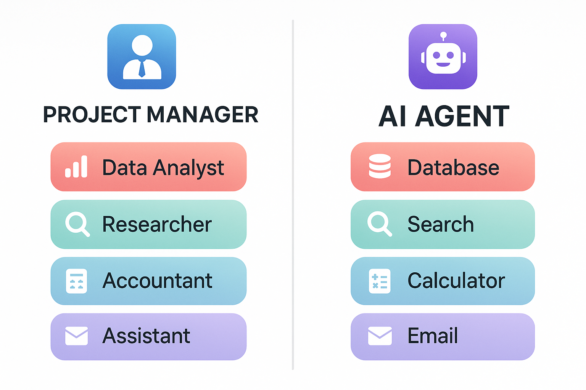
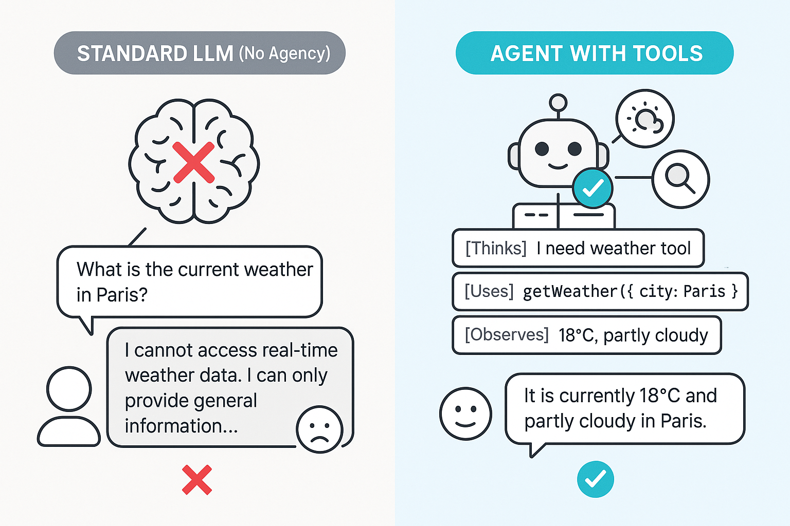
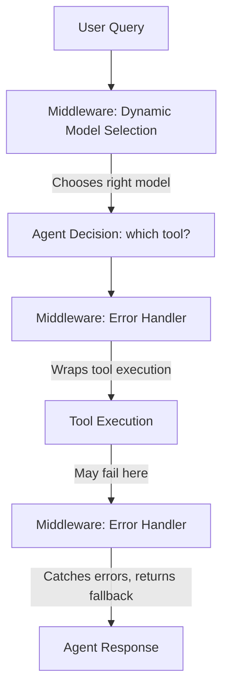
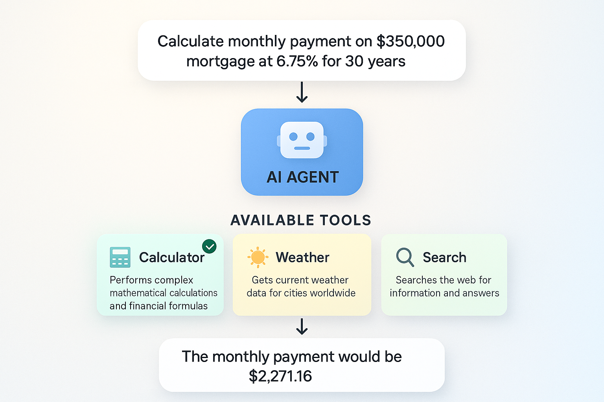
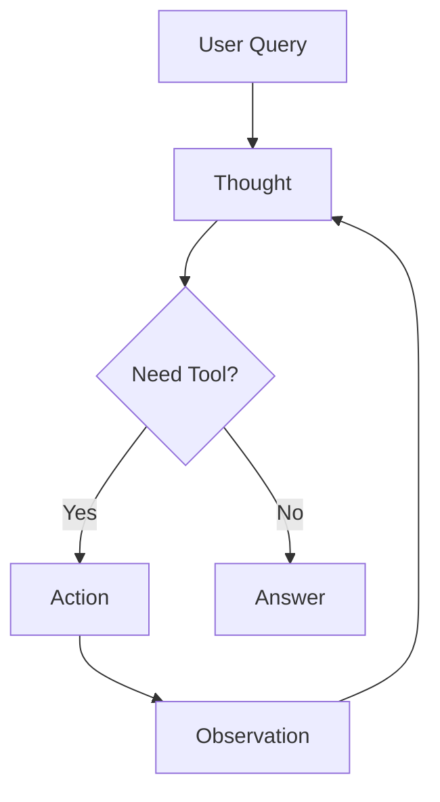

# Getting Started with Agents (Bắt đầu với Agent)

Trong chương này, bạn sẽ học cách xây dựng AI agent có thể suy luận về vấn đề, chọn tool phù hợp, và làm việc lặp đi lặp lại hướng tới giải pháp. Bạn sẽ hiểu pattern ReAct (Reasoning + Acting) bằng cách cài đặt agent loop từng bước, và khám phá cách agent tự trị chọn tool để hoàn thành task phức tạp. Các kỹ năng này giúp bạn xây dựng hệ thống AI tự trị có thể xử lý task phức tạp, nhiều bước.

## Yêu cầu trước

- Đã hoàn thành [Function Calling & Tools](../04-function-calling-tools/README.md)

## 🎯 Mục tiêu học tập

Kết thúc chương này, bạn sẽ có thể:

- ✅ Hiểu AI agent là gì và hoạt động ra sao
- ✅ Cài đặt pattern ReAct (Reasoning + Acting)
- ✅ Xây dựng agent loop lặp cho đến khi giải quyết vấn đề
- ✅ Cho agent nhiều tool và để nó chọn tool phù hợp
- ✅ Dùng create_agent() cho hệ thống agent sẵn sàng production
- ✅ Cài đặt pattern middleware để tuỳ biến agent
- ✅ Xây dựng hệ thống AI tự trị, nhiều bước

---

## 📖 Ví von quản lý với chuyên viên (Manager with Specialists Analogy)

**Hãy tưởng tượng bạn là quản lý dự án với một đội chuyên viên:**

- 📊 Chuyên viên phân tích dữ liệu - có thể truy vấn database
- 🔍 Nhà nghiên cứu - có thể tìm kiếm trên web
- 🧮 Kế toán - có thể làm phép tính
- ✉️ Trợ lý - có thể gửi email

Khi ai đó hỏi: *"Tăng trưởng doanh thu quý này so với năm ngoái của chúng ta là bao nhiêu?"*

Bạn (quản lý) không tự làm mọi thứ. Bạn:
1. **Suy luận**: "Tôi cần dữ liệu từ database và phép tính"
2. **Hành động**: Yêu cầu chuyên viên phân tích dữ liệu cung cấp dữ liệu doanh thu
3. **Quan sát**: Xem xét dữ liệu nhận được
4. **Suy luận**: "Giờ tôi cần tính phần trăm thay đổi"
5. **Hành động**: Yêu cầu kế toán làm phép tính
6. **Quan sát**: Nhận kết quả đã tính
7. **Suy luận**: "Giờ tôi có câu trả lời"
8. **Phản hồi**: Đưa ra câu trả lời cuối cùng

**AI Agent hoạt động y hệt như vậy!**

Chúng:
- **Suy nghĩ** về những gì cần làm (Reasoning)
- **Chọn** tool phù hợp (Ra quyết định)
- **Dùng** tool (Acting)
- **Đánh giá** kết quả (Observation)
- **Lặp lại** cho đến khi có câu trả lời
- **Phản hồi** cho user



*Cả quản lý dự án và AI agent đều giao việc cho chuyên viên/tool, theo cùng một pattern lặp.*

---

## 🤖 Agent là gì?

### LLM thông thường (Không có tính tự chủ hay Tool)

```
User: "What's the current weather in Paris?"
LLM: "I cannot access real-time weather data. I can only provide general information..."
```

### Agent có Tool

```
User: "What's the current weather in Paris?"
Agent: [Suy nghĩ] "I need to use the weather tool"
Agent: [Dùng] get_weather(city="Paris")
Agent: [Quan sát] "18°C, partly cloudy"
Agent: [Phản hồi] "It's currently 18°C and partly cloudy in Paris"
```



*Agent có tool có thể truy cập dữ liệu thời gian thực và thực hiện hành động, trong khi LLM thông thường bị giới hạn ở dữ liệu training.*

---

## 🧠 Pattern ReAct

ReAct = **Rea**soning (Suy luận) + **Act**ing (Hành động)

Agent làm theo vòng lặp lặp lại này:

```
1. Thought (Suy nghĩ): Tiếp theo mình nên làm gì?
2. Action (Hành động): Dùng một tool cụ thể
3. Observation (Quan sát): Tool trả về gì?
4. (Lặp lại 1-3 khi cần)
5. Final Answer (Câu trả lời cuối): Phản hồi cho user
```

**Ví dụ**:
```
User: "Calculate 25 * 17, then tell me if it's a prime number"

Thought 1: I need to calculate 25 * 17
Action 1: calculator(expression="25 * 17")
Observation 1: 425

Thought 2: I need to check if 425 is prime
Action 2: is_prime(number=425)
Observation 2: False (divisible by 5)

Final Answer: "25 * 17 equals 425, which is not a prime number
because it's divisible by 5."
```


*Pattern ReAct: Agent lặp đi lặp lại suy luận về việc cần làm, hành động bằng cách dùng tool, quan sát kết quả, và lặp lại cho đến khi có câu trả lời.*

---

## 🚀 Xây dựng Agent với create_agent()

LangChain Python cung cấp `create_agent()` từ `langchain.agents` - một API cấp cao tự động xử lý vòng lặp ReAct. Đây là **cách tiếp cận khuyến nghị** để xây dựng agent cho production.

**create_agent() làm gì cho bạn**:
- ✅ Quản lý vòng lặp ReAct (Thought → Action → Observation → Repeat)
- ✅ Tự động xử lý lịch sử message
- ✅ Cài đặt giới hạn số lần lặp để ngăn vòng lặp vô hạn
- ✅ Cung cấp xử lý lỗi sẵn sàng cho production
- ✅ Trả về response sạch, có cấu trúc

---

### Ví dụ 1: Agent cơ bản với create_agent()

Hãy xem cách dùng `create_agent()` để tạo agent tự trị tự động xử lý vòng lặp ReAct (Thought → Action → Observation).

**Code chính bạn sẽ làm việc cùng:**
```python
# Create agent using create_agent() - that's it!
agent = create_agent(
    model,
    tools=[calculator],  # Pass tools to the agent
)

# Use the agent with messages array
response = agent.invoke({"messages": [HumanMessage(content=query)]})

# Get the final answer from the last message
last_message = response["messages"][-1]
```

**Code**: [`code/01_create_agent_basic.py`](./code/01_create_agent_basic.py)
**Chạy**: `python 05-agents/code/01_create_agent_basic.py`

**Code ví dụ:**

```python
from langchain.agents import create_agent
from langchain_core.tools import tool
from langchain_core.messages import HumanMessage
from dotenv import load_dotenv
import os

load_dotenv()

# Define a calculator tool for the agent
@tool
def calculator(expression: str) -> str:
    """A calculator that can perform basic arithmetic operations.
    
    Args:
        expression: The mathematical expression to evaluate
    """
    result = eval(expression, {"__builtins__": {}}, {})
    return str(result)

def main():
    # Create agent using create_agent() - that's it!
    agent = create_agent(
        model=os.getenv("AI_MODEL"),
        tools=[calculator],
        system_prompt="You are a helpful math assistant.",
    )

    # Use the agent with messages array
    query = "What is 125 * 8?"
    response = agent.invoke({
        "messages": [HumanMessage(content=query)]
    })

    # Get the final answer from the last message
    last_message = response["messages"][-1]
    print(f"Agent: {last_message.content}")

if __name__ == "__main__":
    main()
```

> **🤖 Thử với [GitHub Copilot](../docs/copilot.md) Chat:** Muốn tìm hiểu thêm về đoạn code này? Mở file này trong editor và hỏi Copilot:
> - "What does create_agent() do under the hood?"
> - "How does create_agent() handle iteration limits and prevent infinite loops?"

### Kết quả mong đợi

```
🤖 Agent with create_agent() Example

👤 User: What is 125 * 8?

🤖 Agent: 125 × 8 = 1000

✅ Under the hood:
   create_agent() implements the ReAct pattern (Thought → Action → Observation)
   and handles all the boilerplate for you.
```

### Cách hoạt động

**Chuyện gì đang xảy ra ở hậu trường**:
1. **Agent nhận query**: "What is 125 * 8?"
2. **Suy luận**: Xác định cần tool calculator
3. **Hành động**: Thực thi `calculator(expression="125 * 8")`
4. **Quan sát**: Nhận kết quả "1000"
5. **Phản hồi**: Định dạng response ngôn ngữ tự nhiên

---

### Ví dụ 2: create_agent() với nhiều Tool

Hãy xem cách cho agent nhiều tool bằng `tools=[tool1, tool2, tool3]` và quan sát cách nó tự trị chọn tool đúng.

**Code chính bạn sẽ làm việc cùng:**
```python
# Create agent with all three tools - agent auto-selects the right one
agent = create_agent(
    model,
    tools=[calculator, get_weather, search],  # Multiple tools!
)

# Agent automatically picks the correct tool for each query
queries = [
    "What is 50 * 25?",              # → Uses calculator
    "What's the weather in Tokyo?",  # → Uses get_weather
    "Tell me about LangChain",       # → Uses search
]
```

**Code**: [`code/02_create_agent_multi_tool.py`](./code/02_create_agent_multi_tool.py)
**Chạy**: `python 05-agents/code/02_create_agent_multi_tool.py`

**Code ví dụ:**

```python
from langchain.agents import create_agent
from langchain_core.tools import tool
from langchain_core.messages import HumanMessage
from dotenv import load_dotenv
import os

load_dotenv()

@tool
def calculator(expression: str) -> str:
    """Perform mathematical calculations."""
    result = eval(expression, {"__builtins__": {}}, {})
    return str(result)

@tool
def get_weather(city: str) -> str:
    """Get the current weather for a city."""
    temps = {"Seattle": 62, "Paris": 18, "Tokyo": 24}
    temp = temps.get(city, 72)
    return f"Current weather in {city}: {temp}°F"

@tool
def search(query: str) -> str:
    """Search for information about a topic."""
    return f"LangChain is a Python framework for building AI applications with LLMs."

def main():
    # Create agent with all three tools
    agent = create_agent(
        model=os.getenv("AI_MODEL"),
        tools=[calculator, get_weather, search],
        system_prompt="You are a helpful assistant with access to multiple tools.",
    )

    # Agent automatically picks the correct tool for each query
    queries = [
        "What is 50 * 25?",              # → Uses calculator
        "What's the weather in Tokyo?",  # → Uses get_weather
        "Tell me about LangChain",       # → Uses search
    ]

    for query in queries:
        response = agent.invoke({
            "messages": [HumanMessage(content=query)]
        })
        last_message = response["messages"][-1]
        print(f"User: {query}")
        print(f"Agent: {last_message.content}\n")

if __name__ == "__main__":
    main()
```

### Kết quả mong đợi

```
🎛️  Multi-Tool Agent with create_agent()

👤 User: What is 50 * 25?
🤖 Agent: 50 multiplied by 25 equals 1250.

👤 User: What's the weather in Tokyo?
🤖 Agent: Current weather in Tokyo: 24°F

👤 User: Tell me about LangChain
🤖 Agent: LangChain is a Python framework for building applications with large
language models (LLMs).

💡 What just happened:
   • The agent automatically selected the right tool for each query
   • Calculator for math (50 * 25)
   • Weather tool for Tokyo weather
   • Search tool for LangChain information
   • All with the same agent instance!
```

### Cách hoạt động

**Chuyện gì đang xảy ra**:
1. **Agent nhận query**: "What is 50 * 25?"
2. **Đọc mô tả tool**: Xem xét tất cả tool khả dụng
3. **Chọn phù hợp nhất**: Tool calculator (mô tả nhắc đến "mathematical calculations")
4. **Thực thi tool**: Chạy calculator với biểu thức
5. **Trả về response tự nhiên**: Định dạng kết quả bằng ngôn ngữ tự nhiên

**Logic chọn Tool**:
- Agent dùng **tên** và **mô tả** tool để khớp query với tool
- Mô tả cụ thể hơn → Chọn tool tốt hơn
- LLM quyết định tool nào phù hợp nhất dựa trên ý nghĩa ngữ nghĩa
- Bạn có thể cho agent nhiều tool, nó sẽ thông minh chọn đúng tool cho mỗi task

> **🤖 Thử với [GitHub Copilot](../docs/copilot.md) Chat:** Muốn tìm hiểu thêm về đoạn code này?
> Mở file này trong editor và hỏi Copilot:
> - "How does the agent decide which tool to use?"
> - "How can I add error handling if a tool fails?"

---

### Ví dụ 3: Vòng lặp ReAct thủ công (Hiểu về Pattern)

Để hiểu `create_agent()` làm gì ở hậu trường, hãy cài đặt vòng lặp ReAct thủ công.

**Code**: [`code/03_manual_react.py`](./code/03_manual_react.py)
**Chạy**: `python 05-agents/code/03_manual_react.py`

**Code ví dụ:**

```python
from langchain_openai import ChatOpenAI
from langchain_core.tools import tool
from langchain_core.messages import HumanMessage, AIMessage, ToolMessage
from dotenv import load_dotenv
import os

load_dotenv()

@tool
def calculator(expression: str) -> str:
    """Perform mathematical calculations."""
    result = eval(expression, {"__builtins__": {}}, {})
    return str(result)

@tool
def is_prime(number: int) -> str:
    """Check if a number is prime."""
    if number < 2:
        return "False"
    for i in range(2, int(number ** 0.5) + 1):
        if number % i == 0:
            return f"False (divisible by {i})"
    return "True"

def run_react_loop(query: str, tools: list, max_iterations: int = 5):
    """Manually implement the ReAct loop."""
    
    model = ChatOpenAI(
        model=os.getenv("AI_MODEL"),
        base_url=os.getenv("AI_ENDPOINT"),
        api_key=os.getenv("AI_API_KEY")
    )
    
    # Create tool lookup
    tools_by_name = {t.name: t for t in tools}
    
    # Bind tools to model
    model_with_tools = model.bind_tools(tools)
    
    # Initialize messages
    messages = [HumanMessage(content=query)]
    
    for iteration in range(max_iterations):
        print(f"\n--- Iteration {iteration + 1} ---")
        
        # Step 1: Call the model
        response = model_with_tools.invoke(messages)
        messages.append(response)
        
        # Step 2: Check if there are tool calls
        if not response.tool_calls:
            print("No more tool calls - Final answer ready")
            return response.content
        
        # Step 3: Execute each tool call
        for tool_call in response.tool_calls:
            tool_name = tool_call["name"]
            tool_args = tool_call["args"]
            
            print(f"Action: {tool_name}({tool_args})")
            
            # Execute the tool
            tool_result = tools_by_name[tool_name].invoke(tool_args)
            print(f"Observation: {tool_result}")
            
            # Add tool result to messages
            messages.append(
                ToolMessage(content=str(tool_result), tool_call_id=tool_call["id"])
            )
    
    return "Max iterations reached"

def main():
    tools = [calculator, is_prime]
    
    query = "Calculate 25 * 17, then tell me if the result is a prime number"
    print(f"Query: {query}")
    
    result = run_react_loop(query, tools)
    print(f"\n🤖 Final Answer: {result}")

if __name__ == "__main__":
    main()
```

### Kết quả mong đợi

```
Query: Calculate 25 * 17, then tell me if the result is a prime number

--- Iteration 1 ---
Action: calculator({'expression': '25 * 17'})
Observation: 425

--- Iteration 2 ---
Action: is_prime({'number': 425})
Observation: False (divisible by 5)

--- Iteration 3 ---
No more tool calls - Final answer ready

🤖 Final Answer: 25 * 17 equals 425, which is not a prime number 
because it is divisible by 5.
```

> **🤖 Thử với [GitHub Copilot](../docs/copilot.md) Chat:** Muốn tìm hiểu thêm về đoạn code này?
> Mở file này trong editor và hỏi Copilot:
> - "Walk me through what happens in each iteration of this loop"
> - "How does the agent know when to stop calling tools?"

---

## 🔧 Pattern Agent bổ sung

Giờ bạn đã hiểu cách xây dựng agent cơ bản với một hoặc nhiều tool, hãy khám phá một pattern bổ sung cho ứng dụng production: **middleware**. Middleware cho phép bạn thêm hành vi như logging, xử lý lỗi, và chọn model động mà không cần chỉnh sửa tool hay logic cốt lõi của agent.

### Ví dụ 4: create_agent() với Middleware

Ví dụ này cho thấy cách dùng **middleware** với `create_agent()` cho các kịch bản production như chọn model động dựa trên độ phức tạp hội thoại và xử lý lỗi khéo léo.

**Code chính bạn sẽ làm việc cùng:**
```python
# Middleware intercepts agent behavior without changing tools
class DynamicModelMiddleware(AgentMiddleware):
    def wrap_model_call(self, request, handler):
        if len(request.state["messages"]) > 10:
            # Switch to more capable model for complex conversations
            return handler(request.override(model=advanced_model))
        return handler(request)

# Create agent with middleware - adds behavior like logging & error handling
agent = create_agent(
    model,
    tools=[calculator, search],
    middleware=[DynamicModelMiddleware(), ToolErrorMiddleware()],  # Plugin-style behavior!
)
```

**Code**: [`code/04_agent_with_middleware.py`](./code/04_agent_with_middleware.py)
**Chạy**: `python 05-agents/code/04_agent_with_middleware.py`

**Middleware là gì?** Middleware chặn và chỉnh sửa hành vi agent mà không thay đổi tool hay logic agent. Hãy nghĩ nó như "plugin" cho agent của bạn.

```python
from langchain.agents import create_agent
from langchain.agents.middleware import AgentMiddleware, ModelRequest
from langchain.agents.middleware.types import ModelResponse
from langchain_core.messages import ToolMessage
from typing import Callable, Any

# Middleware 1: Dynamic Model Selection
# Switches to a more capable (and expensive) model for complex conversations
class DynamicModelMiddleware(AgentMiddleware):
    def __init__(self, messages_threshold: int = 10):
        super().__init__()
        self.messages_threshold = messages_threshold

    def wrap_model_call(
        self,
        request: ModelRequest,
        handler: Callable[[ModelRequest], ModelResponse],
    ) -> ModelResponse:
        message_count = len(request.state["messages"])
        print(f"  [Middleware] Message count: {message_count}")
        
        # Option for complex conversations (>threshold messages)
        if message_count > self.messages_threshold:
            print("  [Middleware] Switching to more capable model")
            # return handler(request.override(model=advanced_model))
        
        return handler(request)


# Middleware 2: Custom Error Handling
# Catches tool failures and provides helpful fallback messages
class ToolErrorMiddleware(AgentMiddleware):
    def wrap_tool_call(
        self,
        request: Any,
        handler: Callable[[Any], ToolMessage],
    ) -> ToolMessage:
        try:
            return handler(request)
        except Exception as e:
            tool_name = request.tool_call.get("name", "unknown")
            print(f"  [Middleware] Tool '{tool_name}' failed: {e}")
            # Return graceful fallback instead of crashing
            return ToolMessage(
                content=f"I encountered an error: {e}. Let me try a different approach.",
                tool_call_id=request.tool_call.get("id", ""),
            )


# Create agent with both middleware
agent = create_agent(
    model,
    tools=[calculator, search],
    middleware=[DynamicModelMiddleware(), ToolErrorMiddleware()]
)
```

> **🤖 Thử với [GitHub Copilot](../docs/copilot.md) Chat:** Muốn tìm hiểu thêm về đoạn code này? Mở file này trong editor và hỏi Copilot:
> - "How would I add request logging middleware?"
> - "Can middleware modify tool arguments before execution?"

### Kết quả mong đợi

Khi chạy `python 05-agents/code/04_agent_with_middleware.py`:

```
🔧 Agent with Middleware Example

Test 1: Simple calculation
────────────────────────────────────────────────────────────
👤 User: What is 25 * 8?

  [Middleware] Message count: 1
  [Middleware] ✓ Using current model

🤖 Agent: 25 multiplied by 8 equals 200.


Test 2: Search with error handling
────────────────────────────────────────────────────────────
👤 User: Search for information about error handling

  [Middleware] Message count: 1
  [Middleware] ✓ Using current model
  [Middleware] ⚠️  Tool "search" failed: Search service temporarily unavailable
  [Middleware] 🔄 Returning fallback message

🤖 Agent: I encountered an error while using the search tool. Let me try
a different approach to answer your question about error handling.

💡 Middleware Benefits:
   • Dynamic model selection → Cost optimization
   • Error handling → Graceful degradation
   • Logging → Easy debugging
   • Flexibility → Customize behavior without changing tools

✅ Production Use Cases:
   • Switch to cheaper models for simple queries
   • Automatic retries with exponential backoff
   • Request/response logging for monitoring
   • User context injection (auth, permissions)
   • Rate limiting and quota management
```

### Cách Middleware hoạt động

**Luồng Middleware**:


**Hai loại Middleware**:

1. **wrap_model_call** - Chặn lệnh gọi ĐẾN model
   - Chọn model động dựa trên độ dài hội thoại
   - Log và giám sát request
   - Injection ngữ cảnh (quyền user, dữ liệu session)

2. **wrap_tool_call** - Chặn việc thực thi tool
   - Xử lý lỗi và retry
   - Biến đổi kết quả tool
   - Kiểm tra quyền trước khi thực thi tool

**Lợi ích cho Production**:
- ✅ **Tối ưu chi phí**: Dùng model rẻ cho task đơn giản, đắt cho task phức tạp
- ✅ **Khả năng chịu lỗi**: Xử lý lỗi khéo léo ngăn agent crash
- ✅ **Khả năng quan sát**: Log tất cả request để debug và giám sát
- ✅ **Linh hoạt**: Thêm hành vi mà không cần chỉnh sửa tool hay logic cốt lõi của agent

**Khi nào dùng middleware**:
- Agent production cần độ tin cậy
- Ứng dụng multi-tenant (nhiều user, nhiều quyền khác nhau)
- Ứng dụng nhạy cảm về chi phí
- Hệ thống cần audit log

---

## 🔧 Logic chọn Tool

Agent dùng **tên** và **mô tả** tool để khớp query với tool:

| Query của User | Tool được chọn | Vì sao |
|-----------|---------------|-----|
| "What is 50 * 25?" | calculator | Khớp "mathematical calculations" |
| "Weather in Tokyo?" | get_weather | Khớp "weather for a city" |
| "Tell me about X" | search | Khớp "search for information" |

**Mẹo để chọn tool tốt hơn**:
1. Dùng **tên mang tính mô tả** - `get_weather` không phải `tool1`
2. Viết **mô tả rõ ràng** - giải thích tool làm gì
3. Ghi tài liệu **tham số** - dùng docstring với phần Args
4. **Cụ thể** - càng chi tiết càng giúp LLM chọn đúng



*Agent thông minh chọn tool đúng dựa trên khớp ngữ nghĩa giữa query và mô tả tool.*

---

## 🎓 Điểm chính cần nhớ

- **Agent tự quyết định** - Chúng chọn tool nào và khi nào dùng
- **Pattern ReAct là cốt lõi**: Reason → Act → Observe → Repeat cho đến khi giải quyết xong
- **create_agent() sẵn sàng cho production** - Tự động xử lý vòng lặp ReAct với xử lý lỗi tích hợp
- **Mô tả tool quan trọng** - Mô tả rõ ràng giúp agent chọn đúng tool
- **Middleware thêm sự linh hoạt** - Hành vi kiểu plugin cho logging, xử lý lỗi, chọn model động
- **Bắt đầu đơn giản, mở rộng dần** - Bắt đầu với agent cơ bản, thêm middleware cho nhu cầu production

---

## 🗺️ Sơ đồ khái niệm

Chương này dạy bạn cách agent dùng pattern ReAct để suy luận tự trị:



*Agent lặp (Think → Act → Observe) cho đến khi giải quyết xong vấn đề.*

---

## 🏆 Bài tập

Sẵn sàng luyện tập chưa? Hoàn thành các thử thách trong [assignment.md](./assignment.md)!

Bài tập gồm:
1. **Research Agent with ReAct Loop** - Xây dựng agent từ đầu dùng pattern ReAct để trả lời câu hỏi
2. **Multi-Step Planning Agent** (Bonus) - Xây dựng agent với nhiều tool chuyên biệt cần suy luận nhiều bước

---

## 📚 Tài nguyên bổ sung

- [LangChain Agents Documentation](https://docs.langchain.com/oss/python/langchain/agents)
- [LangChain Middleware Guide](https://docs.langchain.com/oss/python/langchain/middleware/custom) - Pattern middleware tuỳ chỉnh
- [ReAct Paper](https://arxiv.org/abs/2210.03629) - Nghiên cứu gốc về pattern Reasoning + Acting
- [LangChain create_agent() API](https://docs.langchain.com/oss/python/releases/langchain-v1) - Tài liệu API chính thức

**💡 Muốn xem cài đặt agent thủ công?** Xem thư mục [`samples/`](./samples/) để có:
- **Ví dụ vòng lặp ReAct thủ công** - Xem cách agent hoạt động ở hậu trường không dùng `create_agent()`
- **Pattern agent từng bước** - Logic vòng lặp tuỳ chỉnh và debug chi tiết
- Những cái này rất hữu ích để hiểu nền tảng trước khi dùng `create_agent()`

---

## 🚀 Bước tiếp theo?

Làm tốt lắm! Bạn đã học cách xây dựng **AI agent tự trị** dùng pattern ReAct để suy luận về vấn đề và quyết định tool nào cần dùng — không cần logic hardcode hay luồng điều khiển thủ công.

### Xây dựng thêm trên Agent

**Agent của bạn có thể chọn và dùng tool, nhưng những tool đó đến từ đâu?**

Tiếp theo, bạn sẽ kết nối agent với dịch vụ bên ngoài qua Model Context Protocol (MCP), tạo tool truy xuất từ tài liệu bằng embedding và semantic search, và cuối cùng xây dựng hệ thống nơi agent thông minh tìm kiếm knowledge base của bạn trong hệ thống agentic RAG.

### Ý tưởng dự án (đến hiện tại)

Với những gì đã học, bạn có thể xây dựng:
- 🧮 **Máy tính thông minh** - Agent biết khi nào dùng tool toán học vs tool tìm kiếm
- 🌤️ **Trợ lý thời tiết** - Agent điều phối nhiều nguồn dữ liệu
- 📋 **Điều phối task** - Agent quản lý nhiều tool cho workflow phức tạp
- 🔍 **Trợ lý nghiên cứu** - Agent kết hợp tool tính toán, tìm kiếm, và phân tích

Sau khi hoàn thành các chương còn lại, bạn sẽ thêm tích hợp dịch vụ bên ngoài (MCP) và khả năng tìm kiếm tài liệu!

---

## 🐛 Xử lý sự cố

Các vấn đề phổ biến bạn có thể gặp khi xây dựng agent:

### "Agent lặp vô hạn hoặc chạm max iterations"

**Nguyên nhân**: Agent không có điều kiện dừng hoặc tool không trả về kết quả hữu ích

**Cách sửa**:
1. Kiểm tra điều kiện dừng:
```python
if not response.tool_calls or len(response.tool_calls) == 0:
    # Agent has finished - no more tools needed
    break
```

2. Giảm `max_iterations` để fail nhanh trong lúc phát triển:
```python
max_iterations = 3  # Start small, increase if needed
```

3. Đảm bảo tool trả về kết quả có ý nghĩa - output mơ hồ làm agent bối rối

### Lỗi "Tool not found"

**Nguyên nhân**: Tên tool không khớp giữa những gì LLM sinh ra và những gì bạn định nghĩa

**Cách sửa**: Xác nhận tên tool khớp chính xác:
```python
@tool
def calculator(expression: str) -> str:  # Name must match exactly
    """Perform mathematical calculations."""
    # ...
```

### Agent chọn tool sai

**Nguyên nhân**: Mô tả tool chưa đủ rõ ràng

**Cách sửa**: Cải thiện mô tả tool với use case cụ thể:
```python
# ❌ Vague
"""Does calculations"""

# ✅ Clear
"""Perform mathematical calculations like addition, multiplication, percentages. 
Use this when you need to compute numbers."""
```

### Agent bị kẹt lặp lại cùng một tool

**Nguyên nhân**: Tool không cung cấp đủ thông tin để agent tiến triển

**Cách sửa**: Đảm bảo kết quả tool mang tính mô tả:
```python
# ❌ Not helpful
return "42"

# ✅ Descriptive
return "The calculation result is 42. This is the answer to 6 * 7."
```

---

## 📦 Dependencies

Đảm bảo bạn có các package cần thiết:

```bash
pip install langchain langchain-openai python-dotenv
```

---

## 🗺️ Điều hướng

[← Trước: Function Calling & Tools](../04-function-calling-tools/README.md) | [Về trang chính](../README.md) | [Tiếp: Model Context Protocol (MCP) →](../06-mcp/README.md)

---

## 💬 Có thắc mắc hoặc gặp khó khăn?

Nếu gặp khó khăn hoặc có câu hỏi khi xây dựng ứng dụng AI, hãy tham gia:

[](https://aka.ms/foundry/discord)

Nếu bạn có góp ý sản phẩm hoặc gặp lỗi khi xây dựng, hãy truy cập:

[](https://aka.ms/foundry/forum)
