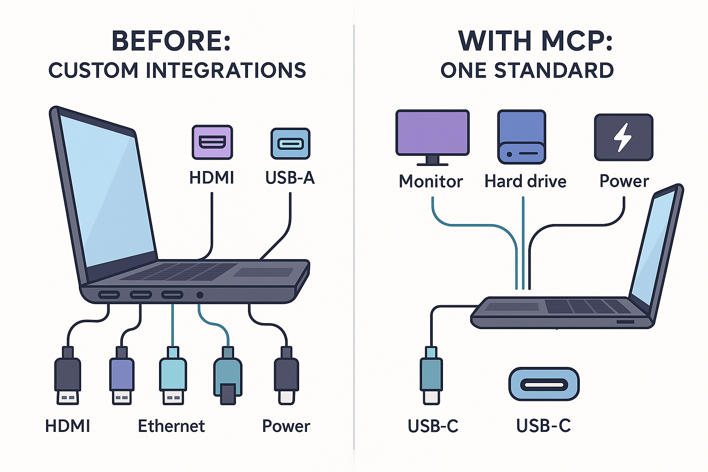
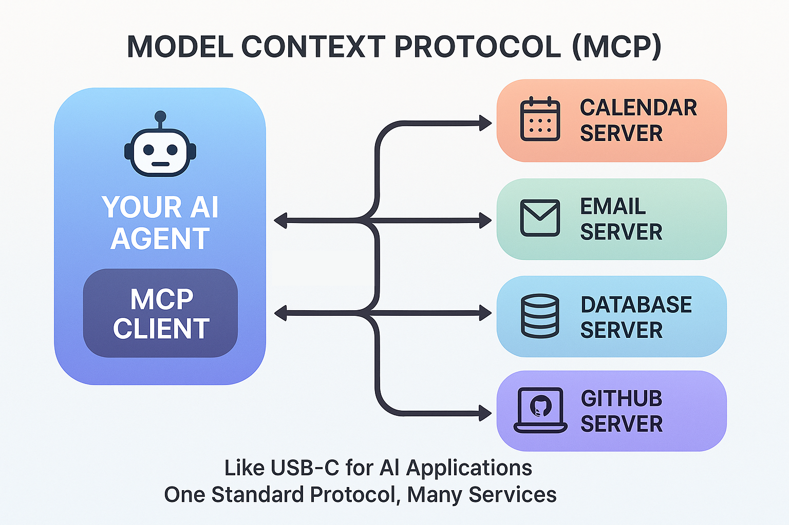
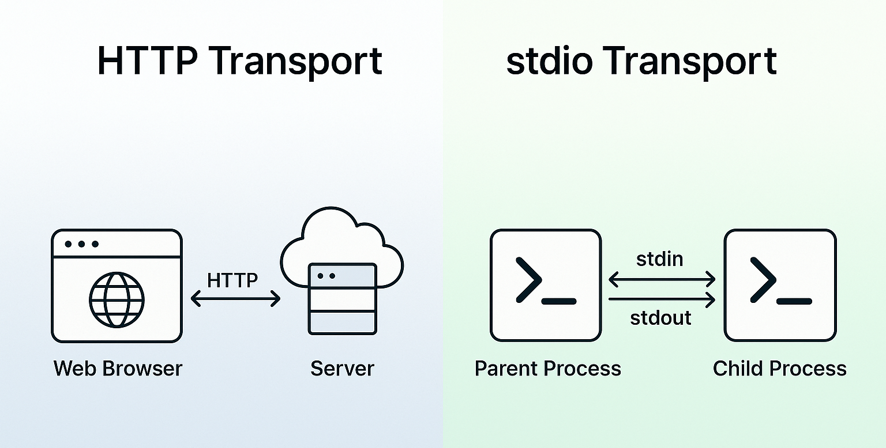
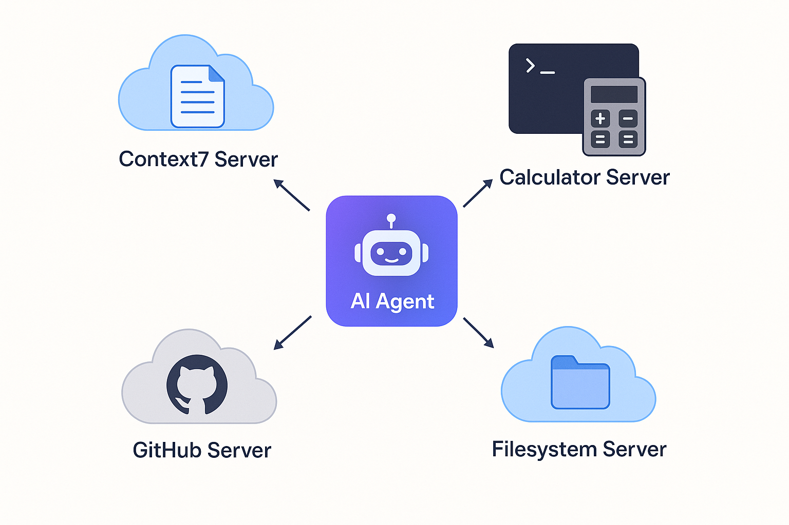
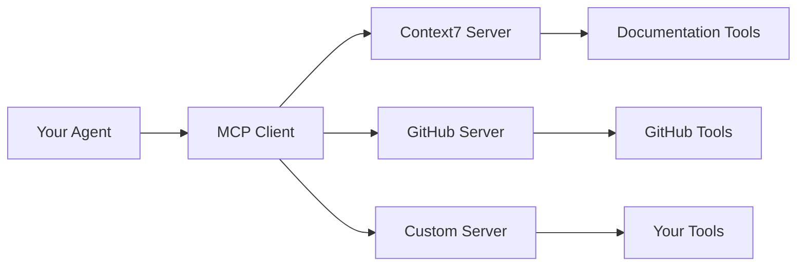

# Model Context Protocol (MCP)

Trong chương này, bạn sẽ học cách kết nối AI agent với dịch vụ bên ngoài bằng **Model Context Protocol (MCP)** — một chuẩn mở cung cấp interface phổ quát để ứng dụng AI truy cập tool và nguồn dữ liệu. Bạn sẽ khám phá cách MCP đơn giản hoá việc tích hợp với các dịch vụ như GitHub, database, và hệ thống tài liệu, và cách dùng MCP tool liền mạch với agent bạn đã xây trong [Getting Started with Agents](../05-agents/README.md).

## Yêu cầu trước

- Đã hoàn thành [Getting Started with Agents](../05-agents/README.md)

## 🎯 Mục tiêu học tập

Kết thúc chương này, bạn sẽ có thể:

- ✅ Hiểu Model Context Protocol (MCP) là gì và vì sao nó quan trọng
- ✅ Kết nối đến MCP server bên ngoài bằng **Streamable HTTP transport**
- ✅ Dùng **stdio transport** để giao tiếp với subprocess
- ✅ Tích hợp MCP tool với LangChain agent (cùng pattern `create_agent()`!)
- ✅ Làm việc với **nhiều MCP server cùng lúc** trong một agent
- ✅ Cài đặt **xử lý lỗi vững chắc** (retry, timeout, fallback)
- ✅ Chọn loại transport phù hợp cho use case của bạn
- ✅ Xây dựng và triển khai **MCP server tuỳ chỉnh** để expose tool của riêng bạn
- ✅ Xử lý sự cố kết nối MCP và tích hợp phổ biến

---

## 📌 Về các ví dụ code

Đoạn code trong README này được đơn giản hoá cho rõ ràng và tập trung vào khái niệm cốt lõi. File code thực tế trong thư mục `code/`, `solution/`, và `samples/` bao gồm:

- ✨ **Console output nâng cao** với logging chi tiết và định dạng
- 🛡️ **Xử lý lỗi sẵn sàng cho production** với khối try-except đầy đủ
- 🔧 **Hỗ trợ biến môi trường** cho cấu hình linh hoạt
- 💡 **Comment giáo dục mở rộng** giải thích khái niệm MCP

Khi chạy file thực tế, bạn sẽ thấy output chi tiết hơn so với ví dụ bên dưới.

---

## 📖 Ví von USB-C cho AI (USB-C for AI Analogy)

**Hãy tưởng tượng xây một laptop cần kết nối với nhiều thiết bị ngoại vi:**

### Trước USB-C (Tích hợp tuỳ chỉnh)
- 🔌 Cổng khác nhau cho mỗi thiết bị (HDMI, DisplayPort, USB-A, Ethernet, nguồn điện)
- 🔧 Driver và giao thức tuỳ chỉnh cho từng cái
- 📦 Laptop cồng kềnh với nhiều cổng chuyên biệt
- ⏱️ Rất nhiều công sức để thêm hỗ trợ thiết bị mới

### Với USB-C (Chuẩn MCP)
- ⚡ Một cổng phổ quát cho mọi thứ
- 🔄 Giao thức chuẩn hoá mà mọi thiết bị đều hiểu
- ✨ Laptop mỏng nhẹ với ít cổng hơn
- ⏰ Thêm hỗ trợ thiết bị mới nhanh hơn



*MCP cung cấp cách chuẩn hoá để AI agent kết nối với tool - giống như USB-C cho ứng dụng AI.*

---

## 🌐 Model Context Protocol (MCP)

**Bạn đã xây agent với tool tự tạo thủ công, nhưng còn việc kết nối với dịch vụ bên ngoài thì sao?**

Trong [Getting Started with Agents](../05-agents/README.md), bạn tạo tool (calculator, weather, search) bằng cách tự viết code cài đặt. Cách này hoạt động tốt cho tool tuỳ chỉnh riêng cho ứng dụng của bạn.

**Nhưng còn việc kết nối với dịch vụ có sẵn hoặc trường hợp tool cần được dùng trên nhiều ứng dụng AI khác nhau thì sao?** Hãy tưởng tượng cần tool cho:
- GitHub (tạo issue, tìm code, quản lý PR)
- Calendar (kiểm tra lịch trống, tạo sự kiện)
- Database công ty bạn (truy vấn dữ liệu, lấy schema)
- Hệ thống tài liệu (lấy docs, resolve tham chiếu)

Viết tích hợp tuỳ chỉnh cho mỗi dịch vụ nghĩa là phải xử lý API khác nhau, phương thức xác thực khác nhau, và định dạng dữ liệu khác nhau. Đây là lúc **Model Context Protocol (MCP)** phát huy tác dụng.

### MCP là gì?

**Model Context Protocol (MCP)** là một chuẩn mở cho phép ứng dụng AI kết nối với tool và nguồn dữ liệu bên ngoài qua một interface phổ quát. Nó giống như USB-C cho ứng dụng AI.

**Vấn đề**: Xây dựng một AI assistant cần truy cập chi tiết Calendar, database, GitHub, và nhiều hơn nữa nghĩa là phải viết tích hợp tuỳ chỉnh cho mỗi dịch vụ với API, phương thức xác thực, và định dạng dữ liệu khác nhau.

**Giải pháp MCP**: Dịch vụ expose khả năng của chúng qua một giao thức chuẩn. Agent của bạn kết nối một lần và có quyền truy cập mọi thứ.

### Kiến trúc



*MCP cung cấp cách chuẩn hoá để AI agent kết nối với dịch vụ bên ngoài - giống như USB-C cho ứng dụng AI.*

Mỗi **MCP Server** là một chương trình expose tool qua giao thức. Agent của bạn kết nối và có thể dùng tất cả tool khả dụng.

### Các loại Transport

MCP định nghĩa hai cơ chế transport chuẩn cho giao tiếp client-server:

| Transport | Phương thức giao tiếp | Khi nào dùng | Ví dụ |
|-----------|---------------------|-------------|---------|
| **Streamable HTTP** | Qua mạng (client → server qua network) | Khi MCP server được truy cập qua URL (local hoặc remote) | `{"transport": "streamable_http", "url": "https://api.mycompany.com/mcp"}` |
| **stdio** | Qua process (parent ↔ child qua stream) | Khi MCP server chạy như subprocess của ứng dụng bạn | `{"transport": "stdio", "command": "python", "args": ["server.py"]}` |

> **📝 Lưu ý về sự phát triển Transport**: Đặc tả MCP hiện tại dùng **Streamable HTTP** làm transport mạng chuẩn. Trong code LangChain Python, bạn dùng `transport: "streamable_http"` - thư viện tự động xử lý giao thức.

**Hiểu về stdin và stdout**:
- **stdin** (standard input): Nơi chương trình đọc input - như text từ bàn phím hoặc dữ liệu pipe
- **stdout** (standard output): Nơi chương trình ghi output - như text ra console hoặc màn hình
- Với stdio transport, client và server giao tiếp qua các stream này, giống như hai chương trình được kết nối bằng pipe



*Streamable HTTP transport dùng giao tiếp qua mạng, trong khi stdio dùng giao tiếp qua process.*

> **💡 Lựa chọn kiến trúc**: Streamable HTTP dành cho server *truy cập được qua mạng* (nghĩ đến: web service). stdio dành cho tool *tích hợp theo process* (nghĩ đến: subprocess).

### Vì sao MCP quan trọng

| Không có MCP | Có MCP |
|-------------|----------|
| Tích hợp tuỳ chỉnh cho mỗi dịch vụ | Một giao thức chuẩn |
| Xác thực riêng cho từng dịch vụ | Cách tiếp cận thống nhất |
| Tốn nhiều thời gian để thêm dịch vụ | Thêm dịch vụ nhanh hơn |

**Điểm mấu chốt**: Trong [Getting Started with Agents](../05-agents/README.md), bạn xây *cài đặt* tool. Với MCP, bạn kết nối tới *nhà cung cấp* tool expose khả năng của họ qua giao thức chuẩn. Cùng pattern `create_agent()`, nhưng nguồn tool khác!

### Dùng MCP trong LangChain

LangChain cung cấp package `langchain-mcp-adapters` để tích hợp MCP:

```bash
pip install langchain-mcp-adapters
```

Giờ hãy xem cách kết nối đến MCP server và dùng tool của nó với `create_agent()`.

---

## 🚀 Xây dựng Agent với MCP Tool

### Ví dụ 1: Agent với tích hợp MCP Server (Context7)

Ví dụ này cho thấy cách dùng `MultiServerMCPClient` để kết nối đến Context7 (một MCP server tài liệu) và dùng tool của nó với `create_agent()`. Đây là cùng pattern agent bạn đã học, nhưng tool có thể được truy cập và dùng theo cách chuẩn hoá hơn.

**Code chính bạn sẽ làm việc cùng:**
```python
from langchain_mcp_adapters.client import MultiServerMCPClient

client = MultiServerMCPClient({
    "context7": {
        "transport": "streamable_http",  # Uses Streamable HTTP protocol
        "url": "https://mcp.context7.com/mcp"  # Remote MCP server
    }
})

# Get tools from MCP server - that's it!
tools = await client.get_tools()

# Same create_agent() pattern, different tool source
agent = create_agent(model, tools)  # Tools from MCP server instead of manually created
```

**Code**: [`code/01_mcp_integration.py`](./code/01_mcp_integration.py)
**Chạy**: `python 06-mcp/code/01_mcp_integration.py`

**Về Context7**: Một MCP server tài liệu cung cấp tài liệu thư viện mới nhất. Nó cung cấp hai tool:
- `resolve-library-id`: Chuyển tên thư viện (vd. "React") thành Context7 ID
- `get-library-docs`: Lấy tài liệu với lọc chủ đề tuỳ chọn

**Code ví dụ:**

```python
import asyncio
import os

from dotenv import load_dotenv
from langchain.agents import create_agent
from langchain_mcp_adapters.client import MultiServerMCPClient
from langchain_openai import ChatOpenAI

load_dotenv()


async def main():
    # Context7 MCP Server - provides documentation for libraries
    mcp_server_url = os.getenv("MCP_SERVER_URL", "https://mcp.context7.com/mcp")

    # Create MCP client with HTTP transport to Context7
    client = MultiServerMCPClient({
        "context7": {
            "transport": "streamable_http",
            "url": mcp_server_url,
        }
    })

    try:
        # 1. Get all available tools from Context7
        print("🔧 Fetching tools from Context7 MCP server...")
        tools = await client.get_tools()

        print(f"✅ Retrieved {len(tools)} tools from Context7:")
        for tool in tools:
            print(f"   • {tool.name}: {tool.description}")

        # 2. Create model
        model = ChatOpenAI(
            model=os.getenv("AI_MODEL"),
            base_url=os.getenv("AI_ENDPOINT"),
            api_key=os.getenv("AI_API_KEY"),
        )

        # 3. Create agent with MCP tools - same create_agent() pattern!
        agent = create_agent(model, tools)

        # 4. Use the agent to get documentation
        query = "How do I use Python requests library to make HTTP GET requests? Get the latest documentation."
        print(f"👤 User: {query}\n")

        response = await agent.ainvoke({"messages": [("human", query)]})
        last_message = response["messages"][-1]

        print(f"🤖 Agent: {last_message.content}\n")

    finally:
        print("✅ MCP client connection closed")


if __name__ == "__main__":
    asyncio.run(main())
```

> **💡 Lưu ý về đơn giản hoá**: File code thực tế dùng `os.getenv("MCP_SERVER_URL", "https://mcp.context7.com/mcp")` với hỗ trợ biến môi trường. Đoạn code trên được đơn giản hoá để thể hiện khái niệm cốt lõi. Xem file đầy đủ để biết pattern production.

> **🤖 Thử với [GitHub Copilot](../docs/copilot.md) Chat:** Muốn tìm hiểu thêm về đoạn code này? Mở file này trong editor và hỏi Copilot:
> - "How does MultiServerMCPClient differ from manually creating tools?"
> - "Can I connect to multiple MCP servers simultaneously?"

### Kết quả mong đợi

```
🔌 MCP Integration Demo - Context7 Documentation Server

📡 Connecting to MCP server at: https://mcp.context7.com/mcp

🔧 Fetching tools from Context7 MCP server...
✅ Retrieved 2 tools from Context7:
   • resolve-library-id: Converts library names to Context7-compatible IDs
   • get-library-docs: Retrieves documentation with optional topic filtering

🤖 Creating agent with MCP tools...

👤 User: How do I use Python requests library to make HTTP GET requests? Get the latest documentation.

🤖 Agent: The `requests` library is Python's most popular HTTP client. 
Here's how to make a GET request...

💡 Key Concepts:
   • MCP provides standardized access to external tools
   • Same create_agent() pattern, different tool source!

✅ MCP client connection closed
```

---

### Ví dụ 2: MCP với stdio Transport

Ví dụ này cho thấy cách dùng **stdio transport** để chạy MCP server như một subprocess. Không giống HTTP (giao tiếp qua mạng), stdio dùng stream input/output chuẩn để giao tiếp.

**Code chính bạn sẽ làm việc cùng:**
```python
from pathlib import Path

# Run MCP server as a local subprocess
client = MultiServerMCPClient({
    "localCalculator": {
        "transport": "stdio",  # Local subprocess, not HTTP!
        "command": "python",
        "args": [str(Path(__file__).parent / "servers" / "stdio_calculator_server.py")]
    }
})

# Same agent pattern, different transport type
tools = await client.get_tools()
agent = create_agent(model, tools)
```

**Server**: [`code/servers/stdio_calculator_server.py`](./code/servers/stdio_calculator_server.py)
**Code**: [`code/02_mcp_stdio_local.py`](./code/02_mcp_stdio_local.py)
**Chạy**: `python 06-mcp/code/02_mcp_stdio_local.py`

**So sánh Transport**:

| Đặc điểm | Streamable HTTP (Ví dụ 1) | stdio (Ví dụ 2) |
|---------|-----------------|-------------------|
| **Giao tiếp** | Qua mạng (HTTP request) | Qua process (stream stdin/stdout) |
| **Triển khai Server** | Chạy độc lập với client | Chạy như subprocess của client |
| **Kết nối** | Client kết nối qua URL | Client tạo và quản lý process |
| **Vòng đời** | Server chạy độc lập | Vòng đời server gắn với client |
| **Phù hợp nhất cho** | Dịch vụ truy cập được qua mạng (local hoặc remote) | Tool tích hợp theo process (gắn kết chặt) |

**Cả hai transport đều có thể**:
- ✅ Xác thực user (Streamable HTTP: token/key, stdio: credential subprocess)
- ✅ Truy cập tài nguyên mạng (Streamable HTTP: trực tiếp, stdio: subprocess có thể gọi mạng)
- ✅ Được dùng trong production (lựa chọn tuỳ thuộc kiến trúc và nhu cầu)

> **💡 Sự khác biệt thực sự**:
> - **Streamable HTTP**: MCP server là một web service riêng biệt mà client kết nối tới
> - **stdio**: MCP server là subprocess được client truy cập trực tiếp
>
> Hãy nghĩ: Streamable HTTP = gọi web API, stdio = chạy một chương trình và giao tiếp với nó.

> **🤖 Thử với [GitHub Copilot](../docs/copilot.md) Chat:** Muốn tìm hiểu thêm về đoạn code này?
> Mở file này trong editor và hỏi Copilot:
> - "When should I use stdio transport vs HTTP transport?"
> - "How does the calculator server communicate with the agent?"

### Kết quả mong đợi

```
🔧 Starting local MCP server via stdio...

📟 Connecting to stdio MCP server...
✅ Connected! Retrieved 2 tools from local server:
   • calculate: Perform mathematical calculations using Python's math module
   • convert_temperature: Convert temperature between Celsius and Fahrenheit

🧮 Testing calculator tool...

👤 User: What is 15 * 23 + 100?
🤖 Agent: 15 * 23 + 100 = 445

🌡️  Testing temperature conversion...

👤 User: Convert 100 degrees Fahrenheit to Celsius
🤖 Agent: 100°F = 37.78°C

💡 Key Concepts:
   • stdio transport runs MCP server as a subprocess
   • Communicates via standard input/output streams

✅ MCP client connection closed
```

---

### Ví dụ 3: Tích hợp Agent đa Server

Ví dụ này minh hoạ sức mạnh thực sự của MCP: kết nối tới **nhiều MCP server cùng lúc**. Agent nhận tool từ tất cả server và thông minh chọn tool nào cần dùng dựa trên truy vấn!

**Code chính bạn sẽ làm việc cùng:**
```python
# Connect to multiple servers at once!
client = MultiServerMCPClient({
    "context7": {
        "transport": "streamable_http",
        "url": "https://mcp.context7.com/mcp"  # Remote docs server
    },
    "calculator": {
        "transport": "stdio",
        "command": "python",
        "args": [str(server_path)]  # Local math server
    }
})

# Agent gets tools from BOTH servers
tools = await client.get_tools()  # Combines tools from all servers
agent = create_agent(model, tools)

# Agent chooses the right tool for each task automatically!
```



*Một AI Agent kết nối đến nhiều MCP server cùng lúc - Context7 cho tài liệu, Calculator cho toán học, GitHub cho code, và Filesystem cho thao tác file.*

**Code**: [`code/03_mcp_multi_server.py`](./code/03_mcp_multi_server.py)
**Chạy**: `python 06-mcp/code/03_mcp_multi_server.py`

**Điều làm cho cách này mạnh mẽ:**
- ✅ Kết hợp nhiều loại transport khác nhau (Streamable HTTP + stdio)
- ✅ Kết hợp tool từ nhiều dịch vụ khác nhau
- ✅ Agent tự động định tuyến truy vấn đến tool phù hợp
- ✅ Mở rộng đến hàng chục server mà không cần đổi code agent
- ✅ Ví dụ thực tế: GitHub + Calendar + Database + Documentation trong một agent

**Use case thực tế:**
- Documentation (Context7) + Math (Calculator) + Weather (API)
- GitHub (code) + Calendar (lịch) + Database (truy vấn dữ liệu)
- Tool nội bộ công ty + Dịch vụ bên ngoài trong một interface thống nhất

> **🤖 Thử với [GitHub Copilot](../docs/copilot.md) Chat:** Muốn tìm hiểu thêm về đoạn code này?
> Mở file này trong editor và hỏi Copilot:
> - "How does the agent decide which server's tool to use?"
> - "What happens if two servers have tools with the same name?"

### Kết quả mong đợi

```
🌐 Connecting to multiple MCP servers...

🔧 Fetching tools from all servers...
✅ Retrieved 4 total tools from 2 servers:

📚 From Context7 (Documentation):
   • resolve-library-id: Convert library names to Context7 IDs
   • get-library-docs: Retrieve library documentation

🧮 From Local Calculator:
   • calculate: Perform mathematical calculations
   • convert_temperature: Convert temperature between units

Test 1: Math question (should use calculator)

👤 User: What is 25 * 4 + 100?
🤖 Agent: 25 * 4 + 100 = 200

Test 2: Documentation question (should use Context7)

👤 User: How do I use FastAPI to create a REST API? Get documentation.
🤖 Agent: FastAPI is a modern, fast web framework for building APIs with Python...

💡 Key Concepts:
   • Agent receives tools from ALL connected servers
   • Agent automatically chooses the right tool for each task

✅ All MCP connections closed
```

---

### Ví dụ 4: Xử lý lỗi & Pattern Production

Ví dụ này cho thấy **best practice** để xử lý lỗi MCP, dùng khả năng retry tích hợp sẵn của LangChain.

**Code chính bạn sẽ làm việc cùng:**
```python
import asyncio

# Create model
model = ChatOpenAI(
    model=os.getenv("AI_MODEL"),
    base_url=os.getenv("AI_ENDPOINT"),
    api_key=os.getenv("AI_API_KEY"),
)

agent = create_agent(model, tools)

# Execute with timeout - prevent indefinite hangs
timeout_seconds = 30
response = await asyncio.wait_for(
    agent.ainvoke({"messages": [("human", query)]}),
    timeout=timeout_seconds
)
```

**Code**: [`code/04_mcp_error_handling.py`](./code/04_mcp_error_handling.py)
**Chạy**: `python 06-mcp/code/04_mcp_error_handling.py`

**Pattern được đề cập:**
1. **with_retry() của LangChain** - Exponential backoff tích hợp sẵn (không cần code tuỳ chỉnh!)
2. **Kiểm tra sức khoẻ kết nối** - Giám sát tình trạng khả dụng của MCP server
3. **Xử lý timeout** - Ngăn treo vô thời hạn
4. **Suy giảm khéo léo (Graceful degradation)** - Tiếp tục hoạt động khi MCP bị down
5. **Chiến lược dự phòng** - Dùng server thay thế hoặc dữ liệu cache
6. **Dọn dẹp đúng cách** - Luôn đóng kết nối trong khối finally

**Vì sao dùng with_retry()?**
- ✅ Không cần vòng lặp retry tuỳ chỉnh
- ✅ Exponential backoff đã được kiểm chứng trong production
- ✅ Hoạt động với mọi component LangChain
- ✅ Code đơn giản hơn, ít bug hơn

**Checklist Production:**
- ✅ Dùng model.with_retry() để tự động retry
- ✅ Timeout request
- ✅ Chiến lược dự phòng
- ✅ Giám sát sức khoẻ
- ✅ Log lỗi/metric
- ✅ Suy giảm khéo léo

> **🤖 Thử với [GitHub Copilot](../docs/copilot.md) Chat:** Muốn tìm hiểu thêm về đoạn code này?
> Mở file này trong editor và hỏi Copilot:
> - "How does with_retry() implement exponential backoff?"
> - "What other production patterns should I consider for MCP?"

### Kết quả mong đợi

```
🛡️  MCP Error Handling & Retry Patterns

Pattern 1: Primary + Fallback Strategy

📡 Trying primary server (Context7)...
🔄 Attempting to connect to MCP server...
✅ Connected! Retrieved 2 tools

🔧 Fetching tools from MCP server...
✅ Retrieved 2 tools successfully

Pattern 2: Using LangChain's Built-In with_retry()

✅ Model configured with automatic retry (max 3 attempts)
   - LangChain handles exponential backoff automatically
   - No custom retry loops needed!

Pattern 3: Query Execution with Timeout

👤 User: How do I use Python's asyncio library? Get the latest documentation.
🤖 Agent: Python's asyncio library provides infrastructure for writing single-threaded
concurrent code using coroutines...

Pattern 4: MCP Server Health Check

✅ MCP server is healthy

🏥 Health status: HEALTHY

💡 Error Handling Best Practices:
   ✅ Use LangChain's with_retry() for automatic exponential backoff
   ✅ Implement fallback servers for high availability

✅ MCP connection closed gracefully
```

---

## 🔧 Pattern Agent bổ sung

### Ví dụ 5: Tạo MCP Server tuỳ chỉnh

Muốn xây MCP server của riêng bạn để expose tool tuỳ chỉnh? Ví dụ này cho thấy cách tạo MCP server sẵn sàng cho production mà bất kỳ MCP client nào cũng có thể kết nối tới!

**Vì sao tạo server tuỳ chỉnh?**
- Expose tool nội bộ công ty bạn cho AI agent
- Bọc API có sẵn theo chuẩn MCP
- Tạo tool tái sử dụng cho team của bạn
- Chia sẻ tool của bạn với hệ sinh thái MCP

**Code chính bạn sẽ làm việc cùng:**
```python
from mcp.server.fastmcp import FastMCP

# Create MCP server
mcp = FastMCP("my-calculator")

@mcp.tool()
def calculate(expression: str) -> str:
    """
    Perform mathematical calculations.
    
    Args:
        expression: Math expression to evaluate, e.g., '2 + 2', 'sqrt(16)'
    
    Returns:
        The result of the calculation.
    """
    result = eval(expression, {"__builtins__": {}}, safe_namespace)
    return str(result)

# Run with HTTP transport
mcp.run(transport="streamable-http", port=3000)
```

**Cài đặt hoàn chỉnh**: [`samples/basic_mcp_server.py`](./samples/basic_mcp_server.py) - Một MCP server calculator sẵn sàng cho production với:
- Streamable HTTP transport để truy cập qua mạng
- Đánh giá biểu thức an toàn với hàm toán học
- Xử lý lỗi đúng cách

**Chạy server**:
```bash
python 06-mcp/samples/basic_mcp_server.py
# Server starts on http://localhost:3000/mcp
```

**Kết nối đến server tuỳ chỉnh của bạn**:
```python
client = MultiServerMCPClient({
    "myCalculator": {
        "transport": "streamable_http",
        "url": "http://localhost:3000/mcp"
    }
})
```

**Best Practices**:
- ✅ Dùng tên và mô tả tool mang tính mô tả
- ✅ Validate tham số input
- ✅ Xử lý lỗi khéo léo và trả về thông báo hữu ích
- ✅ Thêm logging để debug và giám sát
- ✅ Hỗ trợ tắt khéo léo (xử lý signal)

**Tìm hiểu thêm**:
- [MCP SDK Documentation](https://modelcontextprotocol.io/docs) - Tài liệu SDK chính thức
- [MCP Registry](https://github.com/mcp) - Các cài đặt MCP server

---

### Cách hoạt động

**Khác gì so với Getting Started with Agents**:
1. **Nguồn Tool**: Thay vì tự tạo tool thủ công, bạn lấy chúng từ MCP server
2. **Khám phá Tool**: `client.get_tools()` lấy tất cả tool khả dụng từ server
3. **Thực thi Tool**: MCP client xử lý giao tiếp với server từ xa
4. **Cùng pattern create_agent()**: Agent hoạt động y hệt - chỉ nguồn tool thay đổi!

**Lợi ích của việc tích hợp MCP**:
- ✅ **Không cần code tích hợp tuỳ chỉnh** - MCP xử lý kết nối
- ✅ **Khám phá tool động** - Server có thể thêm/xoá tool mà không cần đổi code
- ✅ **Giao thức chuẩn** - Hoạt động với bất kỳ server tuân thủ MCP nào
- ✅ **Sẵn sàng production** - Streamable HTTP transport mở rộng cho triển khai từ xa

**Thiết lập Context7**:

Ví dụ hoạt động ngay không cần cấu hình gì với server Context7 công khai! Code tự động kết nối đến `https://mcp.context7.com/mcp`.

**Tuỳ chỉnh (tuỳ chọn)**:
- Để dùng Context7 server local thay thế, đặt `MCP_SERVER_URL=http://localhost:3000/mcp` trong file `.env`, rồi chạy:
  ```bash
  npx -y @upstash/context7-mcp --transport http --port 3000
  ```
- Để có rate limit cao hơn với server công khai, lấy API key tại [context7.com](https://context7.com) và bỏ comment phần `headers` trong code

---

## 🎓 Điểm chính cần nhớ

- **MCP là chuẩn phổ quát** - Giống USB-C cho ứng dụng AI, một giao thức cho mọi dịch vụ
- **Hai loại transport phục vụ nhu cầu khác nhau**:
  - **Streamable HTTP**: Giao tiếp qua mạng, hoạt động với server local hoặc remote
  - **stdio**: Giao tiếp qua process bằng stream input/output chuẩn
- **Hoạt động liền mạch với agent** - Cùng pattern `create_agent()` bạn đã học, chỉ khác nguồn tool
- **Sức mạnh đa server** - Kết nối đến hàng chục server, agent thông minh chọn tool đúng
- **Pattern production quan trọng** - Luôn cài đặt xử lý lỗi, retry, timeout, và fallback
- **Khám phá tool động** - Server có thể thêm/xoá tool mà không cần đổi code client
- **Tạo server của riêng bạn** - Expose tool công ty, bọc API, chia sẻ với hệ sinh thái MCP
- **Xử lý sự cố là chìa khoá** - Biết cách debug vấn đề kết nối, transport, và tool thất bại

---

## 🗺️ Sơ đồ khái niệm

Chương này dạy bạn cách MCP chuẩn hoá việc tích hợp tool AI:



*Một client, nhiều server, giao thức chuẩn hoá - đó là sức mạnh của MCP.*

---

## 🏆 Bài tập

Sẵn sàng luyện tập chưa? Hoàn thành các thử thách trong [assignment.md](./assignment.md)!

Bài tập gồm:
1. **Connect to MCP Server** - Thiết lập tích hợp Context7
2. **Build Multi-Server Agent** - Kết nối đến nhiều MCP server
3. **Custom Tool Integration** (Bonus) - Kết hợp MCP tool với tool thủ công

---

## 📚 Tài nguyên bổ sung

- [MCP for Beginners](https://github.com/microsoft/mcp-for-beginners) - Khoá học đầy đủ về MCP
- [Model Context Protocol](https://modelcontextprotocol.io/) - Đặc tả và tài liệu MCP chính thức
- [LangChain MCP Adapters](https://pypi.org/project/langchain-mcp-adapters/) - Package tích hợp MCP cho LangChain Python
- [MCP Registry](https://github.com/mcp) - Khám phá các MCP server khả dụng
- [Context7 MCP Server](https://github.com/upstash/context7) - Server tài liệu dùng trong chương này

---

## 🚀 Bước tiếp theo?

Làm tốt lắm! Bạn đã học cách kết nối AI agent với dịch vụ bên ngoài bằng **Model Context Protocol (MCP)** — cách chuẩn hoá để tích hợp tool mà không cần viết cài đặt tuỳ chỉnh cho từng dịch vụ.

### Xây dựng thêm trên MCP

**Agent của bạn giờ có thể dùng tool từ dịch vụ bên ngoài, nhưng còn việc tìm kiếm qua tài liệu và knowledge base của riêng bạn thì sao?** Ở các chương tiếp theo, bạn sẽ học:

1. **Documents, Embeddings & Semantic Search** - Xử lý tài liệu, tạo embedding, và xây dựng khả năng semantic search
2. **Building Agentic RAG Systems** - Kết hợp agent với truy xuất tài liệu để xây dựng hệ thống hỏi-đáp thông minh

---

## 🐛 Xử lý sự cố

Các vấn đề phổ biến bạn có thể gặp khi làm việc với MCP:

### "Failed to connect to MCP server" hoặc Connection Timeout

**Nguyên nhân**: MCP server không chạy, không thể truy cập, hoặc bị chặn bởi firewall

**Cách sửa**:

1. **Với Streamable HTTP transport**: Xác nhận URL đúng và server đang chạy:
```python
# Test the endpoint manually first
url = "https://mcp.context7.com/mcp"
print(f"Testing connection to {url}...")
```

2. **Với stdio transport**: Kiểm tra đường dẫn file server đúng:
```python
# Use absolute path or verify relative path
from pathlib import Path
server_path = Path(__file__).parent / "servers" / "stdio_calculator_server.py"
print(f"Server path: {server_path}")
# Ensure file exists before connecting
```

3. **Thêm timeout kết nối và retry logic** (xem Ví dụ 4):
```python
# Implement timeout with asyncio
import asyncio
tools = await asyncio.wait_for(client.get_tools(), timeout=10.0)
```

---

### "No tools returned from MCP server"

**Nguyên nhân**: Server đang chạy nhưng không expose tool nào, hoặc xác thực thất bại

**Cách sửa**:

1. **Kiểm tra log server** để tìm lỗi trong việc đăng ký tool
2. **Xác nhận xác thực** nếu server yêu cầu API key:
```python
client = MultiServerMCPClient({
    "context7": {
        "transport": "streamable_http",
        "url": "https://mcp.context7.com/mcp",
        "headers": {
            "Authorization": f"Bearer {os.getenv('CONTEXT7_API_KEY')}"  # Add auth header
        }
    }
})
```

3. **Test server trực tiếp** dùng một MCP client đơn giản để cô lập vấn đề

---

### "Module not found" cho stdio server

**Nguyên nhân**: Đường dẫn file server không đúng hoặc dependency server chưa cài

**Cách sửa**:

1. **Xác nhận resolve đường dẫn**:
```python
from pathlib import Path

server_path = Path(__file__).parent / "servers" / "stdio_calculator_server.py"
print(f"Server exists: {server_path.exists()}")
```

2. **Kiểm tra file server tồn tại**:
```bash
# Verify server file exists
ls 06-mcp/code/servers/stdio_calculator_server.py

# Note: stdio servers run via transport, not manually.
# They communicate via stdin/stdout pipes.
```

3. **Đảm bảo tất cả dependency server đã được cài** trong project của bạn

---

### Agent không dùng MCP tool

**Nguyên nhân**: Tool chưa được truyền đúng cho agent, hoặc mô tả tool không rõ ràng

**Cách sửa**:

1. **Xác nhận tool được lấy và truyền cho agent**:
```python
tools = await client.get_tools()
print(f"Retrieved {len(tools)} tools:", [t.name for t in tools])

agent = create_agent(model, tools)  # Ensure tools array is passed here
```

2. **Kiểm tra mô tả tool rõ ràng** - mô tả mơ hồ làm agent bối rối:
```python
# Tools should have clear, specific descriptions
# MCP server should expose well-described tools
```

3. **Test với yêu cầu tool rõ ràng** trong truy vấn:
```python
query = "Use the calculate tool to compute 5 * 10"
# Being explicit helps verify tools are accessible
```

---

### Lỗi "Session terminated" hoặc "Transport closed"

**Nguyên nhân**: Kết nối MCP bị đóng đột ngột hoặc xảy ra timeout

**Cách sửa**:

1. **Cài đặt dọn dẹp đúng cách** với try/finally:
```python
client = MultiServerMCPClient(config)
try:
    # Use MCP client
    tools = await client.get_tools()
    # ... use agent ...
finally:
    # Python MCP client handles cleanup automatically
    pass
```

2. **Xử lý thất bại kết nối khéo léo** (xem Ví dụ 4 cho pattern retry)

3. **Với stdio transport**: Đảm bảo subprocess không bị crash:
```bash
# Check server logs for errors
# Servers log to stderr with stdio transport
```

---

### Nhiều MCP server xung đột hoặc tool trùng tên

**Nguyên nhân**: Các server khác nhau expose tool có tên giống nhau

**Cách sửa**:

1. **MCP tự động namespace tool** theo server, nhưng nếu xảy ra xung đột:
```python
# Check which server provides which tool
for tool in tools:
    print(f"Tool: {tool.name}, Description: {tool.description}")
```

2. **Dựa vào mô tả tool** - agent dùng mô tả để chọn tool đúng

3. **Cân nhắc đổi tên tool** trong cài đặt MCP server của bạn nếu xung đột gây vấn đề

---

### Vấn đề hiệu năng với stdio transport

**Nguyên nhân**: Overhead khởi động subprocess hoặc độ trễ giao tiếp

**Cách sửa**:

1. **Chọn transport dựa trên nhu cầu kiến trúc**:
```python
# If MCP server needs to be network-accessible (shared across processes/machines):
http_config = {"transport": "streamable_http", "url": "https://api.myserver.com/mcp"}

# If MCP server is tightly integrated with client process:
stdio_config = {"transport": "stdio", "command": "python", "args": ["server.py"]}
```

2. **Cân nhắc giữ process server sống** cho các lần gọi lặp lại (nâng cao)

3. **Cache danh sách tool** nếu chúng không đổi giữa các lần gọi

---

## 📦 Dependencies

```bash
pip install langchain langchain-openai langchain-mcp-adapters mcp python-dotenv
```

---

## 🗺️ Điều hướng

[← Trước: Getting Started with Agents](../05-agents/README.md) | [Về trang chính](../README.md) | [Tiếp: Documents, Embeddings & Semantic Search →](../07-documents-embeddings-semantic-search/README.md)

---

## 💬 Có thắc mắc hoặc gặp khó khăn?

Nếu gặp khó khăn hoặc có câu hỏi khi xây dựng ứng dụng AI, hãy tham gia:

[](https://aka.ms/foundry/discord)

Nếu bạn có góp ý sản phẩm hoặc gặp lỗi khi xây dựng, hãy truy cập:

[](https://aka.ms/foundry/forum)
