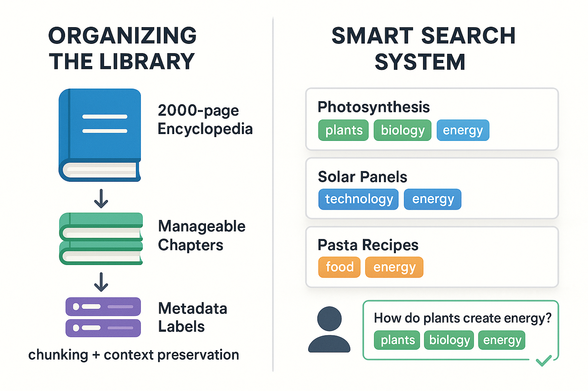
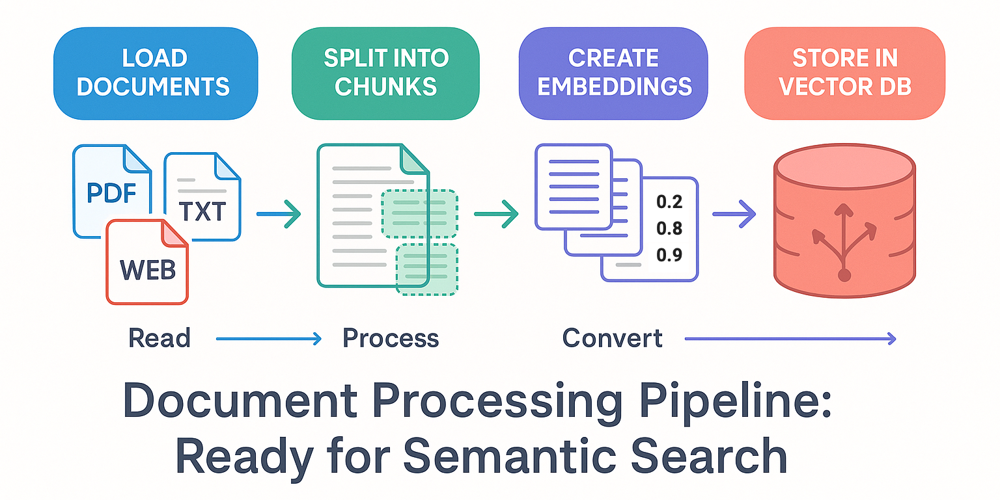
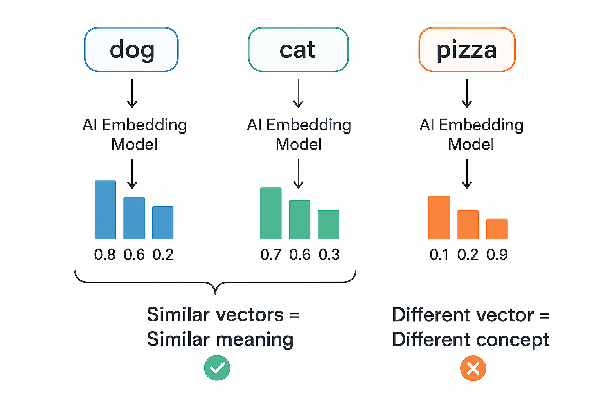
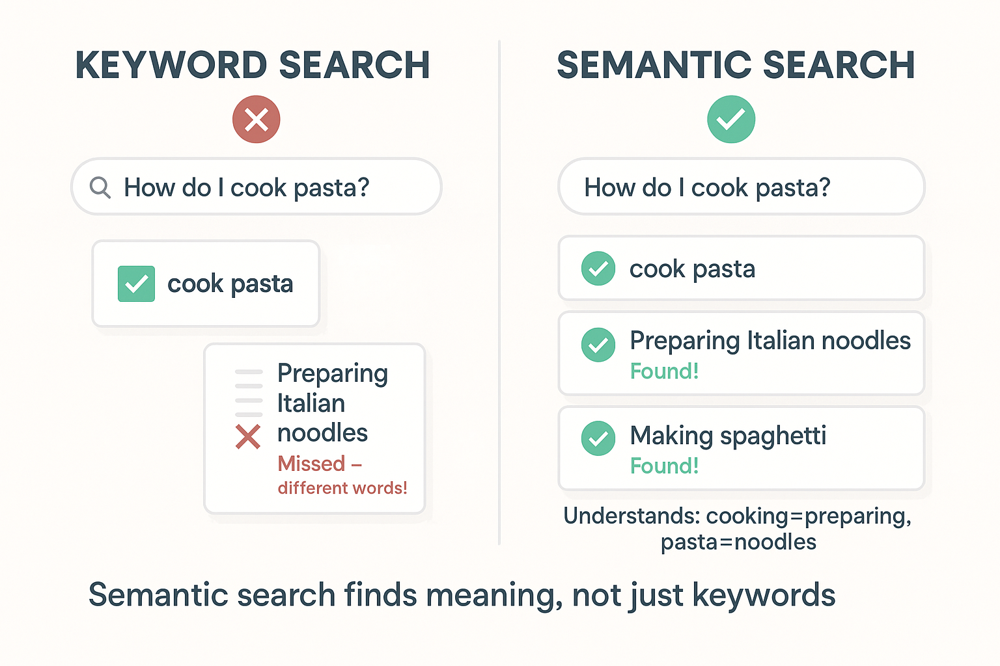

# Documents, Embeddings & Semantic Search (Tài liệu, Embedding & Tìm kiếm ngữ nghĩa)

Trong chương này, bạn sẽ học toàn bộ pipeline làm việc với tài liệu trong ứng dụng AI — từ load và chuẩn bị tài liệu đến kích hoạt semantic search thông minh. Bạn sẽ khám phá cách load nội dung từ nhiều nguồn khác nhau, chia nó thành chunk dễ quản lý, chuyển văn bản thành embedding số, và thực hiện similarity search hiểu ý nghĩa thay vì chỉ khớp từ khoá.

**Vì sao học cái này sau agent?** Bạn đã xây agent có thể dùng tool để giải quyết vấn đề. Giờ bạn sẽ học cách tạo **retrieval tool** cho agent khả năng tìm kiếm thông minh qua tài liệu của bạn. Sự kết hợp này — agent với khả năng retrieval — cho phép **hệ thống agentic RAG** nơi AI tự trị quyết định khi nào và cách nào để tìm kiếm knowledge base của bạn để trả lời câu hỏi. Bạn sẽ xây dựng pattern mạnh mẽ này trong [Building Agentic RAG Systems](../08-agentic-rag-systems/README.md).

## Yêu cầu trước

- Đã hoàn thành [Getting Started with Agents](../05-agents/README.md)
- Đã cấu hình biến môi trường (xem [Course Setup](../00-course-setup/README.md))

## 🎯 Mục tiêu học tập

Kết thúc chương này, bạn sẽ có thể:

- ✅ Load tài liệu từ nhiều nguồn khác nhau (text, PDF, web)
- ✅ Chia tài liệu dài thành chunk dễ quản lý
- ✅ Hiểu chiến lược chunking và đánh đổi của chúng
- ✅ Làm việc với metadata tài liệu
- ✅ Hiểu embedding là gì và hoạt động ra sao
- ✅ Tạo embedding cho văn bản bằng model Azure AI
- ✅ Lưu embedding trong vector store
- ✅ Thực hiện semantic similarity search
- ✅ Xây dựng nền tảng cho hệ thống RAG

---

## 📌 Về các ví dụ code

Đoạn code trong README này được đơn giản hoá cho rõ ràng và tập trung vào khái niệm cốt lõi. File code thực tế trong thư mục `code/`, `solution/`, và `samples/` bao gồm:

- ✨ **Console output nâng cao** với emoji, dấu phân cách, và định dạng chi tiết
- 📊 **Thống kê bổ sung** và metric để hiểu rõ hơn
- 🎯 **Ví dụ đầy đủ hơn** với tập dữ liệu đa dạng và nhiều truy vấn
- 💡 **Nội dung giáo dục mở rộng** với insight và quan sát chính
- 🛡️ **Xử lý lỗi vững chắc** với khối try-except và thao tác an toàn

Khi chạy file thực tế, bạn sẽ thấy output chi tiết hơn so với ví dụ bên dưới. Điều này có chủ đích - README tập trung dạy khái niệm, trong khi code minh hoạ thực hành chất lượng production.

---

## 📖 Ví von hệ thống thư viện thông minh (Smart Library System Analogy)

**Hãy tưởng tượng bạn đang xây một hệ thống thư viện hiện đại, thông minh.**

### Phần 1: Tổ chức thư viện (Xử lý tài liệu)

Khi ai đó tặng một bộ bách khoa toàn thư khổng lồ cho thư viện của bạn, bạn không thể:

- ❌ Đưa độc giả cả cuốn sách 2.000 trang
- ❌ Đưa họ các trang ngẫu nhiên
- ❌ Chỉ cho họ xem từng từ riêng lẻ

Thay vào đó, bạn cần:

- Tìm đúng phần (loading)
- Chia thành các chương dễ quản lý (chunking)
- Gắn nhãn mỗi phần bằng metadata (tổ chức)
- Giữ một số phần trùng lặp giữa các đoạn để không mất ngữ cảnh

### Phần 2: Hệ thống tìm kiếm thông minh (Embedding & Semantic Search)

Giờ hãy tưởng tượng mỗi phần sách được gắn một "thẻ số" đặc biệt đại diện cho ý nghĩa của nó:

- Phần về "quang hợp": `[plants: 0.9, biology: 0.8, energy: 0.7]`
- Phần về "tấm pin mặt trời": `[plants: 0.1, technology: 0.9, energy: 0.8]`
- Phần về "công thức nấu pasta": `[plants: 0.2, food: 0.9, energy: 0.3]`

> **💡 Lưu ý:** Các "thẻ có tên" đơn giản hoá này chỉ để minh hoạ. Embedding thực tế là vector dày đặc gồm 1536+ con số không có nhãn dễ đọc cho con người. Hãy nghĩ chúng như toạ độ trong không gian ngữ nghĩa 1536 chiều, tương tự (vĩ độ, kinh độ) nhưng nhiều chiều hơn rất nhiều!

Khi ai đó hỏi "Cây tạo năng lượng như thế nào?", hệ thống:

1. Chuyển câu hỏi thành số: `[plants: 0.9, biology: 0.7, energy: 0.8]`
2. Tìm các phần có số tương tự
3. Trả về phần quang hợp (khớp hoàn hảo!)

**Đây là cách xử lý tài liệu và semantic search hoạt động cùng nhau!**

LLM có giới hạn context nghĩa là chúng chỉ có thể xử lý một lượng văn bản nhất định cùng lúc. Xử lý tài liệu chuẩn bị nội dung của bạn, và semantic search giúp bạn tìm những gì cần dựa trên *ý nghĩa*, không chỉ khớp từ khoá. Mạnh mẽ!



*Hệ thống thư viện thông minh: Tổ chức tài liệu thành chunk có metadata (trái), sau đó dùng semantic search để tìm nội dung liên quan theo ý nghĩa (phải).*

---

## 📄 Phần 1: Làm việc với Tài liệu

### Vì sao cần Document Loader?

LLM cần input dạng văn bản, nhưng dữ liệu đến ở nhiều định dạng: file text, PDF, website, JSON/CSV, và nhiều hơn nữa. **Document loader xử lý sự phức tạp của việc đọc các định dạng khác nhau.**



*Pipeline xử lý tài liệu: Load tài liệu → Chia thành chunk → Tạo embedding → Lưu vào vector database, sẵn sàng cho semantic search.*

---

### Ví dụ 1: Load File Text

Hãy xem cách dùng `TextLoader` để đọc file text và truy cập `page_content` và `metadata`.

**Code chính bạn sẽ làm việc cùng:**

```python
# Initialize the loader with a file path
loader = TextLoader("./data/sample.txt")

# Load the document - returns list of Document objects
docs = loader.load()

# Access document properties
print(docs[0].page_content)  # The actual text content
print(docs[0].metadata)       # Metadata like source path
```

**Code**: [`code/01_load_text.py`](./code/01_load_text.py)
**Chạy**: `python 07-documents-embeddings-semantic-search/code/01_load_text.py`

**Code ví dụ:**

Đầu tiên, tạo một file text mẫu:

```python
from langchain_community.document_loaders import TextLoader
from pathlib import Path

# Create sample data
data_dir = Path("./data")
data_dir.mkdir(exist_ok=True)

sample_text = """
LangChain is a framework for building applications with large language models.

It provides tools for:
- Working with different AI providers
- Managing prompts and templates
- Processing and storing documents
- Building RAG systems
- Creating AI agents

The framework is designed to be modular and composable.
"""

(data_dir / "sample.txt").write_text(sample_text.strip())

# Load the document
loader = TextLoader("./data/sample.txt")
docs = loader.load()

print(f"Loaded {len(docs)} document(s)")
print(f"Content: {docs[0].page_content}")
print(f"Metadata: {docs[0].metadata}")
```

> **🤖 Thử với [GitHub Copilot](../docs/copilot.md) Chat:** Muốn tìm hiểu thêm về đoạn code này? Mở file này trong editor và hỏi Copilot:
> - "How can I load PDF files instead of text files using LangChain?"
> - "How would I load multiple text files from a directory at once?"

### Kết quả mong đợi

Khi chạy ví dụ này bằng `python 07-documents-embeddings-semantic-search/code/01_load_text.py`, bạn sẽ thấy:

```text
Loaded 1 document(s)
Content: LangChain is a framework for building applications with large language models.

It provides tools for:
- Working with different AI providers
- Managing prompts and templates
...

Metadata: {'source': './data/sample.txt'}
```

### Cách hoạt động

**Chuyện gì đang xảy ra**:

1. **Tạo dữ liệu mẫu**: Ta ghi một file text vào `./data/sample.txt`
2. **Khởi tạo TextLoader**: Truyền đường dẫn file cho loader
3. **Load**: Gọi `loader.load()` để đọc file
4. **Kết quả**: Trả về một list các object `Document`

**Điểm chính**:

- `TextLoader` đọc file text và xử lý file I/O
- Trả về list các object `Document` (kể cả với file đơn, để nhất quán)
- Mỗi document có hai thuộc tính chính:
  - `page_content`: Nội dung văn bản thực tế
  - `metadata`: Thông tin về document (source, v.v.)
- Metadata tự động bao gồm đường dẫn file nguồn

---

## ✂️ Chia nhỏ Tài liệu (Splitting)

### Vì sao cần chia tài liệu?

- **Giới hạn context của LLM**: Model chỉ xử lý được ~4.000-128.000 token
- **Độ liên quan**: Chunk nhỏ hơn = truy xuất chính xác hơn
- **Chi phí**: Input nhỏ hơn = chi phí API thấp hơn

### Đánh đổi kích thước Chunk

| Chunk nhỏ (200-500 ký tự) | Chunk lớn (1000-2000 ký tự) |
|------------------------------|--------------------------------|
| ✅ Chính xác hơn | ✅ Nhiều ngữ cảnh hơn |
| ✅ Tốt hơn cho câu hỏi cụ thể | ✅ Tốt hơn cho chủ đề phức tạp |
| ❌ Có thể mất ngữ cảnh | ❌ Khớp kém chính xác hơn |
| ❌ Nhiều chunk hơn cần xử lý | ❌ Ít chunk hơn |

### Ví dụ 2: Chia văn bản (Text Splitting)

Ở đây bạn sẽ chia tài liệu dài thành chunk dễ quản lý bằng `RecursiveCharacterTextSplitter` với kích thước chunk và độ chồng lấp có thể cấu hình.

**Code chính bạn sẽ làm việc cùng:**

```python
# Create a splitter with chunk size and overlap settings
splitter = RecursiveCharacterTextSplitter(
    chunk_size=300,      # Target size in characters
    chunk_overlap=50,    # Overlap between chunks (preserves context)
)

# Split text into document chunks
docs = splitter.create_documents([text])
```

**Code**: [`code/02_splitting.py`](./code/02_splitting.py)
**Chạy**: `python 07-documents-embeddings-semantic-search/code/02_splitting.py`

> **🤖 Thử với [GitHub Copilot](../docs/copilot.md) Chat:** Muốn tìm hiểu thêm về đoạn code này? Mở file này trong editor và hỏi Copilot:
> - "How do I determine the optimal chunk size for my documents?"
> - "Can I split on specific delimiters like headings or paragraphs?"

### Hướng dẫn thực tế về kích thước Chunk

**Điểm khởi đầu**: Dùng **500 ký tự** với độ chồng lấp **100 ký tự** (20%) cho hầu hết use case.

**Điều chỉnh dựa trên kết quả**:

- Quá ít kết quả → Tăng kích thước chunk
- Kết quả quá chung chung → Giảm kích thước chunk
- Mất ngữ cảnh ở ranh giới → Tăng độ chồng lấp

---

## 🔄 Chồng lấp Chunk (Chunk Overlap)

**Vì sao cần chồng lấp chunk?** Không có chồng lấp, "the mitochondria is the | powerhouse of the cell" bị chia giữa câu, mất ngữ cảnh. Với chồng lấp, cả hai chunk đều chứa "is the powerhouse," giữ được ý nghĩa.

**Độ chồng lấp khuyến nghị**: Bắt đầu với 20% kích thước chunk (vd. 100 ký tự cho chunk 500 ký tự).

### Ví dụ 3: So sánh Chunk Overlap

**Code**: [`code/03_overlap.py`](./code/03_overlap.py)
**Chạy**: `python 07-documents-embeddings-semantic-search/code/03_overlap.py`

Ví dụ này so sánh chunk có và không có chồng lấp để cho thấy cách chồng lấp giữ được ngữ cảnh.

---

## 🏷️ Metadata Tài liệu

Metadata giúp bạn:

- Theo dõi nguồn tài liệu
- Lọc theo danh mục, ngày, tác giả
- Hiểu ngữ cảnh

### Ví dụ 4: Làm việc với Metadata

**Code**: [`code/04_metadata.py`](./code/04_metadata.py)
**Chạy**: `python 07-documents-embeddings-semantic-search/code/04_metadata.py`

**Code chính bạn sẽ làm việc cùng:**

```python
# Create document with custom metadata
doc = Document(
    page_content="LangChain is a framework...",
    metadata={
        "source": "langchain-guide.md",
        "category": "tutorial",
        "date": "2024-01-15",
        "author": "Tech Team",
    },
)

# Metadata is preserved when splitting
split_docs = splitter.split_documents([doc])
# Each chunk retains the original metadata!
```

> **🤖 Thử với [GitHub Copilot](../docs/copilot.md) Chat:** Muốn tìm hiểu thêm về đoạn code này? Mở file này trong editor và hỏi Copilot:
> - "How can I filter search results by metadata values like category or date?"
> - "Can I add custom metadata after documents are loaded?"

---

## 🔢 Phần 2: Embedding

### Embedding là gì?

Embedding chuyển văn bản thành vector số nắm bắt ý nghĩa ngữ nghĩa:

- Khái niệm tương tự → Vector tương tự
- "king" - "man" + "woman" ≈ "queen"



*Embedding ánh xạ văn bản thành các điểm trong không gian ngữ nghĩa, nơi các ý nghĩa tương tự nằm gần nhau.*

### Ví dụ 5: Tạo Embedding với Azure AI

**Code**: [`code/05_basic_embeddings.py`](./code/05_basic_embeddings.py)
**Chạy**: `python 07-documents-embeddings-semantic-search/code/05_basic_embeddings.py`

**Code chính bạn sẽ làm việc cùng:**

```python
import os
from dotenv import load_dotenv
from langchain_openai import AzureOpenAIEmbeddings

load_dotenv()

def get_embeddings_endpoint():
    """Get the Azure OpenAI endpoint, removing /openai/v1 suffix if present."""
    endpoint = os.getenv("AI_ENDPOINT", "")
    if endpoint.endswith("/openai/v1"):
        endpoint = endpoint.replace("/openai/v1", "")
    return endpoint

# Initialize Azure OpenAI embeddings model
embeddings = AzureOpenAIEmbeddings(
    azure_endpoint=get_embeddings_endpoint(),
    api_key=os.getenv("AI_API_KEY"),
    model=os.getenv("AI_EMBEDDING_MODEL", "text-embedding-ada-002"),
    api_version="2024-02-01",
)

# Embed multiple texts
texts = [
    "LangChain makes building AI apps easier",
    "LangChain simplifies AI application development",
    "I love eating pizza for dinner",
    "The weather is sunny today",
]

all_embeddings = embeddings.embed_documents(texts)

print(f"Created {len(all_embeddings)} embeddings")
print(f"Each embedding has {len(all_embeddings[0])} dimensions")
```

> **🤖 Thử với [GitHub Copilot](../docs/copilot.md) Chat:** Muốn tìm hiểu thêm về đoạn code này? Mở file này trong editor và hỏi Copilot:
> - "How do I compare two embeddings to find their similarity?"
> - "What's the difference between embed_query and embed_documents?"

### Cosine Similarity

Để so sánh embedding, ta dùng cosine similarity:

```python
import math

def cosine_similarity(a: list[float], b: list[float]) -> float:
    """Calculate cosine similarity between two vectors."""
    dot_product = sum(x * y for x, y in zip(a, b))
    mag_a = math.sqrt(sum(x * x for x in a))
    mag_b = math.sqrt(sum(x * x for x in b))
    return dot_product / (mag_a * mag_b)

# Similar meanings → High similarity scores (>0.8)
# Different topics → Low similarity scores (<0.5)
```

---

## 🗄️ Phần 3: Vector Store

### Vector Store là gì?

Vector store là database được tối ưu để lưu và tìm kiếm embedding:

- Lưu: Thêm tài liệu cùng embedding của chúng
- Tìm kiếm: Tìm tài liệu tương tự bằng vector similarity

### Ví dụ 6: Dùng InMemoryVectorStore

**Code**: [`code/06_vector_store.py`](./code/06_vector_store.py)
**Chạy**: `python 07-documents-embeddings-semantic-search/code/06_vector_store.py`

**Code chính bạn sẽ làm việc cùng:**

```python
import os
from dotenv import load_dotenv
from langchain_core.documents import Document
from langchain_core.vectorstores import InMemoryVectorStore
from langchain_openai import AzureOpenAIEmbeddings

load_dotenv()

# Create embeddings model
embeddings = AzureOpenAIEmbeddings(
    azure_endpoint=get_embeddings_endpoint(),
    api_key=os.getenv("AI_API_KEY"),
    model=os.getenv("AI_EMBEDDING_MODEL", "text-embedding-ada-002"),
    api_version="2024-02-01",
)

# Create sample documents
docs = [
    Document(page_content="LangChain is a framework for building AI applications"),
    Document(page_content="Python is a popular programming language"),
    Document(page_content="Agents can use tools to solve complex problems"),
    Document(page_content="Vector databases store embeddings for fast similarity search"),
    Document(page_content="RAG combines retrieval with generation for accurate answers"),
]

# Create vector store from documents
vector_store = InMemoryVectorStore.from_documents(docs, embeddings)
print(f"Created vector store with {len(docs)} documents")

# Perform similarity search
query = "How do I build AI applications?"
results = vector_store.similarity_search(query, k=2)

print(f"\nQuery: {query}")
print(f"\nTop {len(results)} results:")
for i, doc in enumerate(results):
    print(f"  {i + 1}. {doc.page_content}")
```

### Kết quả mong đợi

```text
Created vector store with 5 documents

Query: How do I build AI applications?

Top 2 results:
  1. LangChain is a framework for building AI applications
  2. RAG combines retrieval with generation for accurate answers
```

---

## 🎯 Phần 4: Semantic Search

### Keyword Search vs Semantic Search



*Keyword search khớp từ chính xác, trong khi semantic search hiểu ý nghĩa và tìm nội dung liên quan kể cả khi diễn đạt khác nhau.*

### Ví dụ 7: Tìm kiếm với Similarity Score

**Code**: [`code/07_similarity_scores.py`](./code/07_similarity_scores.py)
**Chạy**: `python 07-documents-embeddings-semantic-search/code/07_similarity_scores.py`

**Code chính bạn sẽ làm việc cùng:**

```python
# Search with scores to see how well each result matches
results_with_scores = vector_store.similarity_search_with_score(
    "pets that need less attention",
    k=4
)

for doc, score in results_with_scores:
    print(f"Score: {score:.4f} - {doc.page_content}")
```

### Hiểu về Score

- Càng gần 1.0 = Càng tương tự
- Càng gần 0.0 = Càng ít tương tự
- Thường dùng ngưỡng (vd. > 0.7) để lọc kết quả

---

## ⚡ Phần 5: Xử lý theo Batch

### Ví dụ 8: Batch Embedding

**Code**: [`code/08_batch_embeddings.py`](./code/08_batch_embeddings.py)
**Chạy**: `python 07-documents-embeddings-semantic-search/code/08_batch_embeddings.py`

```python
texts = ["Text 1", "Text 2", "Text 3", ...]

# Slow: One at a time
for text in texts:
    embedding = embeddings.embed_query(text)  # ❌ Inefficient

# Fast: Batch processing
batch_embeddings = embeddings.embed_documents(texts)  # ✅ Much faster!
```

**Điểm chính cần nhớ:**

- Xử lý theo batch thường nhanh hơn
- Giảm số lệnh gọi API (chi phí thấp hơn)
- Luôn dùng `embed_documents()` cho nhiều văn bản

---

## 🧮 Phần 6: Quan hệ giữa các Embedding (Bonus)

### Ví dụ 9: Demo Vector Math

**Code**: [`code/09_embedding_relationships.py`](./code/09_embedding_relationships.py)
**Chạy**: `python 07-documents-embeddings-semantic-search/code/09_embedding_relationships.py`

Embedding nắm bắt quan hệ ngữ nghĩa có thể thao tác qua phép toán vector:

```text
Embedding("Puppy") - Embedding("Dog") + Embedding("Cat") ≈ Embedding("Kitten")
```

Điều này hoạt động vì embedding mã hoá các quan hệ như loài và giai đoạn cuộc sống thành các chiều riêng biệt.

---

## 🎓 Điểm chính cần nhớ

- **Document loader** đọc nhiều định dạng file thành Document
- **Text splitter** chia tài liệu thành chunk dễ quản lý
- **Chunk overlap** giữ ngữ cảnh giữa các chunk
- **Embedding** chuyển văn bản thành vector số bằng Azure AI
- **Vector store** cho phép similarity search nhanh
- **Semantic search** tìm nội dung theo ý nghĩa, không phải từ khoá
- **Metadata** giúp tổ chức và lọc tài liệu
- **Xử lý theo batch** hiệu quả hơn gọi từng cái riêng lẻ

---

## 📦 Dependencies

Khoá học dùng `langchain-openai` cho Azure OpenAI embedding:

```bash
pip install langchain langchain-openai langchain-core langchain-text-splitters langchain-community python-dotenv
```

---

## 🔧 Biến môi trường

Đảm bảo các biến môi trường sau được thiết lập:

```bash
AI_ENDPOINT=your-azure-endpoint
AI_API_KEY=your-api-key
AI_EMBEDDING_MODEL=text-embedding-ada-002
```

---

## 🏆 Bài tập

Sẵn sàng luyện tập chưa? Hoàn thành các thử thách trong [assignment.md](./assignment.md)!

Bài tập gồm:

1. **Similarity Explorer** - Khám phá cách embedding nắm bắt sự tương tự ngữ nghĩa
2. **Semantic Book Search** (Bonus) - Xây dựng hệ thống gợi ý sách bằng semantic search

---

## 🗺️ Điều hướng

[← Trước: MCP](../06-mcp/README.md) | [Về trang chính](../README.md) | [Tiếp: Agentic RAG Systems →](../08-agentic-rag-systems/README.md)

---

## 💬 Có thắc mắc?

[](https://aka.ms/foundry/discord)
