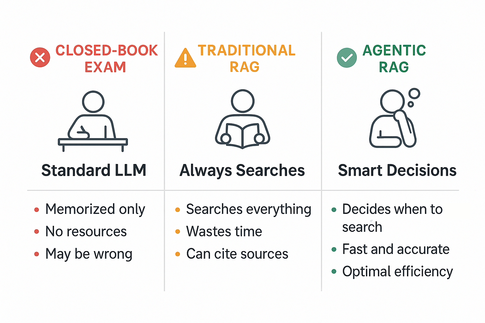
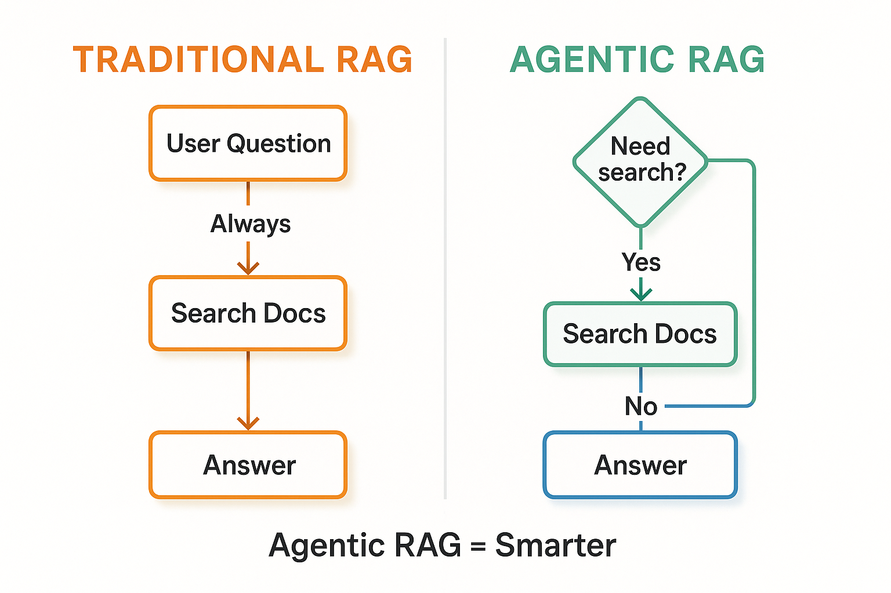
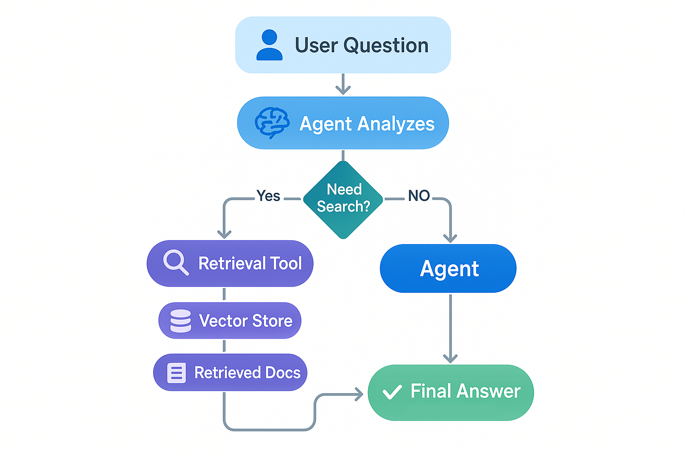
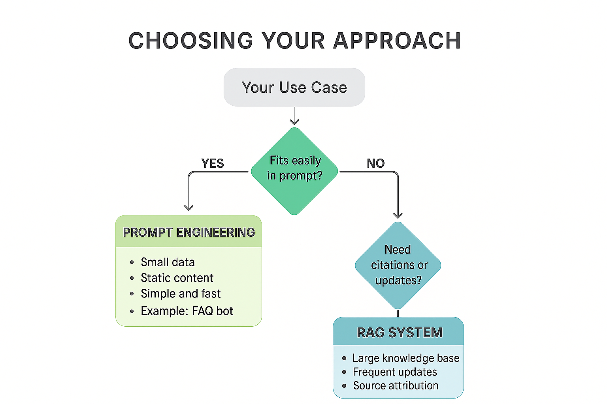

# Building Agentic RAG Systems (Xây dựng hệ thống Agentic RAG)

Trong chương này, bạn sẽ học xây dựng hệ thống **Agentic RAG** nơi AI agent thông minh quyết định khi nào và cách nào để tìm kiếm tài liệu của bạn để trả lời câu hỏi. Không giống RAG truyền thống luôn tìm kiếm bất kể có cần hay không, agentic RAG cho AI của bạn quyền tự chủ để xác định liệu retrieval có cần thiết hay không — trả lời trực tiếp khi đã có kiến thức, hoặc tìm kiếm tài liệu khi cần thêm ngữ cảnh.

Bạn sẽ kết hợp mọi thứ đã học để xây dựng hệ thống hỏi-đáp thông minh cung cấp câu trả lời chính xác, có nguồn từ knowledge base tuỳ chỉnh. Bạn sẽ tiếp tục dùng:

- Tool từ [Function Calling & Tools](../04-function-calling-tools/README.md)
- Agent từ [Getting Started with Agents](../05-agents/README.md)
- Document retrieval từ [Documents, Embeddings & Semantic Search](../07-documents-embeddings-semantic-search/README.md)

## Yêu cầu trước

- Đã hoàn thành [Function Calling & Tools](../04-function-calling-tools/README.md)
- Đã hoàn thành [Getting Started with Agents](../05-agents/README.md)
- Đã hoàn thành [Documents, Embeddings & Semantic Search](../07-documents-embeddings-semantic-search/README.md)

## 🎯 Mục tiêu học tập

Kết thúc chương này, bạn sẽ có thể:

- ✅ Hiểu sự khác biệt giữa Agentic RAG và Traditional RAG
- ✅ Xây dựng agent quyết định khi nào tìm kiếm vs trả lời trực tiếp
- ✅ Tạo retrieval tool từ vector store
- ✅ Cài đặt tìm kiếm tài liệu thông minh với việc agent tự ra quyết định
- ✅ Xử lý ngữ cảnh và trích dẫn trong hệ thống agentic
- ✅ Áp dụng khung quyết định (RAG vs Prompt Engineering)

---

## 📖 Ví von học sinh thông minh (Smart Student Analogy)

**Hãy tưởng tượng ba kiểu học sinh làm bài thi:**

**Thi Closed-Book (LLM thông thường)**:

- ❌ Học sinh chỉ dựa vào kiến thức đã học thuộc
- ❌ Không thể tra cứu sự kiện cụ thể
- ❌ Có thể đưa câu trả lời sai một cách tự tin
- ❌ Có giới hạn kiến thức (dừng học ở thời điểm training)

**Thi Open-Book không có chiến lược (Traditional RAG)**:

- ✅ Học sinh có thể tham khảo sách giáo khoa trong lúc thi
- ❌ Tra sách giáo khoa cho MỌI câu hỏi, kể cả "2+2 là mấy?"
- ❌ Lãng phí thời gian tìm kiếm khi đã biết câu trả lời
- ✅ Chính xác hơn, có thể trích dẫn nguồn
- ❌ Chậm hơn và tốn kém hơn vì tìm kiếm không cần thiết

**Thi Open-Book thông minh (Agentic RAG)**:

- ✅ Học sinh có thể tham khảo sách giáo khoa trong lúc thi
- ✅ **Tự quyết định** khi nào cần tra cứu vs trả lời từ kiến thức có sẵn
- ✅ "2+2 là mấy?" → Trả lời trực tiếp (không cần tra cứu)
- ✅ "Doanh thu Q3 của công ty ta là bao nhiêu?" → Tra cứu tài liệu
- ✅ Nhanh với câu hỏi đơn giản, kỹ lưỡng với câu hỏi phức tạp
- ✅ Chính xác hơn, có thể trích dẫn nguồn khi cần

**Đây chính là sức mạnh của Agentic RAG!** Agent đưa ra quyết định thông minh về khi nào retrieval là cần thiết.



*Ví von Học sinh thông minh: Closed-book chỉ dựa vào trí nhớ, Traditional RAG tìm kiếm mọi thứ, Agentic RAG thông minh quyết định khi nào cần tìm kiếm.*

---

## 🤖 Agentic RAG vs Traditional RAG

### Khác biệt chính

**Traditional RAG**:

```
User Question → LUÔN Search → Retrieve Docs → Generate Answer
```

Mọi câu hỏi đều kích hoạt tìm kiếm, kể cả khi agent đã biết câu trả lời.

**Agentic RAG**:

```
User Question → Agent Quyết định → [Search nếu cần] → Generate Answer
```

Agent dùng suy luận để xác định liệu retrieval có cần thiết hay không.



*Traditional RAG luôn tìm kiếm, trong khi Agentic RAG đưa ra quyết định thông minh về khi nào cần tìm kiếm.*

### Ví dụ: Sự khác biệt trong thực tế

**"What is 2 + 2?"**

- Traditional RAG: Tìm kiếm vector store, lấy tài liệu không liên quan, trả lời "4" (tìm kiếm lãng phí)
- Agentic RAG: Trả lời ngay "4" (không cần tìm kiếm)

**"What was our company's revenue in Q3 2024?"**

- Traditional RAG: Tìm kiếm vector store, lấy tài liệu tài chính, trả lời "$1.2M"
- Agentic RAG: Tìm kiếm tài liệu, trả lời "$1.2M dựa trên báo cáo tài chính Q3"

### Lợi ích của Agentic RAG

| Lợi ích | Traditional RAG | Agentic RAG |
|---------|-----------------|-------------|
| **Hiệu quả** | Tìm kiếm mỗi lần | Chỉ tìm kiếm khi cần |
| **Tốc độ** | Chậm với câu hỏi đơn giản | Nhanh với đơn giản, kỹ lưỡng với phức tạp |
| **Chi phí** | Chi phí embedding + search mỗi query | Chi phí thấp hơn - chỉ tìm kiếm khi cần thiết |
| **Thông minh** | Cứng nhắc, dễ đoán | Thích nghi, tự ra quyết định |
| **Độ phức tạp** | Pipeline đơn giản | Cần agent loop |

### Khi nào dùng cách tiếp cận nào

**Dùng Traditional RAG khi**:

- Mọi câu hỏi đều cần tìm kiếm tài liệu của bạn
- Ví dụ: "Tìm trong database pháp lý của chúng ta các case về X"
- Bạn muốn hành vi dễ đoán, đơn giản

**Dùng Agentic RAG khi**:

- Câu hỏi kết hợp kiến thức chung và dữ liệu tuỳ chỉnh
- Ví dụ: "Thủ đô nước Pháp là gì và địa chỉ văn phòng Paris của chúng ta là gì?"
  - Agent trả lời thủ đô từ kiến thức chung (Paris)
  - Agent tìm kiếm tài liệu cho địa chỉ văn phòng
- Bạn muốn hiệu năng và chi phí tối ưu

**Với hầu hết ứng dụng, Agentic RAG là lựa chọn tốt hơn** vì nó kết hợp sự linh hoạt với hiệu quả.

---

## 🏗️ Kiến trúc Agentic RAG



*Kiến trúc Agentic RAG: Agent quyết định liệu có nên truy xuất tài liệu hay trả lời trực tiếp, sau đó sinh response kèm trích dẫn khi cần.*

**Thành phần chính**:

1. **Agent**: Ra quyết định khi nào cần tìm kiếm
2. **Retrieval Tool**: Tìm kiếm vector store khi cần
3. **Vector Store**: Chứa embedding tài liệu của bạn
4. **Quyết định thông minh**: Agent quyết định tìm kiếm vs trả lời trực tiếp

### Khi nào dùng RAG vs Prompt Engineering

**Cây quyết định:**

1. Vừa dễ dàng trong prompt? → **Prompt Engineering**
2. Knowledge base lớn không vừa? → **RAG**
3. Cập nhật thường xuyên? → **RAG**
4. Cần trích dẫn nguồn? → **RAG**



*Cây quyết định để chọn giữa Prompt Engineering (dữ liệu nhỏ, tĩnh) và RAG (knowledge base lớn, động, có trích dẫn).*

**Prompt Engineering**: Dữ liệu nhỏ, nội dung tĩnh (vd. FAQ bot với 20 câu hỏi). Đơn giản, nhanh, không cần hạ tầng.

**RAG**: Knowledge base lớn, cập nhật thường xuyên, cần trích dẫn (vd. customer support với 10.000 sổ tay hướng dẫn). Mở rộng được, luôn cập nhật, cung cấp attribution nguồn.

---

## 💻 Xây dựng hệ thống RAG đầu tiên

Trước khi xây hệ thống RAG, hãy chắc chắn RAG là lựa chọn đúng! Hãy xem khung quyết định hoạt động thực tế.

### Ví dụ 1: Chọn cách tiếp cận đúng (RAG vs Lựa chọn khác)

Ví dụ này minh hoạ khung quyết định ta vừa học, so sánh Prompt Engineering và RAG song song để hiểu khi nào mỗi cách tiếp cận hợp lý.

**Code chính bạn sẽ làm việc cùng:**

```python
# Wrap vector store in a retrieval tool for the agent
@tool
def search_docs(query: str) -> str:
    """Search company documentation for technical information..."""  # Agent reads this to decide when to call
    results = vector_store.similarity_search(query, k=2)  # Search for top 2 matches
    return "\n\n".join([f"[{doc.metadata['source']}]: {doc.page_content}" for doc in results])

# Create agent with the retrieval tool - agent decides when to use it
agent = create_agent(model, tools=[search_docs], system_prompt="...")
```

**Code**: [`code/01_when_to_use_rag.py`](./code/01_when_to_use_rag.py)
**Chạy**: `python 08-agentic-rag-systems/code/01_when_to_use_rag.py`

Demo này cho thấy hai kịch bản thực tế:

1. **Kịch bản 1: FAQ Bot nhỏ** → Dùng **Prompt Engineering** (5 Q&A vừa trong prompt)
2. **Kịch bản 2: Documentation Bot lớn** → Dùng **Agentic RAG** (hàng nghìn tài liệu, agent quyết định khi nào tìm kiếm)

> **🤖 Thử với [GitHub Copilot](../docs/copilot.md) Chat:** Muốn tìm hiểu thêm về đoạn code này? Mở file này trong editor và hỏi Copilot:
> - "How does agent decision-making improve efficiency in agentic RAG?"
> - "What factors should I consider when choosing between RAG and prompt engineering?"

---

**Bạn đã học về agentic RAG, nhưng "traditional RAG" thực sự trông như thế nào?** Trước khi xây hệ thống thông minh, hãy xem pattern truyền thống - một cách tiếp cận đơn giản tìm kiếm tài liệu cho MỌI query, kể cả "What is 2+2?". Điều này giúp bạn hiểu sự kém hiệu quả mà agent giải quyết.

### Ví dụ 1a: Traditional RAG (Pattern luôn tìm kiếm)

Hãy xem traditional RAG luôn tìm kiếm, bất kể có cần hay không.

**Code chính bạn sẽ làm việc cùng:**

```python
# Traditional RAG: Always retrieves, then generates (no agent decision!)
def traditional_rag(question: str) -> str:
    # Step 1: ALWAYS retrieve documents (even if not needed!)
    retrieved_docs = vector_store.similarity_search(question, k=2)
    context = "\n".join([doc.page_content for doc in retrieved_docs])
    
    # Step 2: Generate answer with context
    messages = [
        SystemMessage(content="Answer based on the provided context."),
        HumanMessage(content=f"Context:\n{context}\n\nQuestion: {question}")
    ]
    return model.invoke(messages).content
```

**Code**: [`code/01a_traditional_rag.py`](./code/01a_traditional_rag.py)
**Chạy**: `python 08-agentic-rag-systems/code/01a_traditional_rag.py`

**Pattern Traditional RAG**:

1. User hỏi một câu hỏi (BẤT KỲ câu hỏi nào)
2. Hệ thống LUÔN tìm kiếm vector store
3. Hệ thống truyền tài liệu đã lấy + câu hỏi cho LLM
4. LLM sinh câu trả lời dựa trên ngữ cảnh đã lấy

**Vấn đề**:

```text
Question: "What is the capital of France?"
Traditional RAG: 🔍 Searching documents... (lãng phí thời gian và lệnh gọi API)
Agent: I can answer this directly - it's Paris! (không cần tìm kiếm)
```

Ví dụ này minh hoạ:

- Dùng pattern retrieve-rồi-generate đơn giản 2 bước
- Cách hệ thống tìm kiếm kể cả với câu hỏi kiến thức chung
- So sánh chi phí: traditional RAG vs cách tiếp cận agentic
- Khi nào traditional RAG hợp lý (query luôn cần tìm kiếm tài liệu)

**Điểm mấu chốt**: Traditional RAG đơn giản và dễ đoán, nhưng kém hiệu quả. Nó tìm kiếm mỗi lần, kể cả khi trả lời "What is 2+2?". Điều này lãng phí lệnh gọi API, thời gian, và tiền bạc cho các thao tác retrieval không cần thiết.

---

**Traditional RAG thường lãng phí thời gian tìm kiếm cho mọi câu hỏi, kể cả câu hỏi kiến thức chung.** Làm sao xây dựng hệ thống đủ thông minh để chỉ tìm kiếm khi cần — trả lời "What is 2+2?" trực tiếp nhưng tìm kiếm tài liệu cho "What was our Q3 revenue?" Đó là agentic RAG: bọc vector store của bạn trong một tool và để agent quyết định khi nào dùng nó.

### Ví dụ 2: Agentic RAG với Retrieval Tool

Hãy xem cách tạo retrieval tool từ vector store bằng `@tool` và đưa nó cho `create_agent()` để ra quyết định thông minh.

**Code chính bạn sẽ làm việc cùng:**

```python
# Create a retrieval tool that the agent can choose to use
@tool
def search_langchain_docs(query: str) -> str:
    """Search LangChain documentation for specific information..."""  # Agent decides when to call based on this
    results = vector_store.similarity_search(query, k=2)  # Semantic search
    return "\n\n".join([f"[{doc.metadata['source']}]: {doc.page_content}" for doc in results])

# Agent autonomously decides: general knowledge? Answer directly. Need docs? Use tool.
agent = create_agent(model, tools=[search_langchain_docs], system_prompt="...")
```

**Code**: [`code/02_agentic_rag.py`](./code/02_agentic_rag.py)
**Chạy**: `python 08-agentic-rag-systems/code/02_agentic_rag.py`

**Code ví dụ:**

> **📝 Lưu ý**: Đoạn code bên dưới được đơn giản hoá cho rõ ràng. File code thực tế bao gồm nhiều tài liệu hơn, test nhiều câu hỏi cho thấy khi nào agent tìm kiếm vs trả lời trực tiếp, và cung cấp console output chi tiết cho thấy quá trình ra quyết định của agent.

```python
import os
from dotenv import load_dotenv
from langchain.agents import create_agent
from langchain_core.documents import Document
from langchain_core.messages import HumanMessage
from langchain_core.tools import tool
from langchain_core.vectorstores import InMemoryVectorStore
from langchain_openai import AzureOpenAIEmbeddings, ChatOpenAI

load_dotenv()


def get_embeddings_endpoint():
    """Get the Azure OpenAI endpoint, removing /openai/v1 suffix if present."""
    endpoint = os.getenv("AI_ENDPOINT", "")
    if endpoint.endswith("/openai/v1"):
        endpoint = endpoint.replace("/openai/v1", "")
    return endpoint


# Create embeddings
embeddings = AzureOpenAIEmbeddings(
    azure_endpoint=get_embeddings_endpoint(),
    api_key=os.getenv("AI_API_KEY"),
    model=os.getenv("AI_EMBEDDING_MODEL", "text-embedding-ada-002"),
    api_version="2024-02-01",
)

# Create sample documents
docs = [
    Document(page_content="Our Q3 2024 revenue was $1.2 million", metadata={"source": "financials.txt"}),
    Document(page_content="The API uses OAuth 2.0 authentication", metadata={"source": "api-docs.txt"}),
    Document(page_content="Company headquarters is in Seattle, WA", metadata={"source": "about.txt"}),
]

# Create vector store
vector_store = InMemoryVectorStore.from_documents(docs, embeddings)

# Create retrieval tool - agent decides when to use it!
@tool
def search_company_docs(query: str) -> str:
    """Search company documentation for specific information about 
    revenue, API details, company information, etc.
    Use this when you need to look up specific company data.
    """
    results = vector_store.similarity_search(query, k=2)
    return "\n\n".join([
        f"[{doc.metadata['source']}]: {doc.page_content}" 
        for doc in results
    ])

# Create agent with the retrieval tool
model = ChatOpenAI(
    model=os.getenv("AI_MODEL"),
    base_url=os.getenv("AI_ENDPOINT"),
    api_key=os.getenv("AI_API_KEY"),
)
agent = create_agent(
    model,
    tools=[search_company_docs],
    system_prompt="You are a helpful assistant with access to company documents. Use the search tool when you need specific company information. For general knowledge questions, answer directly.",
)

# Test: Agent decides when to search
queries = [
    "What is 2 + 2?",           # Agent answers directly (no search)
    "What was Q3 revenue?",     # Agent searches documents
    "What is the capital of France?",  # Agent answers directly
    "Where is the company headquarters?",  # Agent searches documents
]

for query in queries:
    print(f"\n🔍 Query: {query}")
    response = agent.invoke({"messages": [HumanMessage(content=query)]})
    print(f"Answer: {response['messages'][-1].content}")
```

> **🤖 Thử với [GitHub Copilot](../docs/copilot.md) Chat:** Muốn tìm hiểu thêm về đoạn code này? Mở file này trong editor và hỏi Copilot:
> - "How does the agent decide when to use the retrieval tool vs answering directly?"
> - "How would I add metadata filtering to the retrieval tool?"

### Kết quả mong đợi

Khi chạy ví dụ này bằng `python 08-agentic-rag-systems/code/02_agentic_rag.py`, bạn sẽ thấy:

```text
🔍 Query: What is 2 + 2?
🧠 Agent answered from knowledge
Answer: 4

🔍 Query: What was Q3 revenue?
📚 Agent searched documents
Answer: According to our financial documents, Q3 2024 revenue was $1.2 million.

🔍 Query: What is the capital of France?
🧠 Agent answered from knowledge
Answer: The capital of France is Paris.

🔍 Query: Where is the company headquarters?
📚 Agent searched documents
Answer: Company headquarters is in Seattle, WA.
```

---

## 📋 Khi nào dùng RAG vs Prompt Engineering

| Tiêu chí | Prompt Engineering | RAG |
|----------|-------------------|-----|
| **Kích thước dữ liệu** | Nhỏ (vừa trong prompt) | Lớn (hàng nghìn tài liệu) |
| **Tần suất cập nhật** | Ít khi thay đổi | Cập nhật thường xuyên |
| **Cần trích dẫn** | Không | Có |
| **Ví dụ** | FAQ bot với 20 câu hỏi | Customer support với 10.000 sổ tay |

**Cây quyết định**:
1. Vừa dễ dàng trong prompt? → **Prompt Engineering**
2. Knowledge base lớn không vừa? → **RAG**
3. Cập nhật thường xuyên? → **RAG**
4. Cần trích dẫn nguồn? → **RAG**

---

## 🎓 Điểm chính cần nhớ

- **Traditional RAG** luôn tìm kiếm, kể cả khi không cần thiết (2 bước đơn giản: retrieve → generate)
- **Agentic RAG** để agent quyết định khi nào cần tìm kiếm
- Tạo **retrieval tool** từ vector store bằng `@tool`
- Dùng `create_agent()` từ `langchain.agents` để xây dựng agent ra quyết định thông minh
- **Trích dẫn nguồn** khi dùng thông tin đã truy xuất
- Chọn **RAG vs Prompt Engineering** dựa trên kích thước dữ liệu và tần suất cập nhật

---

## 📦 Dependencies

```bash
pip install langchain langchain-openai langchain-core langgraph python-dotenv
```

---

## 🗺️ Điều hướng

[← Trước: Documents & Embeddings](../07-documents-embeddings-semantic-search/README.md) | [Về trang chính](../README.md) | [Tiếp: Deploy to Microsoft Foundry →](../09-deploy-to-microsoft-foundry/README.md)

---

## 🚀 Bước tiếp theo

Bạn đã xây dựng hệ thống Agentic RAG thông minh. Ở chương tiếp theo (tuỳ chọn), bạn sẽ học cách triển khai agent LangChain lên Microsoft Foundry như một hosted agent.

Đến hiện tại, bạn đã học:

1. ✅ Thiết lập môi trường Python cho LangChain
2. ✅ Hiểu kiến trúc và thành phần của LangChain
3. ✅ Làm việc với chat model và hội thoại nhiều lượt
4. ✅ Tạo prompt, template, và structured output
5. ✅ Xây dựng tool với function calling
6. ✅ Tạo agent tự trị với pattern ReAct
7. ✅ Kết nối đến MCP server cho tool bên ngoài
8. ✅ Xử lý tài liệu với embedding và vector store
9. ✅ Xây dựng hệ thống Agentic RAG thông minh

Tiếp tục với [Deploy LangChain Agents to Microsoft Foundry](../09-deploy-to-microsoft-foundry/README.md) khi bạn sẵn sàng đưa agent local của mình lên môi trường cloud hosted.

---

## 💬 Có thắc mắc?

[](https://aka.ms/foundry/discord)
