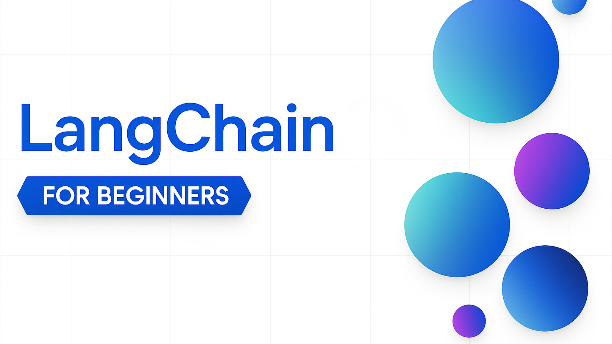

# LangChain for Beginners - Một khoá học

Khoá học dạy mọi thứ bạn cần biết để bắt đầu xây dựng AI Agent với LangChain

## 🦜🔗 Chào mừng

Chào mừng bạn đến với **LangChain for Beginners**! Khoá học này bao quát các kiến thức nền tảng để xây dựng ứng dụng với LangChain và Python. Khoá học gồm [**10 chương**](#-mục-lục), mỗi chương tập trung vào một khái niệm cụ thể. Để **bắt đầu** ngay, bạn có thể vào chương [course-setup](/00-course-setup/), nhưng bạn nên đọc phần tổng quan bên dưới trước.

### Bạn sẽ học và xây dựng được gì

Khoá học đưa bạn từ con số 0 đến khả năng xây dựng các ứng dụng AI mạnh mẽ:

- **Conversational AI (AI hội thoại)** - Xây dựng chatbot hiểu ngữ cảnh với phản hồi streaming và hành vi tuỳ biến
- **Semantic Search (Tìm kiếm ngữ nghĩa)** - Tạo hệ thống tìm kiếm hiểu ý nghĩa, không chỉ dựa vào từ khoá
- **Function Calling & Tools (Gọi hàm & công cụ)** - Cho AI khả năng dùng tool và trích xuất dữ liệu có cấu trúc
- **Autonomous Agents (Agent tự trị)** - Xây dựng agent biết suy luận, ra quyết định và tự chọn tool
- **MCP Integration (Tích hợp MCP)** - Kết nối AI với các dịch vụ bên ngoài bằng chuẩn Model Context Protocol
- **Agentic RAG** - Xây dựng hệ thống hỏi-đáp thông minh, nơi agent tự quyết định khi nào cần tra cứu knowledge base
- **Microsoft Foundry Deployment (Triển khai lên Microsoft Foundry)** - Triển khai agent LangChain của bạn thành hosted agent bằng VS Code hoặc Azure Developer CLI

**Sau khi hoàn thành**, bạn sẽ hiểu vững về LangChain và biết cách xây dựng các ứng dụng AI thực tế có thể triển khai được!

> **Cách tiếp cận giảng dạy:** Khoá học đi theo hướng "agent-first" (agent trước). Bạn sẽ học về tool, rồi đến agent, sau đó kết hợp chúng với document retrieval (truy xuất tài liệu) để xây dựng hệ thống agentic RAG. Cách này phản ánh đúng cách các hệ thống AI production hiện đại được xây dựng.

Đừng quên [star (🌟)](https://github.com/microsoft/langchain-for-beginners/stargazers) và [fork repo này](https://github.com/microsoft/langchain-for-beginners/fork) để chạy code.

---

## 📚 Mục lục

Khoá học gồm **10 chương** (setup + 9 chương), mỗi chương xây dựng dựa trên chương trước để dạy bạn LangChain từ gốc rễ. Mỗi chương gồm giải thích khái niệm, ví dụ code chạy được, và bài thử thách thực hành.

| # | Chương | Mô tả | Khái niệm chính |
|---|---------|-------------|--------------|
| 0 | [Course Setup](./00-course-setup/README.md) | Thiết lập môi trường phát triển (local hoặc cloud) | Python, Azure AI Foundry, Codespaces, biến môi trường |
| 1 | [Introduction to LangChain](./01-introduction/README.md) | Hiểu framework và các khái niệm cốt lõi | Kiến thức nền tảng LangChain, lệnh gọi LLM đầu tiên |
| 2 | [Chat Models & Basic Interactions](./02-chat-models/README.md) | Chat model, message, và hội thoại | Các loại message, streaming, xử lý lỗi, temperature |
| 3 | [Prompts, Messages, and Structured Outputs](./03-prompts-messages-outputs/README.md) | Làm việc với prompt, mảng message, và output kiểu an toàn (type-safe) | Message, template, structured output, Pydantic schema |
| 4 | [Function Calling & Tools](./04-function-calling-tools/README.md) | Mở rộng khả năng AI bằng function calling và tool | Pydantic schema, tool binding, type safety |
| 5 | [Getting Started with Agents](./05-agents/README.md) | Xây dựng agent tự trị biết suy luận và chọn tool | ReAct pattern, agent loop, create_agent(), middleware |
| 6 | [Model Context Protocol (MCP)](./06-mcp/README.md) | Kết nối AI với dịch vụ bên ngoài qua chuẩn MCP | MCP server, stdio transport, tích hợp tool, mô hình multi-server |
| 7 | [Documents, Embeddings & Semantic Search](./07-documents-embeddings-semantic-search/README.md) | Load tài liệu, tạo embedding, và xây dựng semantic search | Document loading, chunking, vector embedding, similarity search |
| 8 | [Building Agentic RAG Systems](./08-agentic-rag-systems/README.md) | Xây dựng hệ thống RAG nơi agent thông minh tự quyết định khi nào cần tra cứu tài liệu | Agentic RAG (agent tự quyết định khi nào tìm kiếm), retrieval tool, hỏi-đáp thông minh |
| 9 | [Deploy LangChain Agents to Microsoft Foundry](./09-deploy-to-microsoft-foundry/README.md) | Triển khai agent LangChain thành hosted agent trên Microsoft Foundry | Hosted agent, Responses protocol, triển khai qua VS Code, Azure Developer CLI |

Mỗi chương bao gồm:
- 📖 **Giải thích khái niệm** kèm ví dụ liên hệ thực tế (analogy)
- 💻 **Ví dụ code** bạn có thể chạy ngay
- 🎯 **Thử thách thực hành** để kiểm tra hiểu biết
- 🔑 **Điểm chính cần nhớ** để củng cố kiến thức

Chúng tôi dự định mở rộng khoá học theo thời gian với thêm nhiều chủ đề. Hãy đón chờ cập nhật!

---

## 📋 Yêu cầu trước khi học

Trước khi bắt đầu khoá học, bạn nên nắm vững:

- **Kiến thức nền tảng Python** - Biến, hàm, object, async/await, dùng pip để cài package
- **Khái niệm cơ bản về Generative AI** - Hiểu cơ bản về LLM, prompt, token, được trình bày trong khoá [GenAI for Beginners](https://github.com/microsoft/generative-ai-for-beginners)

### Công cụ cần thiết

- [Python 3.10 trở lên](https://python.org/)
- Tài khoản Github
- Code editor (khuyến nghị [VS Code](https://code.visualstudio.com/)) (nếu chạy khoá học ở local)

## 👫 Gặp gỡ người học khác, giải đáp thắc mắc

Nếu gặp khó khăn hoặc có câu hỏi về xây dựng AI Agent, hãy tham gia kênh Discord LangChain trong [Microsoft Foundry Community Discord](https://aka.ms/langchain-foundry/discord).

## 🙏 Muốn giúp đỡ?

Bạn có góp ý hoặc phát hiện lỗi chính tả/code? [Tạo issue](https://github.com/microsoft/langchain-for-beginners/issues) hoặc [Tạo pull request](https://github.com/microsoft/langchain-for-beginners/pull).

## 📖 Tài nguyên khoá học và mẫu bổ sung

- **[Glossary (Bảng thuật ngữ)](./GLOSSARY.md)** - Định nghĩa đầy đủ mọi thuật ngữ dùng trong khoá học
- **[LangChain Documentation](https://docs.langchain.com/oss/python/langchain/overview)** - Tài liệu chính thức của LangChain để tìm hiểu sâu hơn
- **[LangChain Sales Analysis Agent Sample](https://github.com/Azure-Samples/langchain-agent-python)** - Học cách xây dựng agent phân tích doanh số với LangChain, MCP và PostgreSQL
- **[Email Agent Sample](https://github.com/microsoft/local-email-agent/)** - Học cách xây dựng agent xử lý email với LangChain và MCP, có thể chạy local với phi-4 hoặc deploy lên cloud

---

## Tài nguyên bổ sung

### LangChain

---

### Azure / Edge / MCP / Agents

---

### Chuỗi Generative AI

[-9333EA?style=for-the-badge&labelColor=E5E7EB&color=9333EA)](https://github.com/microsoft/Generative-AI-for-beginners-dotnet?WT.mc_id=academic-105485-koreyst)
[-C084FC?style=for-the-badge&labelColor=E5E7EB&color=C084FC)](https://github.com/microsoft/generative-ai-for-beginners-java?WT.mc_id=academic-105485-koreyst)
[-E879F9?style=for-the-badge&labelColor=E5E7EB&color=E879F9)](https://github.com/microsoft/generative-ai-with-javascript?WT.mc_id=academic-105485-koreyst)

---

### Kiến thức nền tảng

---

### Chuỗi Copilot

---

## Cần trợ giúp?

Nếu gặp khó khăn hoặc có câu hỏi khi xây dựng ứng dụng AI, hãy tham gia:

Nếu bạn có góp ý sản phẩm hoặc gặp lỗi khi xây dựng, hãy truy cập:

---

## Đóng góp

Dự án này hoan nghênh mọi đóng góp và góp ý. Hầu hết đóng góp yêu cầu bạn đồng ý với Contributor License Agreement (CLA), xác nhận rằng bạn có quyền và thực sự cấp cho chúng tôi quyền sử dụng đóng góp của bạn. Chi tiết tại <https://cla.opensource.microsoft.com>.

Khi bạn gửi pull request, một CLA bot sẽ tự động xác định xem bạn có cần cung cấp CLA hay không và đánh dấu PR phù hợp (vd. status check, comment). Chỉ cần làm theo hướng dẫn của bot. Bạn chỉ cần làm việc này một lần cho tất cả các repo dùng CLA của chúng tôi.

Dự án này tuân theo [Microsoft Open Source Code of Conduct](https://opensource.microsoft.com/codeofconduct/). Để biết thêm thông tin, xem [Code of Conduct FAQ](https://opensource.microsoft.com/codeofconduct/faq/) hoặc liên hệ [opencode@microsoft.com](mailto:opencode@microsoft.com) nếu có thắc mắc.

## Nhãn hiệu

Dự án này có thể chứa nhãn hiệu hoặc logo của các dự án, sản phẩm, hoặc dịch vụ. Việc sử dụng hợp lệ nhãn hiệu hoặc logo của Microsoft phải tuân theo [Microsoft's Trademark & Brand Guidelines](https://www.microsoft.com/legal/intellectualproperty/trademarks/usage/general). Việc sử dụng nhãn hiệu hoặc logo Microsoft trong các phiên bản chỉnh sửa của dự án này không được gây nhầm lẫn hoặc ngụ ý được Microsoft bảo trợ. Bất kỳ việc sử dụng nhãn hiệu bên thứ ba nào cũng phải tuân theo chính sách của bên thứ ba đó.

---

> 📌 **Ghi chú bản dịch:** Đây là bản dịch tiếng Việt do thành viên tự dịch (không phải bản dịch tự động chính thức của Microsoft), giữ nguyên các thuật ngữ kỹ thuật (LLM, agent, tool, embedding, prompt, token, RAG, chain...). Nội dung gốc tiếng Anh: [microsoft/langchain-for-beginners](https://github.com/microsoft/langchain-for-beginners), giấy phép MIT.
